# 📚 Claude Code Advanced Patterns Documentation

Welcome to the comprehensive documentation for Claude Code advanced patterns! This documentation is organized using the **Diataxis framework** to help you find exactly what you need, when you need it.

## 🎯 What Type of Help Do You Need?

```mermaid
graph TD
    Start[What do you need?] --> Learn[I want to LEARN]
    Start --> Solve[I need to SOLVE a problem]
    Start --> Lookup[I need to LOOK UP something]
    Start --> Understand[I want to UNDERSTAND]
    
    Learn --> Tutorials[📖 Tutorials]
    Solve --> HowTo[🔧 How-To Guides]
    Lookup --> Reference[📋 Reference]
    Understand --> Explanation[💡 Explanation]
    
    style Start fill:#f9f,stroke:#333,stroke-width:4px
    style Tutorials fill:#9f9,stroke:#333,stroke-width:2px
    style HowTo fill:#99f,stroke:#333,stroke-width:2px
    style Reference fill:#ff9,stroke:#333,stroke-width:2px
    style Explanation fill:#f99,stroke:#333,stroke-width:2px
```

### Choose Your Path:

| **I want to...** | **You need...** | **Start here** |
|------------------|-----------------|----------------|
| 🎓 **Learn Claude Code from scratch** | Step-by-step lessons | [📖 Tutorials](#-tutorials-learning-oriented) |
| 🔧 **Accomplish a specific task** | Problem-solving recipes | [🔧 How-To Guides](#-how-to-guides-task-oriented) |
| 📋 **Look up technical details** | API specs & configurations | [📋 Reference](#-reference-information-oriented) |
| 💡 **Understand concepts & design** | Background & theory | [💡 Explanation](#-explanation-understanding-oriented) |

---

## 📖 Tutorials (Learning-Oriented)
**Learn by doing** - Complete lessons that teach you Claude Code step-by-step

### 🚀 Complete Learning Path  
| Tutorial | Time | Difficulty | What You'll Build |
|----------|------|------------|-------------------|
| [01. Getting Started with Agents](tutorials/01-getting-started-agents.md) | 20 min | Beginner | Professional Project Assistant agent |
| [02. Automation with Hooks](tutorials/02-automation-with-hooks.md) | 15 min | Beginner | Quality validation hook system |
| [03. Building Workflows](tutorials/03-building-workflows.md) | 25 min | Intermediate | Multi-agent coordination workflow |
| [04. Architecture Automation](tutorials/04-architecture-automation.md) | 30 min | Intermediate | Complete architecture design system |
| [05. Advanced Patterns](tutorials/05-advanced-patterns.md) | 25 min | Advanced | Enterprise-grade EPCC methodology |

---

## 🔧 How-To Guides (Task-Oriented)
**Solve specific problems** - Recipes for accomplishing particular goals

### 🎯 Agent Management
- [Deploy an Agent Globally vs Locally](how-to/deploy-agent.md)
- [Share Agents with Your Team](how-to/share-agents.md)
- [Create a Custom Agent](how-to/create-agent.md)
- [Update Agent Configuration](how-to/update-agent.md)

### 🐛 Debugging & Troubleshooting
- [Debug a Non-Triggering Hook](how-to/debug-hook.md)
- [Fix Agent Not Found Errors](how-to/fix-agent-issues.md)
- [Resolve MCP Connection Issues](how-to/fix-mcp-issues.md)
- [Troubleshoot Workflow Failures](how-to/fix-workflow-issues.md)

### ⚡ Performance & Optimization
- [Optimize Token Usage](how-to/optimize-tokens.md)
- [Monitor Performance Metrics](how-to/monitor-performance.md)
- [Reduce Response Latency](how-to/reduce-latency.md)
- [Cache Expensive Operations](how-to/implement-caching.md)

### 🔄 Workflows & Automation
- [Implement EPCC for New Features](how-to/implement-epcc-for-features.md)
- [Implement EPCC for Bug Fixes](how-to/implement-epcc-for-bugs.md)
- [Implement EPCC for Refactoring](how-to/implement-epcc-for-refactoring.md)
- [Set Up TDD Workflow](how-to/tdd-workflow.md)
- [Create Documentation with Diataxis](../diataxis-workflow-guide.md)
- [Automate PR Reviews](how-to/pr-automation.md)
- [Create CI/CD Integration](how-to/cicd-integration.md)
- [Generate Documentation Automatically](how-to/generate-docs.md)

### 🔐 Security & Permissions
- [Configure Security Settings](how-to/security-setup.md)
- [Manage Tool Permissions](how-to/manage-permissions.md)
- [Handle Sensitive Data](how-to/handle-secrets.md)
- [Audit Security Events](how-to/audit-security.md)

### 👥 Team Collaboration
- [Migrate from Basic Claude](how-to/migrate-from-basic.md)
- [Set Up Team Standards](how-to/team-standards.md)
- [Share Configurations](how-to/share-configs.md)
- [Coordinate Multi-Developer Workflows](how-to/team-workflows.md)

---

## 📋 Reference (Information-Oriented)
**Look up specifications** - Technical details, APIs, and configurations

<table>
<tr>
<td width="50%" valign="top">

### 🤖 Agents
- [Agent Structure Specification](reference/agents/structure.md)
- [YAML Configuration Reference](reference/agents/configuration.md)
- [Available Tools Catalog](reference/agents/tools.md)

### 🪝 Hooks
- [Event Lifecycle Reference](reference/hooks/events.md)
- [Hook Configuration Schema](reference/hooks/configuration.md)

### 📝 Commands
- [EPCC Commands Reference](reference/epcc-commands.md)
- [Diataxis Commands Reference](reference/commands/diataxis.md)
- [TDD Commands Reference](reference/commands/tdd.md)
- [Command Index](reference/commands/index.md)
- [Command Syntax Reference](reference/commands/syntax.md)
- [Custom Command API](reference/commands/api.md)
- [Built-in Commands](reference/commands/built-in.md)

</td>
<td width="50%" valign="top">

### ⚙️ Configuration
- [Configuration Schema](reference/configuration/schema.md)
- [Environment Variables](reference/configuration/environment.md)
- [Settings.json Reference](reference/configuration/settings.md)
- [CLAUDE.md Specification](reference/configuration/claude-md.md)
- [Workflow Configuration](reference/workflow-configuration.md)

### 🔌 MCP Servers
- [MCP Protocol Reference](reference/mcp/protocol.md)
- [Available MCP Servers](reference/mcp/servers.md)
- [MCP Configuration](reference/mcp/configuration.md)
- [Building MCP Servers](reference/mcp/building.md)

### 🔐 Security Reference
- [Permission Schema](reference/security/permission-schema.md)
- [Security Commands](reference/security/commands.md)
- [Monitoring Configuration](reference/monitoring-configuration.md)

### ❗ Errors & Troubleshooting
- [Troubleshooting Guide](troubleshooting.md)
- [Common Issues & Solutions](../DOCUMENTATION_TODO.md#troubleshooting-improvements)

</td>
</tr>
</table>

---

## 💡 Explanation (Understanding-Oriented)
**Understand the why** - Conceptual knowledge and design discussions

### 🏗️ Architecture & Design
- [EPCC Philosophy and Design Principles](explanation/epcc-philosophy.md)
- [Claude Code Architecture Overview](explanation/architecture.md)
- [Why Agents Matter](explanation/why-agents.md)
- [Hook Lifecycle Deep Dive](explanation/hook-lifecycle.md)
- [Workflow Orchestration Concepts](explanation/workflow-concepts.md)

### 🔒 Security & Trust
- [Security Model Explained](explanation/security-model.md)
- [Permission System Design](explanation/permissions.md)
- [Trust Boundaries](explanation/trust-boundaries.md)
- [Risk Mitigation Strategies](explanation/risk-mitigation.md)

### 📊 Performance & Efficiency
- [Performance Considerations](explanation/performance.md)
- [Token Economics](explanation/token-economics.md)
- [Caching Strategies](explanation/caching.md)
- [Scalability Patterns](explanation/scalability.md)

### 🎨 Best Practices & Patterns
- [Design Patterns](explanation/patterns.md)
- [Anti-Patterns to Avoid](explanation/anti-patterns.md)
- [Development Philosophy](explanation/philosophy.md)
- [Future Roadmap](explanation/roadmap.md)

---

## 🚀 Quick Start Options

### For Different Learning Styles:

<table>
<tr>
<td width="50%">

**📚 Want to learn properly?**
Start with [Tutorial 1: Getting Started with Agents](tutorials/01-getting-started-agents.md)
- Structured learning path
- Build confidence gradually
- Understand fundamentals

</td>
<td width="50%">

**⚡ Need results now?**
Jump to [How to Deploy an Agent](how-to/deploy-agent.md)
- Skip to solutions
- Copy working examples
- Learn by doing

</td>
</tr>
</table>

---

## 🎯 Most Common Tasks

### For Individual Developers
1. [Create your first agent](tutorials/01-getting-started-agents.md) - 20 minutes
2. [Set up quality gates](how-to/quality-gates.md) - Prevent bad commits
3. [Optimize token usage](how-to/optimize-tokens.md) - Save costs
4. [Debug common issues](how-to/fix-agent-issues.md) - Quick fixes

### For Team Leads
1. [Share team configurations](how-to/share-configs.md) - Standardize setup
2. [Set up CI/CD integration](how-to/cicd-integration.md) - Automate pipelines
3. [Implement security policies](how-to/security-setup.md) - Protect codebase
4. [Monitor team usage](how-to/monitor-performance.md) - Track metrics

### For DevOps Engineers
1. [Deploy to production](how-to/deploy-production.md) - Best practices
2. [Configure MCP servers](reference/mcp/configuration.md) - External integrations
3. [Set up monitoring](how-to/monitoring-setup.md) - Observability
4. [Incident response](how-to/incident-response.md) - Handle failures

---

## 📦 Project Templates

Quick-start templates for common project types:

| Template | Description | Get Started |
|----------|-------------|-------------|
| 🐍 [Python Web App](templates/python-web-app.md) | FastAPI + PostgreSQL + Redis | `claude init python-web` |
| ⚛️ [React SPA](templates/react-spa.md) | React + TypeScript + Tailwind | `claude init react-spa` |
| 🚀 [Node.js API](templates/node-api.md) | Express + MongoDB + JWT | `claude init node-api` |
| 📱 [Mobile App](templates/mobile-app.md) | React Native + Expo | `claude init mobile` |
| 🤖 [AI/ML Project](templates/ai-ml.md) | PyTorch + Jupyter + MLflow | `claude init ai-ml` |

---

## 📖 Learning Resources

### Documentation Types Explained
- **Tutorials** = Learning-oriented (hand-holding lessons)
- **How-To** = Problem-oriented (recipes for goals)
- **Reference** = Information-oriented (technical descriptions)
- **Explanation** = Understanding-oriented (clarification & discussion)

### External Resources
- 📺 [Video Tutorials](https://youtube.com/@claudecode) *(Coming Soon)*
- 💬 [Community Discord](https://discord.gg/claudecode)
- 🐦 [Twitter Updates](https://twitter.com/claudecode)
- 📝 [Blog Posts](https://claude.ai/blog)

---

## 🔍 Finding What You Need

### Can't find something?
1. Check the [Search Index](search-index.md) for keywords
2. Browse the [Documentation Map](map.md) for visual overview
3. Ask in [Discord](https://discord.gg/claudecode) for help
4. [Open an issue](https://github.com/anthropics/claude-code/issues) to request docs

### Prerequisites Checklist
Before starting, ensure you have:
- ✅ Claude Code installed (`claude --version`)
- ✅ Project initialized (`claude init`)
- ✅ Basic familiarity with terminal/command line
- ✅ 30 minutes for first tutorial

---

## 🤝 Contributing

Help improve these docs:
- 📝 [Documentation Style Guide](contributing/style-guide.md)
- 🐛 [Report Documentation Issues](https://github.com/anthropics/claude-code/issues)
- 🔀 [Submit Documentation PRs](contributing/documentation-prs.md)
- 💡 [Suggest Improvements](contributing/suggestions.md)

---

**Ready to start?** → [📖 Begin with Tutorial 1](tutorials/01-getting-started-agents.md)

*Documentation organized with [Diataxis](https://diataxis.fr) framework*

