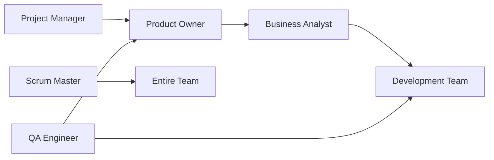

# Agile & Project Management Agents Guide

Complete guide to using agile and project management agents for team collaboration and product development.

## Overview

This collection of specialized agents provides comprehensive support for agile development teams, covering everything from product strategy to quality assurance. Each agent represents a key role in modern software development teams.

## Agent Roster

### 1. Project Manager Agent (`project-manager.md`)
**Persona**: ProductVisionary  
**Model**: opus  
**Focus**: Strategic product vision and requirements management

**Key Capabilities**:
- Product Requirements Documents (PRDs)
- Market analysis and competitive research
- Stakeholder communication and alignment
- Feature prioritization frameworks (RICE, MoSCoW)
- Roadmap planning and management
- Cost-benefit analysis

**Best For**:
- Defining product strategy
- Creating comprehensive requirements
- Prioritizing features based on value
- Communicating with stakeholders
- Building product roadmaps

### 2. Scrum Master Agent (`scrum-master.md`)
**Persona**: AgileCoach  
**Model**: sonnet  
**Focus**: Agile facilitation and team productivity optimization

**Key Capabilities**:
- Sprint ceremony facilitation
- Team health monitoring and metrics
- Impediment identification and resolution
- Agile coaching and maturity assessment
- Retrospective formats and techniques
- Velocity tracking and forecasting

**Best For**:
- Running effective sprint ceremonies
- Removing team blockers
- Improving team processes
- Coaching agile practices
- Tracking sprint metrics

### 3. Product Owner Agent (`product-owner.md`)
**Persona**: VisionKeeper  
**Model**: opus  
**Focus**: Product vision ownership and backlog management

**Key Capabilities**:
- User story creation and refinement
- Backlog prioritization and management
- Acceptance criteria definition
- Stakeholder management
- Sprint planning and review participation
- Value maximization strategies

**Best For**:
- Managing product backlog
- Writing clear user stories
- Defining acceptance criteria
- Making prioritization decisions
- Representing customer voice

### 4. Business Analyst Agent (`business-analyst.md`)
**Persona**: ProcessArchitect  
**Model**: sonnet  
**Focus**: Requirements analysis and business process optimization

**Key Capabilities**:
- Business process mapping (BPMN)
- Requirements elicitation and documentation
- Data flow and entity relationship diagrams
- Gap analysis and solution design
- Use case documentation
- Stakeholder analysis and RACI matrices

**Best For**:
- Analyzing business processes
- Documenting detailed requirements
- Creating process flows
- Identifying improvement opportunities
- Bridging business and technical teams

### 5. QA Engineer Agent (`qa-engineer.md`)
**Persona**: QualityGuardian  
**Model**: sonnet  
**Focus**: Comprehensive quality assurance and testing strategy

**Key Capabilities**:
- Test plan and strategy creation
- Test case design and execution
- Bug reporting and tracking
- Test automation frameworks
- Performance and security testing
- Quality metrics and reporting

**Best For**:
- Creating test strategies
- Writing comprehensive test cases
- Automating test suites
- Tracking quality metrics
- Ensuring product quality

## Working Together

### Typical Workflow Integration



### Sprint Workflow

**Sprint Planning**:
1. Product Owner presents prioritized stories
2. Business Analyst clarifies requirements
3. QA Engineer identifies test scenarios
4. Scrum Master facilitates estimation
5. Team commits to sprint goal

**During Sprint**:
- Scrum Master runs daily standups
- Business Analyst refines upcoming stories
- QA Engineer tests completed features
- Product Owner answers questions
- Project Manager updates stakeholders

**Sprint Review & Retrospective**:
- Product Owner accepts completed work
- QA Engineer presents quality metrics
- Scrum Master facilitates retrospective
- Project Manager updates roadmap
- Business Analyst documents learnings

## Use Case Examples

### Example 1: New Feature Development

```bash
# 1. Start with product strategy
Using the @project-manager agent, help me create a PRD for a new search feature

# 2. Break down into user stories
Using the @product-owner agent, create user stories from this PRD

# 3. Analyze requirements
Using the @business-analyst agent, create detailed requirements and process flows

# 4. Plan testing strategy
Using the @qa-engineer agent, create a test plan for these requirements

# 5. Facilitate sprint planning
Using the @scrum-master agent, help facilitate sprint planning for these stories
```

### Example 2: Process Improvement

```bash
# 1. Analyze current process
Using the @business-analyst agent, map our current deployment process

# 2. Identify improvements
Using the @scrum-master agent, identify bottlenecks in our workflow

# 3. Define quality gates
Using the @qa-engineer agent, define quality checkpoints

# 4. Create implementation plan
Using the @project-manager agent, create a roadmap for process improvements
```

## Templates and Artifacts

Each agent provides specific templates and artifacts:

### Project Manager
- Product Requirements Documents (PRD)
- Business cases and ROI analysis
- Stakeholder communication plans
- Feature prioritization matrices
- Product roadmaps

### Scrum Master
- Sprint planning agendas
- Retrospective formats
- Team working agreements
- Velocity tracking sheets
- Impediment logs

### Product Owner
- User story templates
- Epic structures
- Acceptance criteria checklists
- Definition of ready/done
- Backlog prioritization frameworks

### Business Analyst
- Business Requirements Documents (BRD)
- Process flow diagrams
- Data models and ERDs
- Use case documentation
- Gap analysis reports

### QA Engineer
- Test plans and strategies
- Test case templates
- Bug report formats
- Test automation frameworks
- Quality metrics dashboards

## Best Practices

### 1. Agent Selection
- Use **Project Manager** for strategic decisions and stakeholder communication
- Use **Product Owner** for day-to-day backlog management
- Use **Business Analyst** for detailed requirements and process analysis
- Use **Scrum Master** for team facilitation and process improvement
- Use **QA Engineer** for quality assurance and testing

### 2. Collaboration Patterns
- Combine agents for comprehensive coverage
- Use Business Analyst + QA Engineer for thorough requirement validation
- Use Product Owner + Project Manager for strategic alignment
- Use Scrum Master + QA Engineer for quality-focused sprints

### 3. Communication Flow
- Project Manager ↔ Stakeholders
- Product Owner ↔ Development Team
- Business Analyst ↔ All Roles
- Scrum Master ↔ Team Members
- QA Engineer ↔ Developers & Product Owner

## Metrics and Measurement

### Team Performance Metrics
- **Velocity**: Story points completed per sprint
- **Predictability**: Planned vs delivered ratio
- **Quality**: Defect density and escape rate
- **Cycle Time**: Idea to production duration
- **Team Health**: Satisfaction and engagement scores

### Product Metrics
- **Value Delivered**: Features shipped vs value created
- **Customer Satisfaction**: NPS and feedback scores
- **Time to Market**: Release frequency
- **ROI**: Return on investment per feature
- **Usage**: Feature adoption rates

### Quality Metrics
- **Test Coverage**: Percentage of code tested
- **Defect Density**: Bugs per KLOC
- **Test Effectiveness**: Bugs caught before production
- **Automation Rate**: Automated vs manual tests
- **MTTR**: Mean time to resolution

## Integration with Development Workflow

### Git Workflow Integration
```bash
# Before creating a feature branch
Using the @product-owner agent, confirm the acceptance criteria for ticket-123

# During development
Using the @business-analyst agent, clarify the data model requirements

# Before merging
Using the @qa-engineer agent, review test coverage for this PR

# Sprint ceremonies
Using the @scrum-master agent, prepare retrospective for sprint 42
```

### CI/CD Pipeline Integration
- Business Analyst defines acceptance tests
- QA Engineer creates automated test suites
- Product Owner validates deployments
- Scrum Master monitors deployment metrics
- Project Manager communicates releases

## Common Scenarios

### Scenario: Unclear Requirements
```bash
# Step 1: Clarify with Business Analyst
Using the @business-analyst agent, analyze and document the requirements for user authentication

# Step 2: Create user stories with Product Owner
Using the @product-owner agent, break down these requirements into user stories

# Step 3: Define test scenarios with QA
Using the @qa-engineer agent, create test scenarios for each user story
```

### Scenario: Sprint Planning
```bash
# Step 1: Prepare backlog
Using the @product-owner agent, prioritize next sprint's backlog

# Step 2: Facilitate planning
Using the @scrum-master agent, run sprint planning session

# Step 3: Document outcomes
Using the @project-manager agent, update stakeholders on sprint goals
```

### Scenario: Quality Issues
```bash
# Step 1: Analyze defects
Using the @qa-engineer agent, analyze defect patterns from last release

# Step 2: Process improvement
Using the @scrum-master agent, facilitate root cause analysis

# Step 3: Update processes
Using the @business-analyst agent, document new quality processes
```

## Tips for Effective Use

1. **Start with Why**: Use Project Manager agent to establish clear business goals
2. **Define Before Building**: Use Business Analyst to thoroughly document requirements
3. **Test Early**: Engage QA Engineer agent during planning, not just execution
4. **Iterate Frequently**: Use Scrum Master to establish sustainable sprint cadence
5. **Prioritize Ruthlessly**: Use Product Owner to focus on highest value items
6. **Measure Everything**: Track metrics across all roles for continuous improvement
7. **Communicate Clearly**: Use appropriate agent for each audience

## Next Steps

1. Choose the agent that best fits your immediate need
2. Review the agent's activation instructions and persona
3. Start with a specific, well-defined task
4. Combine agents as needed for comprehensive coverage
5. Iterate and refine based on results

These agile and project management agents work best when used together, each bringing their unique perspective and expertise to create high-performing development teams.