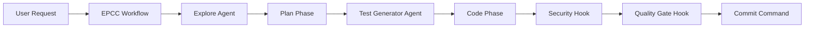

# Core Concepts Guide

🟢 **Difficulty**: Beginner | **Time**: 30 minutes | **Prerequisites**: Claude Code installed

## Introduction

Before diving into advanced patterns, it's essential to understand the core concepts that power Claude Code's extensibility. This guide explains the fundamental building blocks you'll use throughout your journey.

## Table of Contents
1. [Understanding the Claude Code Ecosystem](#understanding-the-claude-code-ecosystem)
2. [Core Concepts](#core-concepts)
3. [How Components Work Together](#how-components-work-together)
4. [Mental Models](#mental-models)
5. [Next Steps](#next-steps)

## Understanding the Claude Code Ecosystem

### The Three Layers of Claude Code

```
┌─────────────────────────────────────┐
│         User Interaction            │
│    (Commands, Prompts, Workflows)   │
├─────────────────────────────────────┤
│      Claude Code Core Engine        │
│   (Processing, Context, Execution)  │
├─────────────────────────────────────┤
│     Extension Layer (Your Work)     │
│  (Agents, Hooks, Commands, MCP)     │
└─────────────────────────────────────┘
```

### Key Directories

Claude Code looks for extensions in two main locations:

1. **Global** (`~/.claude/`): Available across all projects
2. **Project-specific** (`.claude/`): Available only in that project

Priority: Project-specific > Global

## Core Concepts

### 1. Agents 🤖

**What**: Specialized AI personas with focused expertise
**Why**: Different tasks require different approaches and knowledge
**When**: Use when you need consistent, specialized behavior

```
Agent = Persona + Instructions + Tools + Model
```

**Key Characteristics**:
- Persistent personality throughout session
- Specialized knowledge domain
- Optimized model selection (sonnet/opus)
- Defined tool permissions

**Example Mental Model**: Think of agents like hiring a specialist consultant. You wouldn't ask a security expert to design your UI, and you wouldn't ask a UX designer to audit your security.

### 2. Hooks 🔗

**What**: Automated actions triggered by Claude Code events
**Why**: Enforce standards and automate repetitive tasks
**When**: Use for quality gates, notifications, and process automation

```
Event → Hook → Action → Result
```

**Hook Types**:
- **Pre-action**: Run before an action (e.g., before commit)
- **Post-action**: Run after an action (e.g., after file edit)
- **Error**: Run when errors occur
- **Lifecycle**: Run at specific points in Claude's operation

**Example Mental Model**: Hooks are like airport security checkpoints - they automatically check everything passing through without manual intervention.

### 3. Slash Commands 🎮

**What**: Quick-access shortcuts for common operations
**Why**: Faster than typing full instructions
**When**: Use for frequently repeated tasks

```
/command [arguments] → Predefined Actions
```

**Command Structure**:
- Name: Unique identifier
- Arguments: Optional parameters
- Instructions: What Claude should do
- Output: Expected results

**Example Mental Model**: Commands are like keyboard shortcuts in your IDE - faster than clicking through menus.

### 4. MCP Servers 🔌

**What**: Model Context Protocol servers that extend Claude's capabilities
**Why**: Connect to external tools and services
**When**: Need functionality beyond Claude's built-in tools

```
Claude → MCP Server → External Service → Result
```

**Common MCP Servers**:
- GitHub: Repository management
- Database: SQL operations
- Filesystem: Advanced file operations
- Slack: Team notifications

**Example Mental Model**: MCP servers are like plugins in your browser - they add new capabilities by connecting to external services.

### 5. CLAUDE.md Configuration 📝

**What**: Project-specific instructions and context
**Why**: Maintain consistency across sessions
**When**: Every project should have one

```
CLAUDE.md = Project Context + Rules + Patterns
```

**Key Sections**:
- Project overview
- Coding standards
- File structure
- Special instructions
- Common commands

**Example Mental Model**: CLAUDE.md is like a project's README specifically for AI - it tells Claude everything it needs to know about your project.

### 6. Workflows 🔄

**What**: Multi-step, orchestrated processes
**Why**: Complex tasks require coordinated actions
**When**: Tasks with dependencies and multiple phases

```
Step 1 → Step 2 → Step 3 → ... → Complete
   ↓        ↓        ↓
 Hooks   Agents  Commands
```

**Workflow Types**:
- EPCC: Explore → Plan → Code → Commit
- TDD: Test → Code → Refactor
- Feature: Design → Implement → Test → Deploy

**Example Mental Model**: Workflows are like cooking recipes - they define the steps, order, and ingredients needed for a successful outcome.

## How Components Work Together

### Integration Example: Secure Feature Development



1. **User** initiates feature request
2. **Workflow** orchestrates the process
3. **Agents** provide specialized expertise
4. **Hooks** enforce quality standards
5. **Commands** execute specific actions

### The Power of Composition

Components are designed to work together:

- **Agents** can trigger **Commands**
- **Hooks** can call **Agents**
- **Workflows** coordinate everything
- **MCP** extends capabilities for all

## Mental Models

### 1. The Orchestra Model

- **Claude Core**: Conductor
- **Agents**: Specialized musicians
- **Workflows**: Sheet music
- **Hooks**: Stage managers
- **Commands**: Instrument techniques
- **MCP**: Guest performers

### 2. The Kitchen Model

- **Claude Core**: Head chef
- **Agents**: Specialized cooks (pastry, grill, etc.)
- **Workflows**: Recipes
- **Hooks**: Quality control
- **Commands**: Cooking techniques
- **MCP**: Specialty equipment

### 3. The Construction Model

- **Claude Core**: Project manager
- **Agents**: Specialized contractors
- **Workflows**: Building plans
- **Hooks**: Safety inspectors
- **Commands**: Power tools
- **MCP**: Heavy machinery

## Key Principles

### 1. Separation of Concerns
Each component has a specific purpose. Don't try to make hooks do what agents should do.

### 2. Composition Over Complexity
Simple components combined are better than complex monoliths.

### 3. Progressive Enhancement
Start simple, add complexity as needed.

### 4. Fail-Safe Design
Hooks and agents should handle errors gracefully.

### 5. Documentation First
Always document your customizations in CLAUDE.md.

## Common Patterns

### Pattern 1: Specialized Agent Suite
Create multiple agents for different aspects of your project:
- `security-reviewer` for security
- `performance-optimizer` for speed
- `ux-reviewer` for user experience

### Pattern 2: Quality Gate Pipeline
Chain hooks for comprehensive checking:
1. Format code
2. Run linter
3. Execute tests
4. Check security
5. Verify documentation

### Pattern 3: Command Shortcuts
Create commands for multi-step operations:
- `/deploy` - build, test, and deploy
- `/review` - comprehensive code review
- `/refactor` - analyze and improve code

## Troubleshooting Concepts

### Issue: Components Not Loading

**Check**:
1. File location (`.claude/` or `~/.claude/`)
2. File naming (exact names matter)
3. YAML frontmatter (for agents/commands)
4. JSON syntax (for hooks)

### Issue: Unexpected Behavior

**Debug**:
1. Check component priority (project > global)
2. Verify no conflicting components
3. Review Claude.md for overrides
4. Test components in isolation

### Issue: Performance Problems

**Optimize**:
1. Use sonnet for simple tasks
2. Limit hook complexity
3. Cache MCP responses
4. Reduce agent instructions

## Next Steps

Now that you understand the core concepts:

1. **🟢 Beginner**: Continue to [Quick Start Guide](./quick-start.md) for hands-on setup
2. **🟡 Intermediate**: Explore [Intermediate Patterns](./intermediate-patterns.md)
3. **🔴 Advanced**: Deep dive into [Agent Development](./agents-guide.md)

### Suggested Learning Path

```
Concepts (You are here) → Quick Start → First Agent → First Hook → 
First Command → Intermediate Patterns → Advanced Workflows → 
Production Deployment
```

### Practice Exercises

Try these conceptual exercises:

1. **Design Exercise**: Sketch an agent for your specific use case
2. **Planning Exercise**: List hooks that would improve your workflow
3. **Integration Exercise**: Design a workflow combining 3+ components

## Summary

You've learned:
- ✅ The six core components of Claude Code extensions
- ✅ How components work together
- ✅ Mental models for understanding the system
- ✅ Common patterns and troubleshooting

Ready to put these concepts into practice? Head to the [Quick Start Guide](./quick-start.md) →

---

*Last Updated: 2025-08-13*