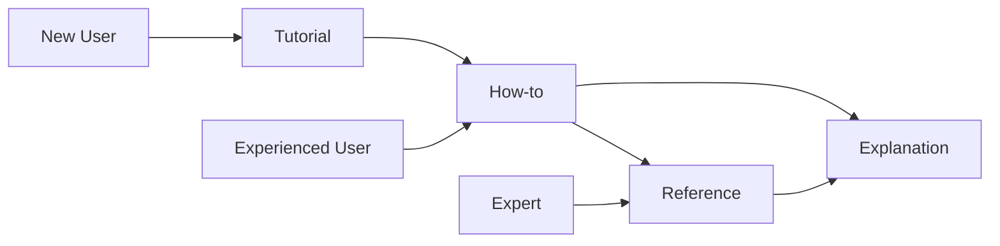

# Diataxis Documentation Workflow Guide

Complete guide to using the Diataxis documentation framework with Claude Code's specialized commands and agents.

## Overview

The Diataxis workflow provides a systematic approach to creating comprehensive documentation using four distinct documentation types, each serving a specific purpose and audience.

## The Diataxis Framework

Diataxis organizes documentation along two axes:

```
         PRACTICAL
            ↑
    Tutorial | How-to
    ---------|----------
    Learning | Working  
    ---------|----------
    Explain  | Reference
            ↓
         THEORETICAL
    
    ← STUDY        DO →
```

### Four Documentation Types

1. **Tutorials** - Learning-oriented guides for beginners
2. **How-to Guides** - Task-oriented instructions for practitioners
3. **Reference** - Information-oriented specifications for lookup
4. **Explanation** - Understanding-oriented discussions for context

## Quick Start

### Creating Your First Documentation

```bash
# Auto-detect documentation needs
/diataxis-docs "user authentication"

# Create complete documentation suite
/diataxis-docs "payment processing" --full

# Create specific documentation type
/diataxis-tutorial "Getting started with React"
/diataxis-howto "Deploy to AWS"
/diataxis-reference "REST API endpoints"
/diataxis-explanation "Microservices architecture"
```

## Workflow Commands

### Main Orchestrator

#### `/diataxis-docs`
The master orchestrator that analyzes your needs and coordinates documentation creation.

**Options:**
- `--full` - Create all four documentation types
- `--learning` - Create tutorial and explanation
- `--working` - Create how-to and reference
- `--understanding` - Create explanation and reference

### Individual Commands

#### `/diataxis-tutorial`
Creates learning-oriented documentation for beginners.

**Use when:**
- Teaching new concepts
- Onboarding new team members
- Creating getting-started guides
- Building confidence through practice

**Output:** `docs/tutorials/[topic-name].md`

#### `/diataxis-howto`
Creates task-oriented guides for solving specific problems.

**Use when:**
- Documenting procedures
- Solving common problems
- Providing step-by-step solutions
- Creating deployment guides

**Output:** `docs/how-to/[task-name].md`

#### `/diataxis-reference`
Creates comprehensive technical specifications.

**Use when:**
- Documenting APIs
- Listing configuration options
- Creating command references
- Providing parameter details

**Output:** `docs/reference/[component-name].md`

#### `/diataxis-explanation`
Creates conceptual documentation for understanding.

**Use when:**
- Explaining architecture decisions
- Discussing design patterns
- Providing theoretical background
- Comparing alternatives

**Output:** `docs/explanation/[concept-name].md`

## Documentation Agents

Each command deploys specialized agents:

### Tutorial Agents
- `@docs-tutorial-agent` - Creates learning journeys
- `@test-generator` - Ensures examples work
- `@ux-optimizer` - Optimizes learning experience

### How-to Agents
- `@docs-howto-agent` - Creates practical guides
- `@code-archaeologist` - Analyzes existing solutions
- `@system-designer` - Designs optimal approaches

### Reference Agents
- `@docs-reference-agent` - Creates structured specs
- `@documentation-agent` - Generates API docs
- `@test-generator` - Validates examples

### Explanation Agents
- `@docs-explanation-agent` - Creates conceptual content
- `@architecture-documenter` - Documents design decisions
- `@business-analyst` - Provides business context

## Choosing the Right Documentation Type

### Decision Matrix

| If users need to... | Use this type | Command |
|-------------------|---------------|---------|
| Learn something new | Tutorial | `/diataxis-tutorial` |
| Solve a specific problem | How-to | `/diataxis-howto` |
| Look up technical details | Reference | `/diataxis-reference` |
| Understand concepts | Explanation | `/diataxis-explanation` |

### User Journey Mapping



## Workflow Patterns

### Pattern 1: Complete System Documentation

```bash
# Document entire system comprehensively
/diataxis-docs "e-commerce platform" --full
```

Creates:
1. Tutorial for new developers
2. How-to guides for common tasks
3. Reference for all APIs
4. Explanation of architecture

### Pattern 2: Feature Documentation

```bash
# Document new feature for different audiences
/diataxis-tutorial "shopping cart feature"
/diataxis-howto "customize shopping cart"
/diataxis-reference "cart API"
```

### Pattern 3: Onboarding Documentation

```bash
# Create learning-focused documentation
/diataxis-docs "development environment" --learning
```

Creates tutorial and explanation for new team members.

### Pattern 4: Operations Documentation

```bash
# Create task-focused documentation
/diataxis-docs "production deployment" --working
```

Creates how-to guides and reference for DevOps team.

## Best Practices

### 1. Start with User Needs

Identify your audience first:
- **Beginners** → Tutorial
- **Practitioners** → How-to
- **Everyone** → Reference
- **Thinkers** → Explanation

### 2. Don't Mix Types

Keep each documentation type pure:
- ❌ Don't put tutorials in how-to guides
- ❌ Don't explain theory in reference docs
- ✅ Do cross-reference between types

### 3. Maintain Consistency

Across all documentation:
- Use consistent terminology
- Align examples
- Maintain same version references
- Use uniform formatting

### 4. Create Learning Paths

Link documentation types:
```markdown
Tutorial → How-to → Reference → Explanation
```

### 5. Iterate Based on Feedback

- Monitor which docs users access
- Identify gaps in coverage
- Update based on questions
- Refine unclear sections

## Examples by Domain

### Web Application

```bash
# Full documentation suite
/diataxis-docs "React application" --full

# Specific aspects
/diataxis-tutorial "React hooks basics"
/diataxis-howto "Implement authentication"
/diataxis-reference "Component props"
/diataxis-explanation "State management patterns"
```

### API Development

```bash
# API documentation
/diataxis-docs "REST API" --working

# Detailed specs
/diataxis-reference "API endpoints"
/diataxis-howto "API authentication"
```

### DevOps

```bash
# Infrastructure documentation
/diataxis-docs "Kubernetes cluster" --full

# Specific guides
/diataxis-tutorial "First Kubernetes deployment"
/diataxis-howto "Scale applications"
/diataxis-reference "kubectl commands"
/diataxis-explanation "Container orchestration"
```

### Data Science

```bash
# ML documentation
/diataxis-docs "machine learning pipeline" --understanding

# Learning materials
/diataxis-tutorial "Your first model"
/diataxis-explanation "Neural network theory"
```

## Quality Checklist

### For Tutorials
- [ ] Guaranteed success if followed
- [ ] Minimal prerequisites
- [ ] Celebrates small wins
- [ ] Builds confidence

### For How-to Guides
- [ ] Solves specific problem
- [ ] Assumes competence
- [ ] Provides alternatives
- [ ] Includes troubleshooting

### For Reference
- [ ] Complete coverage
- [ ] Consistent structure
- [ ] Quick lookup optimized
- [ ] Examples included

### For Explanations
- [ ] Provides context
- [ ] Discusses alternatives
- [ ] Makes connections
- [ ] Thought-provoking

## Integration with Other Workflows

### With EPCC Workflow
```bash
# Document code created with EPCC
/epcc-explore "feature"
/epcc-plan
/epcc-code
/diataxis-docs "feature" --full  # Document the result
```

### With TDD Workflow
```bash
# Document test-driven features
/tdd-feature "payment"
/diataxis-explanation "payment architecture"
/diataxis-reference "payment API"
```

## Advanced Usage

### Custom Documentation Strategies

```bash
# For libraries
/diataxis-tutorial "library basics"
/diataxis-reference "API documentation"
/diataxis-explanation "design principles"

# For frameworks
/diataxis-docs "framework" --full
# Plus cookbook-style how-tos
/diataxis-howto "common patterns"

# For tools
/diataxis-tutorial "getting started"
/diataxis-howto "advanced usage"
/diataxis-reference "CLI reference"
```

### Documentation Maintenance

```bash
# Update existing documentation
/diataxis-reference "API v2"  # Update reference
/diataxis-howto "migrate to v2"  # Add migration guide
/diataxis-explanation "v2 changes"  # Explain decisions
```

## Troubleshooting

### Common Issues

#### "Which type should I create?"
**Solution**: Start with `/diataxis-docs` for auto-detection

#### "Documentation feels redundant"
**Solution**: Each type serves different purpose - ensure pure types

#### "Users can't find information"
**Solution**: Add cross-references and improve navigation

#### "Documentation is incomplete"
**Solution**: Use `--full` flag for comprehensive coverage

## Output Files

All documentation is generated as Markdown files:

- `docs/tutorials/[topic].md` - Learning content
- `docs/how-to/[task].md` - Task guides
- `docs/reference/[component].md` - Technical specs
- `docs/explanation/[concept].md` - Conceptual content

## Summary

The Diataxis workflow provides:
1. **Clear structure** for documentation
2. **Specialized agents** for each type
3. **Orchestrated creation** for completeness
4. **User-focused** content organization

Use it to create documentation that truly serves your users' needs across their entire journey from learning to mastery.