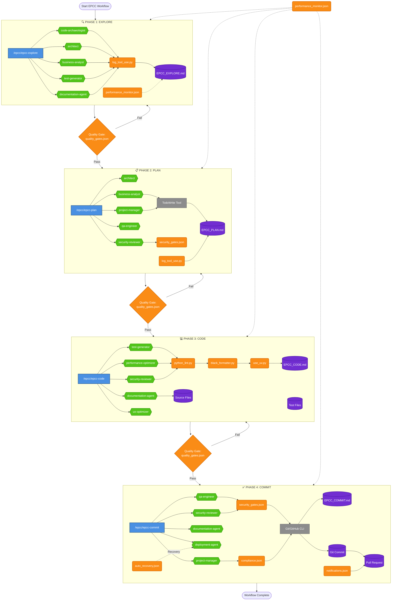
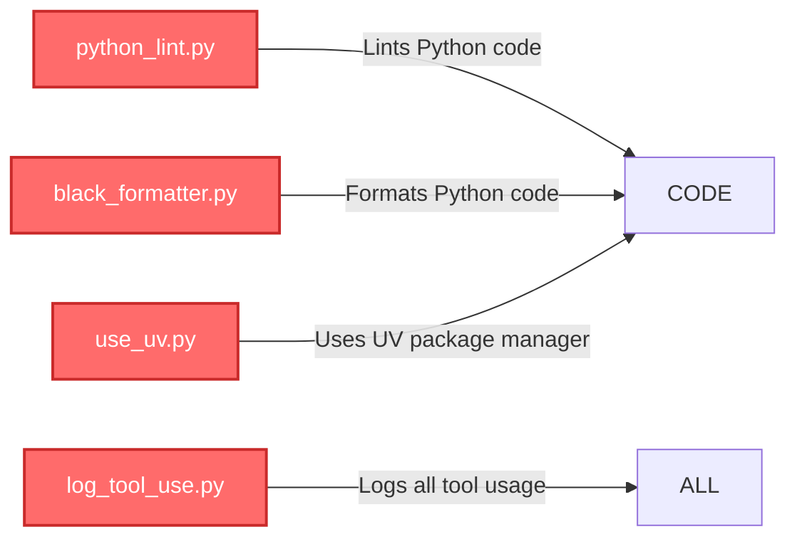
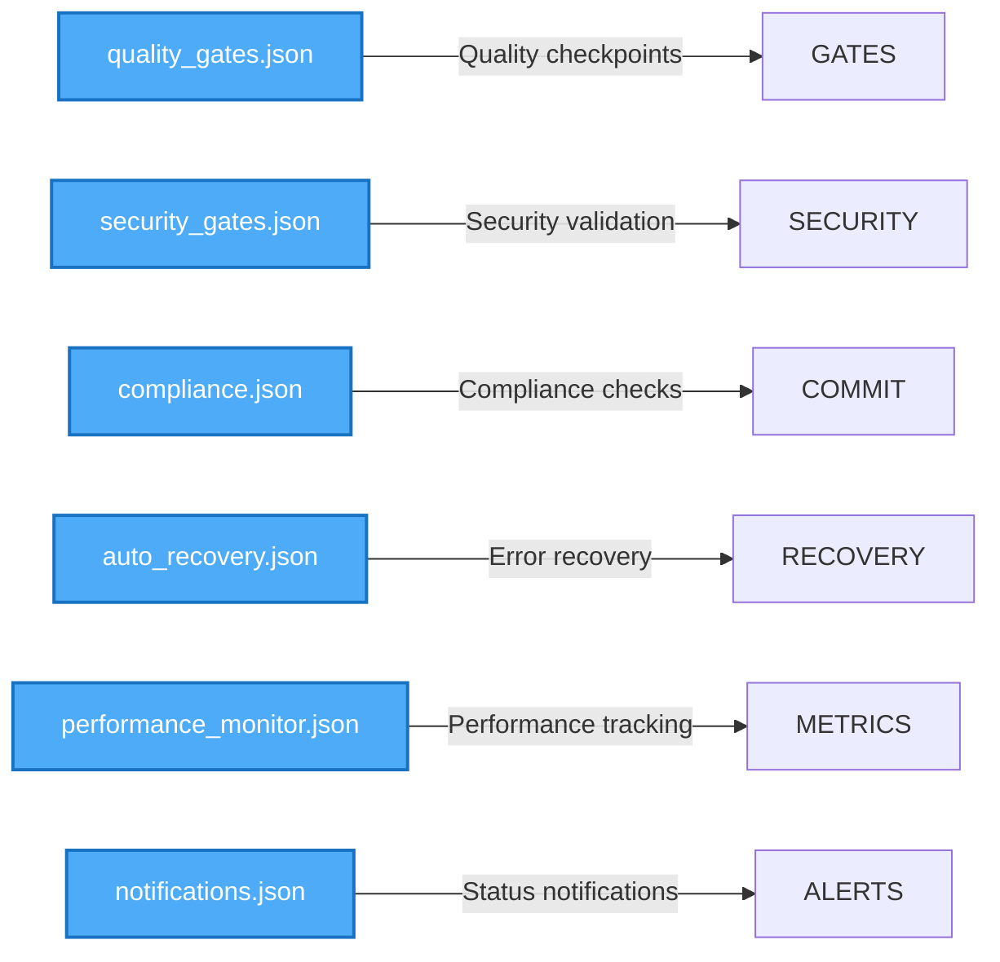
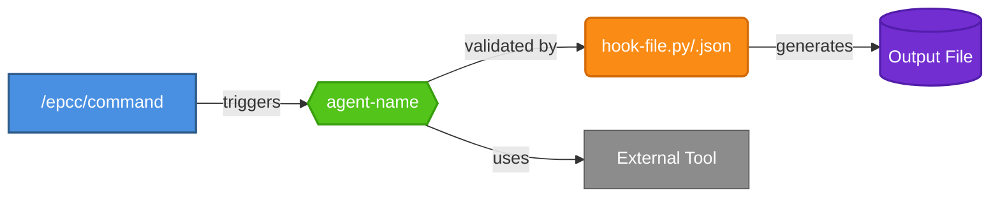

# EPCC Workflow Architecture Diagram

This diagram visualizes the complete Explore-Plan-Code-Commit (EPCC) workflow, showing the relationships between commands, agents, hooks, and outputs at each phase.

## Complete EPCC Workflow with Agent Mappings

## Agent-Hook-Output Matrix

### Detailed Mapping Table

| Phase | Command | Agents (5 per phase) | Relevant Hooks | Output Files |
|-------|---------|---------------------|----------------|--------------|
| **EXPLORE** | `/epcc/epcc-explore` | • code-archaeologist • architect • business-analyst • test-generator • documentation-agent | • log_tool_use.py • performance_monitor.json | • EPCC_EXPLORE.md |
| **PLAN** | `/epcc/epcc-plan` | • architect • business-analyst • security-reviewer • qa-engineer • project-manager | • log_tool_use.py • security_gates.json • performance_monitor.json | • EPCC_PLAN.md |
| **CODE** | `/epcc/epcc-code` | • test-generator • performance-optimizer • security-reviewer • documentation-agent • ux-optimizer | • python_lint.py • black_formatter.py • use_uv.py • quality_gates.json | • EPCC_CODE.md • Source files • Test files |
| **COMMIT** | `/epcc/epcc-commit` | • qa-engineer • security-reviewer • documentation-agent • deployment-agent • project-manager | • security_gates.json • compliance.json • auto_recovery.json • notifications.json | • EPCC_COMMIT.md • Git commit • Pull Request |

## Hook Categories and Functions

### Python-Specific Hooks (Exit Code 2 for Claude Action)

### JSON Configuration Hooks

## Component Legend

## File Locations in Project

| Component Type | Location | Count | Examples |
|---------------|----------|-------|----------|
| **Commands** | `/commands/epcc/` | 4 | `epcc-explore.md`, `epcc-plan.md`, `epcc-code.md`, `epcc-commit.md` |
| **Agents** | `/agents/` | 13 | `architect.md`, `test-generator.md`, `security-reviewer.md` |
| **Python Hooks** | `/hooks/` | 4 | `python_lint.py`, `black_formatter.py`, `use_uv.py`, `log_tool_use.py` |
| **JSON Hooks** | `/hooks/` | 6 | `quality_gates.json`, `security_gates.json`, `compliance.json` |
| **Outputs** | Project root | 4 | `EPCC_EXPLORE.md`, `EPCC_PLAN.md`, `EPCC_CODE.md`, `EPCC_COMMIT.md` |

## Hook Execution Flow

### Python Hooks (Exit Code Behavior)
- **Exit Code 0**: Success, continue workflow
- **Exit Code 1**: Error, stop workflow
- **Exit Code 2**: Claude should take action (format code, install packages, etc.)

### Hook Trigger Points
1. **Pre-Command**: Before agent execution
2. **During Execution**: Real-time validation
3. **Post-Command**: After completion
4. **Quality Gates**: Between phases

## Usage Flow with Actual Components

1. **Developer initiates**: `claude /epcc/epcc-explore "authentication system"`
2. **Explore phase** triggers 5 agents: code-archaeologist, architect, business-analyst, test-generator, documentation-agent
3. **Quality gate** (`quality_gates.json`) validates exploration
4. **Plan phase** triggers 5 agents: architect, business-analyst, security-reviewer, qa-engineer, project-manager
5. **Quality gate** validates plan completeness
6. **Code phase** triggers 5 agents: test-generator, performance-optimizer, security-reviewer, documentation-agent, ux-optimizer
   - Python hooks automatically format and lint code
7. **Quality gate** (`quality_gates.json`) validates code quality
8. **Commit phase** triggers 5 agents: qa-engineer, security-reviewer, documentation-agent, deployment-agent, project-manager
9. **Workflow complete** with full documentation trail

## Key Insights

### Agent Reuse Patterns
- **architect**: Used in EXPLORE and PLAN phases
- **business-analyst**: Used in EXPLORE and PLAN phases
- **security-reviewer**: Used in PLAN, CODE, and COMMIT phases
- **documentation-agent**: Used in EXPLORE, CODE, and COMMIT phases
- **test-generator**: Used in EXPLORE and CODE phases
- **qa-engineer**: Used in PLAN and COMMIT phases
- **project-manager**: Used in PLAN and COMMIT phases

### Python-Specific Integration
All Python hooks use exit code 2 to trigger Claude actions:
- `use_uv.py`: Automatically uses UV package manager
- `black_formatter.py`: Auto-formats Python code
- `python_lint.py`: Runs Ruff linting

### Quality Enforcement Points
1. Between phases: `quality_gates.json`
2. Security checks: `security_gates.json`
3. Compliance: `compliance.json`
5. Performance: `performance_monitor.json`

## Benefits of This Architecture

1. **Comprehensive Coverage**: Each phase uses 5 specialized agents
2. **Automatic Quality**: Python hooks ensure code quality without manual intervention
3. **Security Throughout**: Security validation in 3 of 4 phases
4. **Documentation Trail**: Every phase creates permanent records
5. **Smart Recovery**: `auto_recovery.json` handles errors gracefully
6. **Performance Tracking**: Continuous monitoring across all phases
7. **Compliance Ready**: Built-in compliance checking for enterprise needs

## Related Documentation

- [Agents Guide](../agents/README.md) - Complete agent documentation
- [Hooks Guide](../hooks/EXIT_CODES_GUIDE.md) - Hook configuration and exit codes
- [Commands Guide](../commands/README.md) - Command creation guide
- [EPCC Workflow Guide](epcc-workflow-guide.md) - Detailed implementation guide