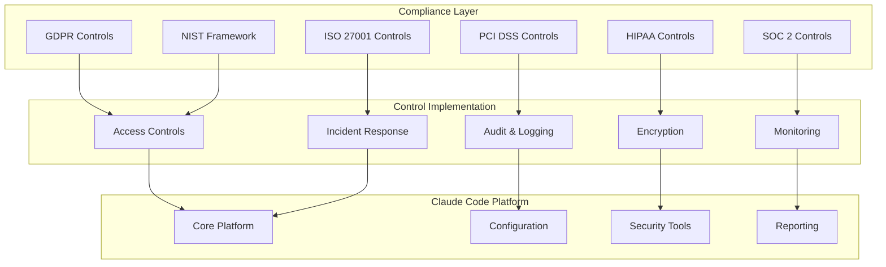

# Compliance Frameworks for Claude Code

Understanding how Claude Code aligns with major compliance frameworks and regulatory requirements for enterprise deployments.

## Overview of Compliance Requirements

Organizations deploying Claude Code must often meet various regulatory and compliance requirements. These frameworks establish standards for data protection, privacy, security controls, and operational procedures. Understanding how Claude Code supports these requirements is essential for successful enterprise adoption.

## General Data Protection Regulation (GDPR)

The GDPR establishes comprehensive data protection rules for organizations processing personal data of EU residents.

### Core GDPR Principles

#### Data Minimization
GDPR requires that data collection be limited to what is necessary for the specified purpose.

**How Claude Code Supports This:**
- Permission systems limit file access to project directories only
- Network access restrictions prevent unnecessary data collection
- Audit logging captures only essential security and operational data
- Configuration allows granular control over data processing scope

**Implementation Strategy:**
```json
{
  "gdpr_compliance": {
    "data_minimization": {
      "file_access": {
        "allowed_paths": ["${project_root}/src", "${project_root}/docs"],
        "denied_paths": ["${project_root}/personal_data", "${home}/documents"]
      },
      "network_access": {
        "allowed_domains": ["github.com", "docs.anthropic.com"],
        "blocked_personal_data_sources": true
      },
      "audit_logging": {
        "log_level": "essential_only",
        "exclude_personal_data": true
      }
    }
  }
}
```

#### Purpose Limitation
Personal data must be processed only for the specific, explicit, and legitimate purposes for which it was collected.

**How Claude Code Supports This:**
- Clear documentation of data processing purposes
- Restricted agent capabilities aligned with stated purposes
- Audit trails showing data usage aligned with purposes
- Configuration prevents scope creep beyond intended use

#### Consent Management
Organizations must obtain and manage valid consent for data processing.

**Claude Code Implementation:**
```python
class GDPRConsentManager:
    def __init__(self):
        self.consent_records = {}
        
    def obtain_consent(self, user_id: str, purpose: str, data_types: list):
        """Obtain explicit consent for specific data processing"""
        consent_request = {
            "user_id": user_id,
            "purpose": purpose,
            "data_types": data_types,
            "timestamp": datetime.utcnow(),
            "consent_given": None
        }
        
        # Present clear consent request to user
        consent_given = self.present_consent_request(consent_request)
        
        if consent_given:
            self.consent_records[user_id] = {
                **consent_request,
                "consent_given": True,
                "withdrawal_option": self.generate_withdrawal_mechanism()
            }
        
        return consent_given
    
    def check_consent(self, user_id: str, purpose: str):
        """Verify valid consent exists for processing"""
        if user_id not in self.consent_records:
            return False
            
        consent = self.consent_records[user_id]
        return (consent["consent_given"] and 
                purpose == consent["purpose"] and
                not consent.get("withdrawn"))
```

#### Right to Erasure (Right to be Forgotten)
Individuals have the right to request deletion of their personal data.

**Implementation Approach:**
```json
{
  "erasure_procedures": {
    "data_identification": {
      "scan_patterns": ["email", "name", "personal_identifier"],
      "file_types": [".log", ".json", ".txt", ".md"],
      "search_scope": "all_project_files"
    },
    "deletion_process": {
      "secure_deletion": true,
      "verification": "cryptographic_proof",
      "audit_trail": "deletion_record_only"
    },
    "retention_exceptions": {
      "legal_hold": "preserve_if_required",
      "security_logs": "anonymize_personal_data"
    }
  }
}
```

### GDPR Technical Safeguards

#### Data Protection by Design and Default
Systems must incorporate data protection measures from the design phase.

**Claude Code's Built-in Protections:**
- Default permission levels deny access to sensitive directories
- Automatic detection of personal data patterns in code
- Encryption of all data in transit and at rest
- Privacy-preserving audit logging

#### Data Breach Notification
Organizations must report data breaches within 72 hours.

**Automated Breach Detection:**
```python
class GDPRBreachDetector:
    def __init__(self):
        self.breach_thresholds = {
            "unauthorized_access": 1,  # Any unauthorized access
            "data_modification": 5,    # 5+ unauthorized modifications
            "data_exfiltration": 1     # Any data leaving approved boundaries
        }
    
    def detect_potential_breach(self, event):
        """Detect events that may constitute a data breach"""
        breach_indicators = []
        
        if event.type == "unauthorized_file_access":
            if self.contains_personal_data(event.file_path):
                breach_indicators.append("personal_data_access")
        
        if event.type == "network_request":
            if self.is_external_domain(event.destination):
                breach_indicators.append("potential_exfiltration")
        
        if breach_indicators:
            self.initiate_breach_response(event, breach_indicators)
    
    def initiate_breach_response(self, event, indicators):
        """Start 72-hour breach notification process"""
        breach_record = {
            "detection_time": datetime.utcnow(),
            "event_details": event,
            "breach_indicators": indicators,
            "notification_deadline": datetime.utcnow() + timedelta(hours=72)
        }
        
        # Alert security team immediately
        self.alert_security_team(breach_record)
        
        # Begin investigation process
        self.start_investigation(breach_record)
```

## Health Insurance Portability and Accountability Act (HIPAA)

HIPAA establishes standards for protecting protected health information (PHI) in healthcare environments.

### HIPAA Security Rule Requirements

#### Administrative Safeguards
Policies and procedures for managing PHI access and security.

**Claude Code Implementation:**
```json
{
  "hipaa_administrative": {
    "access_management": {
      "minimum_necessary_rule": true,
      "role_based_access": {
        "healthcare_provider": ["read_phi", "write_phi"],
        "administrative_staff": ["read_phi_limited"],
        "it_support": ["no_phi_access"]
      },
      "access_review_frequency": "quarterly"
    },
    "workforce_training": {
      "required_training": ["hipaa_basics", "phi_handling", "breach_response"],
      "training_frequency": "annual",
      "documentation_required": true
    }
  }
}
```

#### Physical Safeguards
Controls for workstations and media containing PHI.

**Implementation Controls:**
- Workstation security configurations
- Device and media controls for Claude Code installations
- Facility access controls for systems processing PHI

#### Technical Safeguards
Technology controls for PHI access and transmission.

```python
class HIPAATechnicalSafeguards:
    def __init__(self):
        self.phi_patterns = [
            r'\b\d{3}-\d{2}-\d{4}\b',  # SSN
            r'\b\d{10}\b',              # Phone numbers
            r'\b[A-Z]{2}\d{8}\b'        # Medical record numbers
        ]
    
    def access_control(self, user, resource):
        """Implement unique user identification and authentication"""
        if not self.authenticate_user(user):
            return False
        
        if self.is_phi_resource(resource):
            return self.authorize_phi_access(user, resource)
        
        return self.authorize_general_access(user, resource)
    
    def audit_controls(self, operation):
        """Log all PHI access and operations"""
        if self.involves_phi(operation):
            audit_entry = {
                "timestamp": datetime.utcnow(),
                "user": operation.user,
                "action": operation.action,
                "resource": self.anonymize_resource_name(operation.resource),
                "outcome": operation.outcome,
                "phi_involved": True
            }
            self.log_phi_audit(audit_entry)
    
    def integrity_controls(self, data):
        """Ensure PHI is not improperly altered or destroyed"""
        if self.contains_phi(data):
            checksum = self.calculate_checksum(data)
            self.store_integrity_record(data.id, checksum)
            return self.encrypt_phi(data)
        
        return data
```

### HIPAA Risk Assessment

Regular risk assessments are required to identify vulnerabilities.

```yaml
hipaa_risk_assessment:
  scope:
    - claude_code_installations
    - phi_processing_workflows
    - data_storage_systems
    - network_communications
  
  risk_categories:
    - unauthorized_access
    - data_breach
    - system_vulnerabilities
    - human_error
    - natural_disasters
  
  assessment_frequency: annual
  
  remediation_requirements:
    critical: 30_days
    high: 90_days
    medium: 180_days
    low: 365_days
```

## Service Organization Control 2 (SOC 2)

SOC 2 focuses on controls relevant to security, availability, processing integrity, confidentiality, and privacy.

### SOC 2 Trust Service Criteria

#### Security
Controls to protect against unauthorized access.

**Common Criteria Implementation:**
```json
{
  "soc2_security": {
    "CC1_control_environment": {
      "governance": "security_committee_established",
      "policies": "documented_security_policies",
      "standards": "industry_security_standards"
    },
    "CC2_communication": {
      "security_objectives": "communicated_to_all_users",
      "responsibilities": "defined_security_roles",
      "training": "regular_security_training"
    },
    "CC3_risk_assessment": {
      "frequency": "quarterly",
      "scope": "all_claude_code_components",
      "methodology": "nist_risk_management_framework"
    },
    "CC4_monitoring": {
      "controls_monitoring": "continuous",
      "deficiency_reporting": "documented_process",
      "corrective_actions": "tracked_to_completion"
    },
    "CC5_logical_access": {
      "authentication": "multi_factor_required",
      "authorization": "role_based_access_control",
      "session_management": "timeout_and_encryption"
    }
  }
}
```

#### Availability
System availability and operational performance.

**Availability Controls:**
```python
class SOC2AvailabilityControls:
    def __init__(self):
        self.availability_targets = {
            "system_uptime": 99.9,
            "response_time": 2.0,  # seconds
            "data_recovery_time": 4.0,  # hours
            "backup_frequency": 24.0  # hours
        }
    
    def monitor_availability(self):
        """Monitor system availability metrics"""
        metrics = {
            "uptime_percentage": self.calculate_uptime(),
            "average_response_time": self.calculate_response_time(),
            "failed_requests": self.count_failed_requests(),
            "system_capacity": self.measure_capacity_utilization()
        }
        
        for metric, value in metrics.items():
            if not self.meets_target(metric, value):
                self.trigger_availability_alert(metric, value)
        
        return metrics
    
    def backup_procedures(self):
        """Implement data backup and recovery procedures"""
        backup_config = {
            "frequency": "daily",
            "retention": "90_days",
            "encryption": "aes_256",
            "testing": "monthly_recovery_test"
        }
        
        return backup_config
```

#### Processing Integrity
Accurate, complete, and timely processing.

**Implementation Framework:**
```json
{
  "processing_integrity": {
    "data_validation": {
      "input_validation": "all_user_inputs",
      "data_type_checking": "strict_type_enforcement",
      "range_validation": "business_rule_compliance"
    },
    "error_handling": {
      "error_detection": "comprehensive_error_checking",
      "error_reporting": "detailed_error_logs",
      "error_correction": "automated_where_possible"
    },
    "processing_completeness": {
      "transaction_logging": "all_transactions_logged",
      "reconciliation": "daily_reconciliation_process",
      "exception_handling": "documented_exception_procedures"
    }
  }
}
```

## Payment Card Industry Data Security Standard (PCI DSS)

PCI DSS applies when Claude Code is used in environments that process payment card data.

### PCI DSS Requirements

#### Build and Maintain Secure Networks
```json
{
  "pci_network_security": {
    "firewall_configuration": {
      "default_deny": true,
      "claude_code_ports": ["443", "22"],
      "monitoring": "continuous_traffic_monitoring"
    },
    "system_passwords": {
      "complexity_requirements": "pci_compliant",
      "change_frequency": "90_days",
      "reuse_restriction": "last_12_passwords"
    }
  }
}
```

#### Protect Cardholder Data
```python
class PCIDataProtection:
    def __init__(self):
        self.pci_data_patterns = [
            r'\b4\d{15}\b',      # Visa
            r'\b5[1-5]\d{14}\b', # Mastercard
            r'\b3[47]\d{13}\b'   # American Express
        ]
    
    def scan_for_card_data(self, content):
        """Detect potential cardholder data"""
        for pattern in self.pci_data_patterns:
            if re.search(pattern, content):
                return True
        return False
    
    def protect_card_data(self, data):
        """Implement PCI DSS protection measures"""
        if self.scan_for_card_data(data):
            # Mask the data
            masked_data = self.mask_sensitive_data(data)
            
            # Log security event
            self.log_pci_event("cardholder_data_detected", {
                "location": data.source,
                "action": "masked_and_logged"
            })
            
            return masked_data
        
        return data
```

## ISO 27001 Information Security Management

ISO 27001 provides a framework for information security management systems.

### Information Security Controls

#### Asset Management
```yaml
iso27001_asset_management:
  inventory:
    - claude_code_installations
    - configuration_files
    - security_keys
    - audit_logs
  
  classification:
    public: documentation
    internal: configuration_files
    confidential: security_keys
    restricted: audit_logs
  
  handling_requirements:
    public: standard_controls
    internal: access_logging
    confidential: encryption_required
    restricted: multi_person_access
```

#### Incident Management
```python
class ISO27001IncidentManagement:
    def __init__(self):
        self.incident_categories = [
            "unauthorized_access",
            "malware_detection", 
            "data_breach",
            "system_failure",
            "policy_violation"
        ]
    
    def classify_incident(self, incident):
        """Classify incidents according to ISO 27001"""
        classification = {
            "category": self.determine_category(incident),
            "severity": self.assess_severity(incident),
            "impact": self.evaluate_impact(incident),
            "urgency": self.determine_urgency(incident)
        }
        
        return classification
    
    def incident_response_process(self, incident):
        """Execute ISO 27001 incident response"""
        response_steps = [
            self.immediate_containment,
            self.evidence_preservation,
            self.impact_assessment,
            self.recovery_planning,
            self.lessons_learned
        ]
        
        for step in response_steps:
            step(incident)
```

## NIST Cybersecurity Framework

The NIST Framework provides a policy framework of computer security guidance.

### Framework Core Functions

#### Identify
```json
{
  "nist_identify": {
    "asset_management": {
      "physical_systems": ["servers", "workstations", "network_devices"],
      "software_platforms": ["claude_code", "operating_systems", "applications"],
      "data_assets": ["source_code", "configuration_data", "audit_logs"]
    },
    "business_environment": {
      "mission_objectives": "ai_assisted_development",
      "stakeholders": ["developers", "security_team", "management"],
      "supply_chain": ["anthropic", "third_party_tools", "cloud_providers"]
    },
    "governance": {
      "policies": "information_security_policy",
      "processes": "security_procedures",
      "legal_requirements": ["gdpr", "hipaa", "soc2"]
    }
  }
}
```

#### Protect
```python
class NISTProtectControls:
    def __init__(self):
        self.protection_controls = {
            "access_control": self.implement_access_controls,
            "awareness_training": self.conduct_security_training,
            "data_security": self.protect_data_assets,
            "info_protection": self.implement_info_protection,
            "maintenance": self.perform_system_maintenance,
            "protective_technology": self.deploy_protective_tech
        }
    
    def implement_access_controls(self):
        """Implement identity and access management"""
        return {
            "identity_verification": "multi_factor_authentication",
            "access_management": "role_based_access_control",
            "physical_access": "controlled_facility_access"
        }
    
    def protect_data_assets(self):
        """Implement data protection measures"""
        return {
            "data_at_rest": "aes_256_encryption",
            "data_in_transit": "tls_1_3_encryption",
            "data_disposal": "secure_deletion_procedures",
            "backup_protection": "encrypted_backup_storage"
        }
```

#### Detect
```yaml
nist_detect:
  anomalies_and_events:
    - behavioral_analytics
    - network_monitoring
    - file_integrity_monitoring
    - log_analysis
  
  security_monitoring:
    - continuous_monitoring
    - real_time_alerting
    - threat_intelligence
    - vulnerability_scanning
  
  detection_processes:
    - incident_detection_procedures
    - escalation_procedures
    - communication_procedures
    - analysis_procedures
```

#### Respond
```python
class NISTResponseProcedures:
    def __init__(self):
        self.response_phases = [
            "preparation",
            "detection_analysis", 
            "containment_eradication_recovery",
            "post_incident_activity"
        ]
    
    def execute_response_plan(self, incident):
        """Execute NIST incident response plan"""
        response_plan = {
            "response_planning": self.activate_response_team,
            "communications": self.manage_communications,
            "analysis": self.conduct_analysis,
            "mitigation": self.implement_mitigation,
            "improvements": self.identify_improvements
        }
        
        for activity, action in response_plan.items():
            result = action(incident)
            self.document_response_activity(activity, result)
```

#### Recover
```json
{
  "nist_recover": {
    "recovery_planning": {
      "recovery_objectives": "restore_normal_operations",
      "recovery_time_objective": "4_hours",
      "recovery_point_objective": "1_hour",
      "communication_plan": "stakeholder_notification"
    },
    "improvements": {
      "lessons_learned": "documented_improvements",
      "updated_procedures": "enhanced_response_plans",
      "enhanced_monitoring": "improved_detection_capabilities"
    },
    "communications": {
      "internal_communications": "incident_status_updates",
      "external_communications": "customer_notifications",
      "regulatory_reporting": "compliance_notifications"
    }
  }
}
```

## Implementation Strategies

### Compliance Integration Architecture



### Multi-Framework Compliance

Organizations often must comply with multiple frameworks simultaneously:

```python
class MultiFrameworkCompliance:
    def __init__(self):
        self.frameworks = {
            "gdpr": GDPRCompliance(),
            "hipaa": HIPAACompliance(),
            "soc2": SOC2Compliance(),
            "pci": PCICompliance(),
            "iso27001": ISO27001Compliance(),
            "nist": NISTCompliance()
        }
    
    def assess_compliance(self, operation):
        """Assess operation against all applicable frameworks"""
        compliance_results = {}
        
        for framework_name, framework in self.frameworks.items():
            if framework.is_applicable(operation):
                result = framework.assess_compliance(operation)
                compliance_results[framework_name] = result
        
        return self.aggregate_compliance_results(compliance_results)
    
    def enforce_controls(self, operation):
        """Enforce the most restrictive controls across frameworks"""
        required_controls = set()
        
        for framework in self.frameworks.values():
            if framework.is_applicable(operation):
                controls = framework.get_required_controls(operation)
                required_controls.update(controls)
        
        return self.apply_controls(operation, required_controls)
```

## Continuous Compliance Monitoring

### Automated Compliance Checking

```python
class ComplianceMonitor:
    def __init__(self):
        self.compliance_rules = self.load_compliance_rules()
        self.monitoring_interval = 300  # 5 minutes
    
    def continuous_monitoring(self):
        """Continuously monitor for compliance violations"""
        while True:
            current_state = self.assess_current_state()
            
            for rule in self.compliance_rules:
                if not rule.evaluate(current_state):
                    self.handle_compliance_violation(rule, current_state)
            
            time.sleep(self.monitoring_interval)
    
    def handle_compliance_violation(self, rule, state):
        """Handle detected compliance violations"""
        violation = {
            "rule": rule.name,
            "framework": rule.framework,
            "severity": rule.severity,
            "current_state": state,
            "required_action": rule.remediation_action
        }
        
        self.log_compliance_violation(violation)
        
        if rule.severity == "critical":
            self.immediate_remediation(violation)
        else:
            self.schedule_remediation(violation)
```

### Compliance Reporting

```json
{
  "compliance_reporting": {
    "automated_reports": {
      "frequency": "monthly",
      "formats": ["pdf", "json", "csv"],
      "distribution": ["compliance_team", "management", "auditors"]
    },
    "real_time_dashboards": {
      "compliance_status": "traffic_light_system",
      "violation_trends": "time_series_charts",
      "remediation_progress": "progress_bars"
    },
    "audit_preparation": {
      "evidence_collection": "automated",
      "documentation": "generated_reports",
      "gap_analysis": "compliance_assessment"
    }
  }
}
```

## Conclusion

Compliance with regulatory frameworks is essential for enterprise Claude Code deployments. Each framework has specific requirements, but many controls overlap, allowing organizations to implement comprehensive compliance programs that address multiple regulations simultaneously.

Key strategies for successful compliance implementation:

1. **Risk-Based Approach**: Focus on highest-risk areas first
2. **Integrated Controls**: Implement controls that satisfy multiple frameworks
3. **Automated Monitoring**: Use automation for continuous compliance checking
4. **Documentation**: Maintain comprehensive documentation of compliance efforts
5. **Regular Assessment**: Conduct regular compliance assessments and gap analyses
6. **Stakeholder Engagement**: Involve legal, compliance, and business teams in planning

By understanding and implementing these compliance frameworks, organizations can confidently deploy Claude Code while meeting their regulatory obligations and protecting sensitive data.