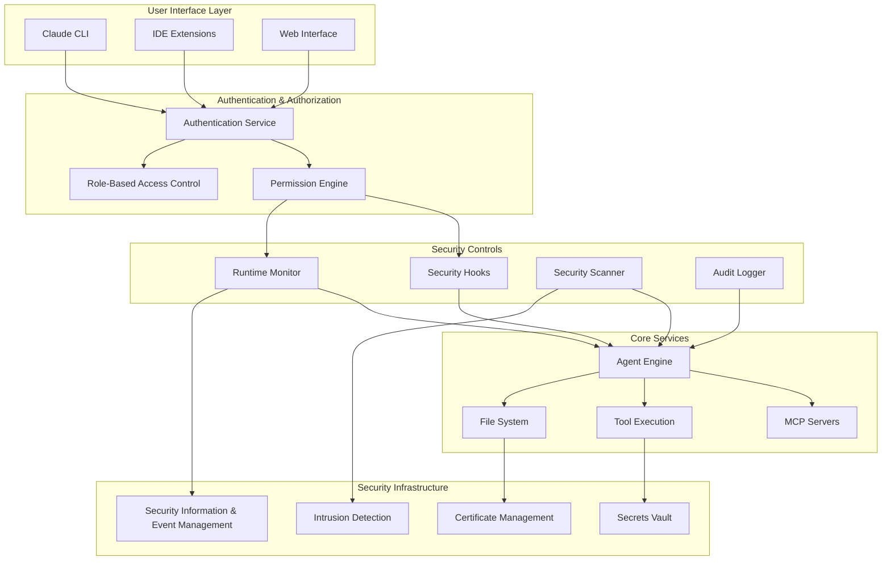
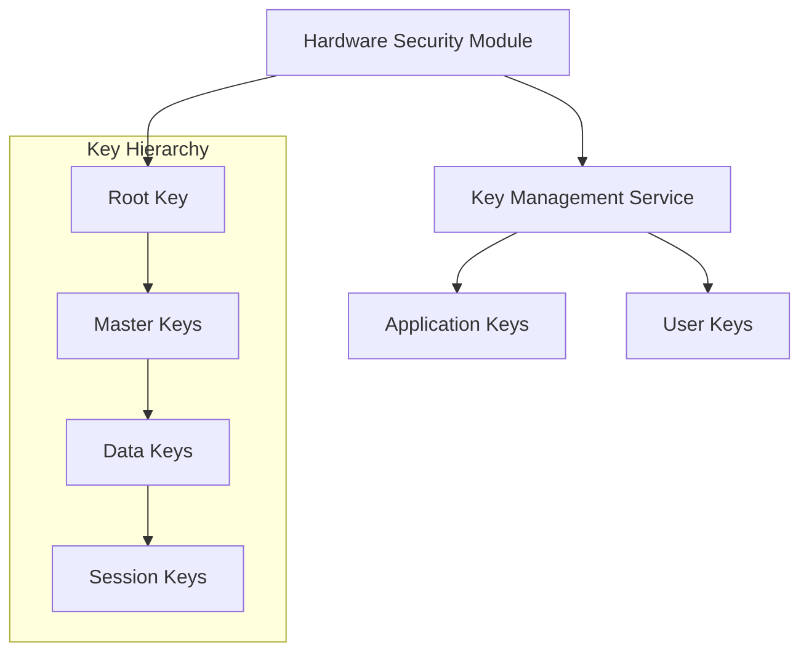
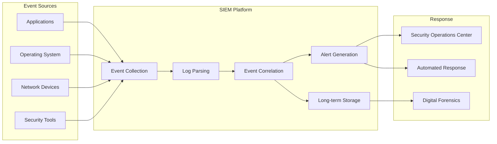
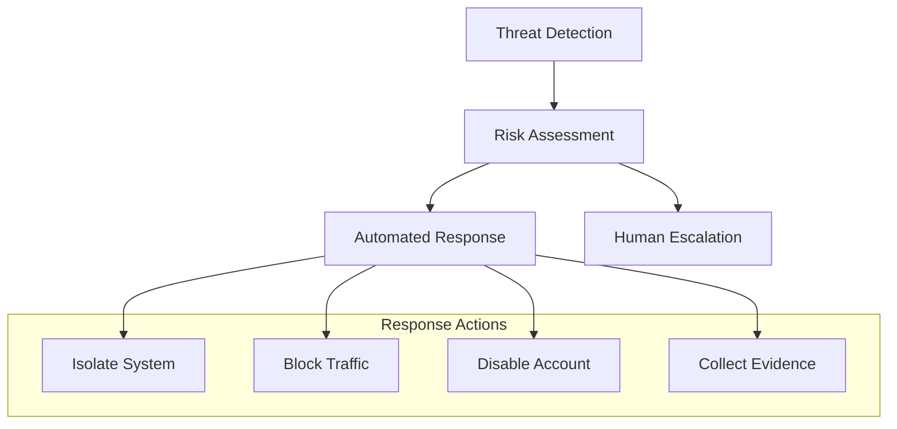
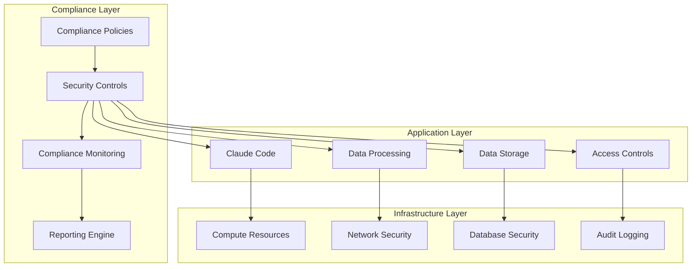

# Claude Code Security Architecture

Understanding the security model, threat landscape, and architectural decisions behind Claude Code's security framework.

## Security Design Philosophy

Claude Code's security architecture is built on three core principles that guide all security decisions and implementations.

### Defense in Depth

Rather than relying on a single security control, Claude Code implements multiple layers of protection:

- **Perimeter Security**: Permission boundaries and access controls
- **Runtime Security**: Dynamic monitoring and threat detection
- **Data Security**: Encryption, secrets management, and data protection
- **Application Security**: Code analysis, vulnerability scanning, and secure coding practices

This layered approach ensures that if one security control fails, others remain in place to protect the system.

### Principle of Least Privilege

Every component, user, and process receives the minimum permissions necessary to perform its function:

- **Default Deny**: All access is denied by default unless explicitly permitted
- **Granular Permissions**: Fine-grained control over specific operations
- **Time-Limited Access**: Permissions expire and require renewal
- **Context-Aware**: Access decisions consider user, location, time, and resource

### Zero Trust Architecture

Claude Code assumes no implicit trust based on network location or user identity:

- **Verify Everything**: All requests are authenticated and authorized
- **Encrypt All Communications**: Data in transit is always encrypted
- **Monitor and Log**: All activities are logged and monitored
- **Continuous Validation**: Security posture is continuously assessed

## Security Architecture Overview

The security architecture consists of several interconnected components that work together to provide comprehensive protection.



### Component Responsibilities

#### Authentication Service
- Validates user identity using multiple factors
- Manages session tokens and refresh cycles
- Integrates with external identity providers
- Enforces authentication policies

#### Permission Engine
- Evaluates access requests against policies
- Provides dynamic permission granting
- Manages permission inheritance and delegation
- Logs all permission decisions

#### Security Hooks
- Intercepts operations before execution
- Applies security policies and validations
- Blocks or modifies unsafe operations
- Triggers security workflows

#### Runtime Monitor
- Continuously monitors system behavior
- Detects anomalous activities and threats
- Correlates events across components
- Triggers automated responses

#### Security Scanner
- Performs static and dynamic analysis
- Identifies vulnerabilities and misconfigurations
- Scans for secrets and sensitive data
- Generates security reports

## Threat Model

Understanding the threat landscape helps inform security architectural decisions and defensive strategies.

### Threat Actors

#### External Attackers
**Motivation**: Financial gain, espionage, disruption
**Capabilities**: 
- Advanced persistent threats (APTs)
- Automated attack tools
- Social engineering
- Zero-day exploits

**Attack Vectors**:
- Network infiltration
- Malicious code injection
- Supply chain compromise
- Credential theft

#### Insider Threats
**Motivation**: Financial gain, revenge, accidental exposure
**Capabilities**:
- Legitimate system access
- Knowledge of internal systems
- Ability to bypass some controls
- Access to sensitive data

**Attack Vectors**:
- Privilege abuse
- Data exfiltration
- Malicious code deployment
- Configuration tampering

#### Third-Party Dependencies
**Motivation**: Unintentional vulnerabilities, supply chain attacks
**Capabilities**:
- Code execution in trusted context
- Access to application data
- Network communication
- File system access

**Attack Vectors**:
- Vulnerable dependencies
- Malicious packages
- Compromised updates
- Backdoors in libraries

### Attack Scenarios

#### Scenario 1: Malicious Code Injection
**Attack Flow**:
1. Attacker gains access to development environment
2. Injects malicious code into project files
3. Code executes during Claude Code operation
4. Attacker gains system access or steals data

**Defensive Measures**:
- Code scanning and validation
- Restricted execution environments
- Input sanitization
- Runtime monitoring

#### Scenario 2: Credential Compromise
**Attack Flow**:
1. Attacker obtains user credentials
2. Authenticates to Claude Code
3. Uses elevated permissions to access resources
4. Exfiltrates sensitive data or deploys malware

**Defensive Measures**:
- Multi-factor authentication
- Session management
- Privilege escalation detection
- Anomaly detection

#### Scenario 3: Supply Chain Attack
**Attack Flow**:
1. Attacker compromises upstream dependency
2. Malicious code enters through package updates
3. Code executes in trusted environment
4. Attacker gains persistent access

**Defensive Measures**:
- Dependency scanning
- Software bill of materials (SBOM)
- Package verification
- Isolated execution environments

## Security Boundaries

Clear security boundaries help contain threats and limit the impact of successful attacks.

### Process Isolation

Each Claude Code component runs in its own security context:

```
┌─────────────────────────────────────────────────────────────┐
│ Host Operating System                                       │
├─────────────────────────────────────────────────────────────┤
│ ┌─────────────┐ ┌─────────────┐ ┌─────────────────────────┐ │
│ │ Claude CLI  │ │ Agent Engine│ │ MCP Server Container   │ │
│ │ Process     │ │ Process     │ │                         │ │
│ │             │ │             │ │ ┌─────────┐ ┌─────────┐ │ │
│ │ Limited FS  │ │ Project FS  │ │ │ Server A│ │ Server B│ │ │
│ │ No Network  │ │ HTTP Client │ │ │ Sandbox │ │ Sandbox │ │ │
│ │ User Mode   │ │ User Mode   │ │ └─────────┘ └─────────┘ │ │
│ └─────────────┘ └─────────────┘ └─────────────────────────┘ │
└─────────────────────────────────────────────────────────────┘
```

### Network Segmentation

Network access is controlled through multiple layers:

- **Application Layer**: URL allowlists and request filtering
- **Transport Layer**: TLS encryption and certificate validation
- **Network Layer**: Firewall rules and traffic monitoring
- **Physical Layer**: Network access control and segmentation

### Data Classification

Different types of data receive appropriate protection levels:

| Classification | Examples | Protection Measures |
|----------------|----------|-------------------|
| Public | Documentation, open source code | Standard access controls |
| Internal | Business logic, configurations | Access logging, encryption at rest |
| Confidential | Customer data, financial info | Strong encryption, audit trails |
| Restricted | Secrets, keys, personal data | Hardware security modules, strict access |

## Cryptographic Architecture

Cryptography provides the foundation for data protection and secure communications.

### Encryption Standards

#### Data at Rest
- **Algorithm**: AES-256-GCM
- **Key Management**: Hardware Security Modules (HSMs)
- **Key Rotation**: Automatic 90-day rotation
- **Compliance**: FIPS 140-2 Level 3

#### Data in Transit
- **Protocol**: TLS 1.3
- **Cipher Suites**: AEAD ciphers only
- **Certificate Validation**: Full chain validation with pinning
- **Perfect Forward Secrecy**: Mandatory for all connections

#### Digital Signatures
- **Algorithm**: Ed25519 for signing, RSA-PSS for compatibility
- **Verification**: All software updates and configurations
- **Chain of Trust**: Multi-level signing hierarchy
- **Revocation**: Real-time certificate status checking

### Key Management



#### Key Hierarchy
1. **Root Keys**: Stored in HSMs, rarely accessed
2. **Master Keys**: Derived from root keys, encrypt other keys
3. **Data Keys**: Encrypt specific data categories
4. **Session Keys**: Temporary keys for specific sessions

#### Key Lifecycle
- **Generation**: Cryptographically secure random generation
- **Distribution**: Secure channels with mutual authentication
- **Storage**: Hardware-backed secure storage
- **Rotation**: Automated based on time and usage
- **Revocation**: Immediate revocation with blocklists
- **Destruction**: Secure deletion with verification

## Access Control Architecture

Access control ensures that only authorized entities can perform specific operations.

### Role-Based Access Control (RBAC)

Users are assigned roles that define their permissions:

```
Users → Roles → Permissions → Resources
```

#### Standard Roles

| Role | Permissions | Use Case |
|------|-------------|----------|
| `Developer` | Read/write code, run tools | Daily development |
| `Reviewer` | Read code, approve changes | Code review |
| `Admin` | Manage permissions, configure | System administration |
| `Auditor` | Read logs, generate reports | Security auditing |
| `Service` | Automated operations | CI/CD systems |

#### Permission Model

Permissions follow the format: `action:resource:condition`

Examples:
- `read:file:project_directory`
- `execute:bash:safe_commands`
- `create:agent:with_approval`
- `access:network:allowlisted_domains`

### Attribute-Based Access Control (ABAC)

For fine-grained control, ABAC considers multiple attributes:

- **Subject Attributes**: User identity, role, clearance level
- **Resource Attributes**: Classification, owner, sensitivity
- **Environment Attributes**: Time, location, network, device
- **Action Attributes**: Operation type, risk level, urgency

#### Policy Examples

```json
{
  "policy": "high_risk_operations",
  "condition": {
    "and": [
      {"subject.role": "developer"},
      {"resource.classification": "confidential"},
      {"action.risk": "high"},
      {"environment.time": "business_hours"}
    ]
  },
  "effect": "permit",
  "obligations": ["require_approval", "audit_log"]
}
```

### Dynamic Access Control

Access decisions adapt to changing conditions:

- **Risk-Based**: Higher risk operations require additional verification
- **Context-Aware**: Decisions consider current threat level
- **Adaptive**: Policies adjust based on user behavior patterns
- **Just-in-Time**: Permissions granted for specific time windows

## Monitoring and Detection

Continuous monitoring enables rapid threat detection and response.

### Security Information and Event Management (SIEM)

Central collection and analysis of security events:



### Behavioral Analytics

Machine learning models detect anomalous behavior:

#### User Behavior Analytics (UBA)
- **Baseline Establishment**: Learn normal user patterns
- **Anomaly Detection**: Identify deviations from baseline
- **Risk Scoring**: Assign risk scores to activities
- **Adaptive Learning**: Update models with new data

#### Entity Behavior Analytics (EBA)
- **System Behavior**: Monitor application and system patterns
- **Network Behavior**: Analyze traffic patterns and connections
- **File Access Patterns**: Track unusual file access
- **Command Execution**: Monitor for suspicious commands

### Threat Intelligence Integration

External threat intelligence enhances detection capabilities:

- **Indicators of Compromise (IoCs)**: Known malicious signatures
- **Tactics, Techniques, and Procedures (TTPs)**: Attack methodologies
- **Vulnerability Intelligence**: Known security weaknesses
- **Attribution Data**: Threat actor information

## Incident Response Architecture

Structured approach to handling security incidents ensures effective response.

### Incident Response Phases

#### 1. Preparation
- **Response Team**: Defined roles and responsibilities
- **Procedures**: Documented response procedures
- **Tools**: Incident response tools and platforms
- **Training**: Regular training and simulation exercises

#### 2. Detection and Analysis
- **Event Triage**: Initial assessment of security events
- **Investigation**: Detailed analysis of incidents
- **Classification**: Categorize incidents by type and severity
- **Documentation**: Record all findings and actions

#### 3. Containment, Eradication, and Recovery
- **Short-term Containment**: Immediate actions to limit damage
- **System Backup**: Preserve evidence and system state
- **Long-term Containment**: Sustainable containment measures
- **Eradication**: Remove threats from environment
- **Recovery**: Restore systems to normal operation

#### 4. Post-Incident Activity
- **Lessons Learned**: Document what was learned
- **Process Improvement**: Update procedures and controls
- **Training Updates**: Enhance training based on experience
- **Monitoring Enhancement**: Improve detection capabilities

### Automated Response

Automated systems provide rapid initial response:



## Compliance and Regulatory Architecture

Framework for meeting compliance requirements across different regulations.

### Compliance Frameworks

#### General Data Protection Regulation (GDPR)
- **Data Minimization**: Collect only necessary data
- **Purpose Limitation**: Use data only for stated purposes
- **Consent Management**: Obtain and manage user consent
- **Right to Erasure**: Enable data deletion requests
- **Data Portability**: Provide data export capabilities

#### Health Insurance Portability and Accountability Act (HIPAA)
- **Protected Health Information (PHI)**: Identify and protect PHI
- **Access Controls**: Restrict access to authorized users
- **Audit Trails**: Log all PHI access and modifications
- **Encryption**: Encrypt PHI at rest and in transit
- **Risk Assessments**: Regular security risk assessments

#### Service Organization Control 2 (SOC 2)
- **Security**: Protect against unauthorized access
- **Availability**: Ensure system availability
- **Processing Integrity**: Ensure accurate data processing
- **Confidentiality**: Protect confidential information
- **Privacy**: Protect personal information

### Compliance Architecture



## Security Architecture Evolution

The security architecture continuously evolves to address new threats and requirements.

### Threat Landscape Evolution

#### Emerging Threats
- **AI-Powered Attacks**: Machine learning enhanced attacks
- **Supply Chain Attacks**: Sophisticated dependency compromises
- **Cloud-Native Threats**: Container and serverless vulnerabilities
- **IoT Integration**: Internet of Things security challenges

#### Adaptive Defenses
- **AI-Driven Security**: Machine learning for threat detection
- **Zero Trust Evolution**: Extended zero trust architectures
- **Quantum-Safe Cryptography**: Post-quantum cryptographic algorithms
- **Behavioral Biometrics**: Advanced user authentication

### Architectural Principles for Evolution

#### Modularity
Design components to be independently updateable and replaceable.

#### Interoperability
Ensure compatibility with existing and future security tools.

#### Scalability
Architecture must scale with organizational growth and threat complexity.

#### Resilience
System must continue operating effectively under attack or component failure.

## Conclusion

Claude Code's security architecture provides a comprehensive, defense-in-depth approach to protecting users, data, and systems. By understanding the architectural principles, threat model, and security boundaries, organizations can effectively implement and maintain secure Claude Code deployments.

The architecture balances security with usability, ensuring that strong security controls don't impede productivity. Regular assessment and evolution of the security architecture ensures continued effectiveness against emerging threats and changing requirements.

Key takeaways for security architects and practitioners:

1. **Layered Defense**: Implement multiple security controls at different layers
2. **Risk-Based Approach**: Focus security efforts on highest risk areas
3. **Continuous Monitoring**: Monitor all activities and adapt to threats
4. **User Experience**: Balance security with usability requirements
5. **Compliance Integration**: Build compliance into the architecture from the start
6. **Evolution Planning**: Design for change and continuous improvement