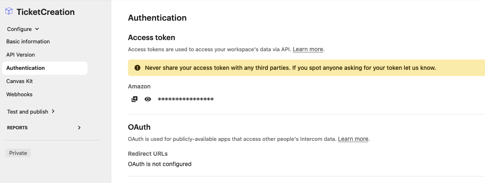
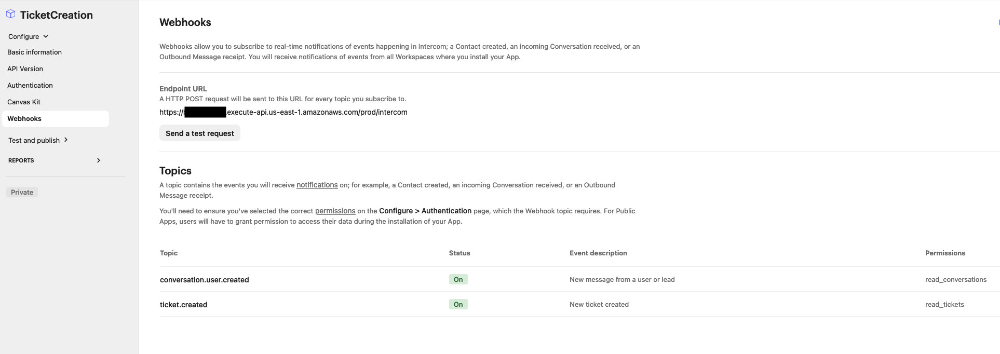
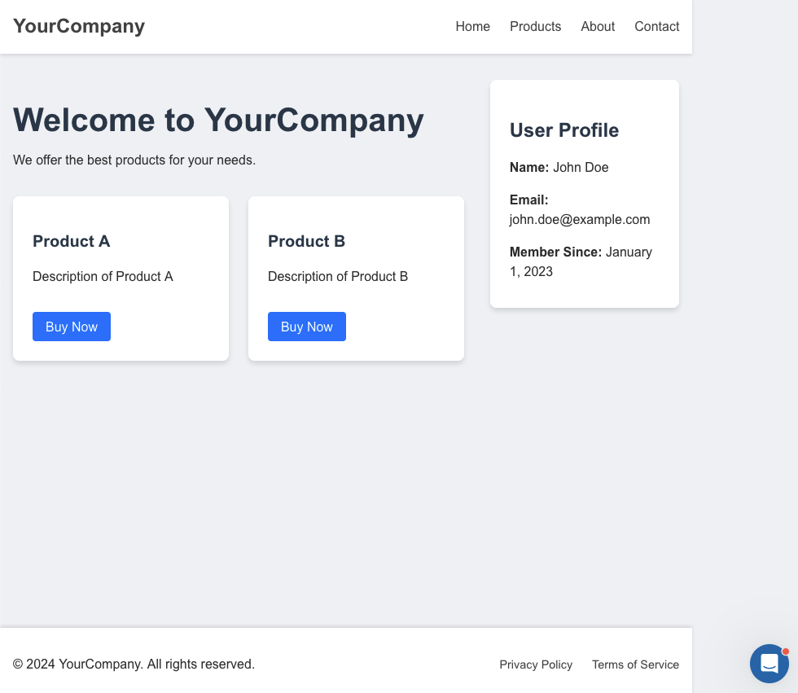
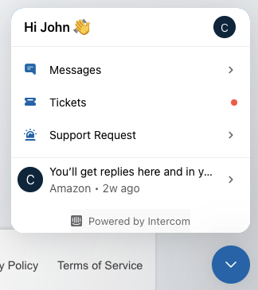
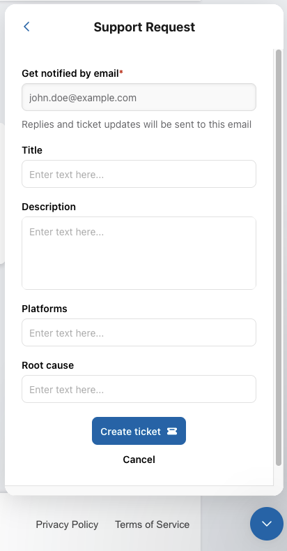
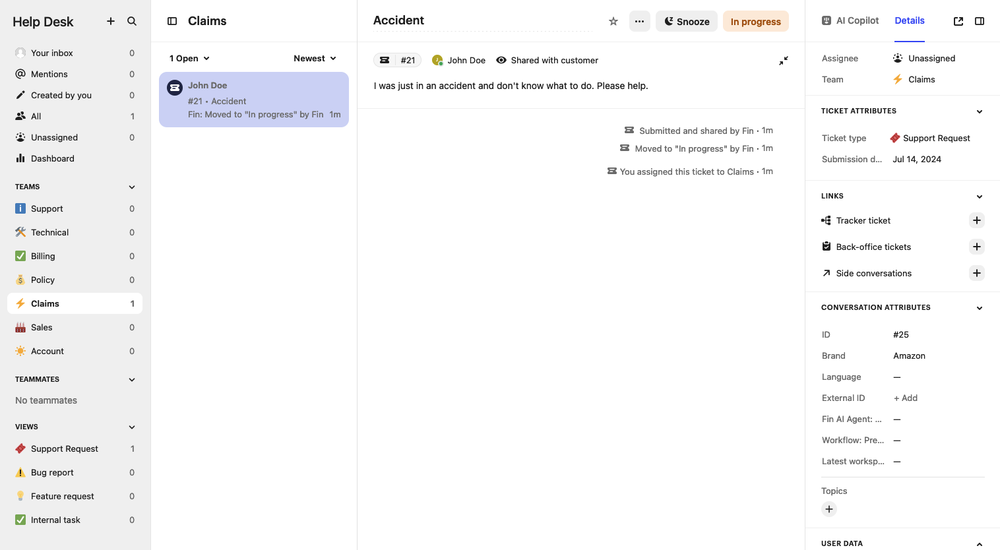

# Intercom Ticket Classification with Claude

In this demo, we will see how we can integrate Intercom with Amazon Bedrock to provide ticket classification using the Anthropic Claude model. Using Webhooks from Intercom, when a new ticket is created an AWS Lambda function will be invoked that will use Amazon Bedrock to classify the ticket. The same Lambda function will then make an API request to Intercom to update the ticket with the new ticket assignment.

## Overview


1. Ticket is created from the client
2. Webhook notification is sent to Amazon API Gateway with ticket information
3. Amazon API Gateway invokes AWS Lambda function
4. Request is made to Amazon Bedrock
5. Response is returned to AWS Lambda function
6. API Request is made to Intercom to update ticket

## Set up

In order to use this demo, you'll need to set up your Intercom application for use with WebHooks. This is a high level overview of the process.

1. Create a [development workspace](https://developers.intercom.com/docs/build-an-integration/getting-started) in Intercom
2. Access the [developer hub](https://app.intercom.com/a/apps/_/developer-hub)
3. Create a new app
4. Copy the access token from Authentication
5. Create `.env` file and configure with `INTERCOM_API_TOKEN=` and the access token to the `.env` file
6. Deploy the CDK
7. Copy the `APIGatewayURL` from the CDK output
8. Add the APIGatewayURL to the Webhook in Intercom
9. Add relevant topics
10. Create teams
11. Copy App ID
12. Create `intercom-client/.env` and configure with `VITE_INTERCOM_APP_ID=` App ID
13. Start local client

### Intercom Configuration

To use this demo, you'll need to configure Intercom to send notification to the Amazon API Gateway. To do this, you will need to create an App in Intercom. This will be done through the [developer hub](https://app.intercom.com/a/apps/_/developer-hub). Once you have created the App, copy the access token generated. This will be used by the AWS Lambda function when making requests. We will update this using AWS Secrets Manager during the deployment.



### CDK Deployment

This demo will deploy several resources within your AWS account. In order to deploy this CDK, you should have the following:

- [Yarn](https://yarnpkg.com/getting-started/install) installed
- AWS CLI [installed](https://docs.aws.amazon.com/cli/latest/userguide/getting-started-install.html) and [configured](https://docs.aws.amazon.com/cli/latest/userguide/cli-chap-configure.html)
- [Claude Haiku access](https://docs.aws.amazon.com/bedrock/latest/userguide/model-access.html) in Bedrock

To deploy:

Create a `.env` file and add your access token.

```
INTERCOM_API_TOKEN="xxxxxxxxxxx"
```

Then, launch the CDK.

```
yarn launch
```

Once deployed, take note of the `IntercomIntegration.APIGatewayURL`. This will be used to configure the Webhooks within Intercom.

### Back to Intercom

#### Webhook Configuration

In your app, add the URL to the Webhooks section. When configured with Topics, notifications will be sent to this target and consumed by our AWS Lambda function for processing.



Add the `ticket.created` topic to this Webhook. Other topics can be added for additional processing.

To secure the Amazon API Gateway, we will restrict access to the API Gateway to only the [Intercom IP addresses](https://developers.intercom.com/docs/webhooks#which-ip-addresses-should-i-add-to-my-allowlist-for-intercom-webhooks) in the CDK deployment.

```typescript
      policy: new PolicyDocument({
        statements: [
          new PolicyStatement({
            principals: [new AnyPrincipal()],
            actions: ['execute-api:Invoke'],
            resources: ['execute-api:/*/*/*'],
            effect: Effect.ALLOW,
          }),
          new PolicyStatement({
            principals: [new AnyPrincipal()],
            actions: ['execute-api:Invoke'],
            resources: ['execute-api:/*/*/*'],
            conditions: {
              NotIpAddress: {
                'aws:SourceIp': [
                  '34.231.68.152/32',
                  '34.197.76.213/32',
                  '35.171.78.91/32',
                  '35.169.138.21/32',
                  '52.70.27.159/32',
                  '52.44.63.161/32',
                ],
              },
            },
            effect: Effect.DENY,
          }),
        ],
      }),
```

#### Add Teams

Add [several teams](https://app.intercom.com/a/apps/_/settings/helpdesk/teams) to your Intercom account. These are the potential teams that a ticket will be routed to. In this example, we are using the following teams to simulate an insurance company:

```
Account
Billing
Claims
Policy
Sales
Support
Technical
```


#### Workspace App

In the [General](https://app.intercom.com/a/apps/_/settings/workspace/general) section of your workspace, copy the App ID that is being used.


### Client Configuration

With this App ID, we will finally configure the client to use this App ID.

Create and configure the `./intercom-client/.env` file with this App ID:

```
VITE_INTERCOM_APP_ID='xxxxxx'
```

### Launch Client

```
cd intercom-client
yarn dev
```

## Integration in Action

Once everything is deployed and configured, we can see the integration in action. After starting the client, navigate to `http://localhost:5173/`



You should see the Intercom chat widget in the lower right corner.



Open that widget so we can create a Support Request.



Enter a Title and Description for the request.

For example:

```
Title: Accident
Description: I was just in an accident and don't know what to do. Please help.
```

When this request is submitted, it will initially be `Unassigned`. However, we want to automatically assign this ticket to the correct team. After processing with Amazon Bedrock, this ticket will be assigned to the Claims team.



## How it works

In order to assign this ticket, we will be passing the request information from Intercom to our Lambda function. This is done through Webhooks from Intercom.

The notification will look something like this:

```json
{
  "type": "notification_event",
  "app_id": "xxxxxx",
  "data": {
    "type": "notification_event_data",
    "item": {
      "type": "ticket",
      "id": "25",
      "ticket_id": "21",
      "ticket_attributes": {
        "_default_title_": "Accident",
        "_default_description_": "I was just in an accident and don't know what to do.  Please help.  ",
        "Platforms": null,
        "Root cause": null
      }
    }
  }
}
```

In order to route this to the correct team, we need to know what teams and admins are available. We will query Intercom for this information and use it when we're updating the ticket.

```typescript
const response = await fetch('https://api.intercom.io/teams', {
  method: 'GET',
  headers: {
    'Intercom-Version': '2.11',
    'Authorization': `Bearer ${intercomToken}`,
  },
});

const response = await fetch('https://api.intercom.io/admins', {
  method: 'GET',
  headers: {
    'Intercom-Version': '2.11',
    'Authorization': `Bearer ${intercomToken}`,
  },
});
```

### Classify

To classify the ticket correctly, we will create a [multi-shot example prompt](https://docs.anthropic.com/en/docs/build-with-claude/prompt-engineering/multishot-prompting#example-analyzing-customer-feedback) to help Claude route it to the correct team using labeled categories.

```typescript
const categories = `<category> 
    <label>Billing Inquiries</label>
    <content> Questions about invoices, charges, fees, and premiums Requests for clarification on billing statements Inquiries about payment methods and due dates 
    </content> 
</category> 
<category> 
    <label>Policy Administration</label>
    <content> Requests for policy changes, updates, or cancellations Questions about policy renewals and reinstatements Inquiries about adding or removing coverage options 
    </content> 
</category> 
<category> 
    <label>Claims Assistance</label> 
    <content> Questions about the claims process and filing procedures Requests for help with submitting claim documentation Inquiries about claim status and payout timelines 
    </content> 
</category> 
<category> 
    <label>Coverage Explanations</label> 
    <content> Questions about what is covered under specific policy types Requests for clarification on coverage limits and exclusions Inquiries about deductibles and out-of-pocket expenses 
    </content> 
</category> 
<category> 
    <label>Quotes and Proposals</label> 
    <content> Requests for new policy quotes and price comparisons Questions about available discounts and bundling options Inquiries about switching from another insurer 
    </content> 
</category> 
<category> 
    <label>Account Management</label> 
    <content> Requests for login credentials or password resets Questions about online account features and functionality Inquiries about updating contact or personal information 
    </content> 
</category> 
<category> 
    <label>Billing Disputes</label> 
    <content> Complaints about unexpected or incorrect charges Requests for refunds or premium adjustments Inquiries about late fees or collection notices 
    </content> 
</category> 
<category> 
    <label>Claims Disputes</label> 
    <content> Complaints about denied or underpaid claims Requests for reconsideration of claim decisions Inquiries about appealing a claim outcome 
    </content> 
</category> 
<category> 
    <label>Policy Comparisons</label> 
    <content> Questions about the differences between policy options Requests for help deciding between coverage levels Inquiries about how policies compare to competitors' offerings 
    </content> 
</category> 
<category> 
    <label>General Inquiries</label> 
    <content> Questions about company contact information or hours of operation Requests for general information about products or services Inquiries that don't fit neatly into other categories 
    </content> 
</category>`;

export async function classifyTicket(ticketContent: string): Promise<string> {
  const prompt = `
    You will classify a customer support ticket into one of the following categories:
    <categories>
        ${categories}
    </categories>

    Here is the customer support ticket:
    <ticket>
        ${ticketContent}
    </ticket>

    Respond with just the label of the category between category tags.
  `;

  return invokeBedrock(prompt);
}

export async function invokeBedrock(prompt: string): Promise<string> {
  const params = {
    modelId: BEDROCK_MODEL_ID,
    contentType: 'application/json',
    accept: 'application/json',
    body: JSON.stringify({
      anthropic_version: 'bedrock-2023-05-31',
      max_tokens: 4096,
      messages: [
        { role: 'user', content: prompt },
        { role: 'assistant', content: '<category>' },
      ],
      temperature: 0,
      top_p: 1,
      stop_sequences: ['</category>'],
    }),
  };

  try {
    const command = new InvokeModelCommand(params);
    const response = await bedrockClient.send(command);

    const responseBody = JSON.parse(new TextDecoder().decode(response.body));
    return responseBody.content[0].text.trim();
  } catch (error) {
    console.error('Error invoking Bedrock:', error);
    throw error;
  }
}
```

When this prompt passed to Bedrock, Claude Haiku will be used to classify the ticket using one of the available teams. This classification could be further enhanced with RAG to provide even more context to Claude. In this simple example, we will use just these examples.

Once classified, an API request is made to Intercom to update the ticket with the new assignee.

```typescript
const response = await fetch(`https://api.intercom.io/tickets/${ticketId}`, {
  method: 'PUT',
  headers: {
    'Content-Type': 'application/json',
    'Accept': 'application/json',
    'Intercom-Version': '2.11',
    'Authorization': `Bearer ${intercomToken}`,
  },
  body: JSON.stringify({
    assignment: {
      admin_id: selectedAdmin.id,
      assignee_id: assigneeId,
    },
    state: 'in_progress',
  }),
});
```

## Clean up

To remove the AWS resources deployed as part of this demo:

```
yarn cdk destroy
```
