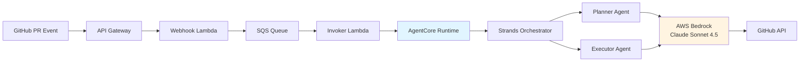

# GitHub PR Review Agent with Claude Agent SDK

> Proof-of-concept demonstrating Claude Agent SDK integration with AWS Bedrock AgentCore

## Overview

This is a GitHub PR review agent that demonstrates how to integrate Claude Agent SDK with AWS Bedrock AgentCore. When a pull request is opened, the agent analyzes the code changes and posts review comments to GitHub using Claude Sonnet 4.5.

### What It Does

When you create a pull request:

1. GitHub triggers a WebHook to an API Gateway
2. An Invoker Lambda triggers the AgentCore Runtime agent
3. Fetches PR diff from GitHub
4. Analyzes code changes using Claude
5. Posts review comments to the PR


### Key Components

This implementation uses Claude Agent SDK with the Strands orchestration pattern, running on AWS Bedrock AgentCore. The infrastructure follows an event-driven architecture with Lambda functions, SQS for message queuing, and DynamoDB for state tracking. Observability is provided through OpenTelemetry tracing and CloudWatch logs. All infrastructure is deployed using AWS CDK.

## Architecture

### High-Level System Design



### Component Overview

| Component | Technology | Purpose |
|-----------|-----------|---------|
| **AI Model** | Claude Sonnet 4.5 (AWS Bedrock) | LLM for code analysis and review |
| **Agent Framework** | Claude Agent SDK + Strands orchestration | Multi-agent coordination |
| **Runtime** | AWS Bedrock AgentCore (managed containers) | Scalable agent execution |
| **Language** | Python 3.12 (FastAPI) | Agent implementation |
| **Infrastructure** | AWS CDK (TypeScript) | Infrastructure as Code |
| **Observability** | OpenTelemetry + CloudWatch + X-Ray | Full stack tracing |
| **Architecture** | Event-driven serverless | Scalable, reliable processing |

## How It Works

### Strands Planner-Executor Pattern

The agent uses a planner-executor pattern to break the review into discrete steps:

1. Planner agent creates a step-by-step review plan
2. Executor agents run each step individually
3. Strands orchestrator coordinates the workflow

This approach helps manage Claude's context window and keeping it on task by enforcing a strict "one task per execution" model.  

### Event-Driven Workflow

The system uses standard AWS event-driven patterns. When a PR is opened, a GitHub webhook triggers the workflow. Messages are queued in an SQS FIFO queue to handle ordering, and Lambda functions orchestrate the execution. DynamoDB tracks workflow state as it progresses from PENDING to RUNNING to COMPLETED. EventBridge Scheduler provides a retry mechanism for long-running workflows.

### Key Design Decisions

**FastAPI Background Tasks**: The agent returns HTTP 200 immediately, then continues work in background. This prevents Lambda timeout issues.

**Security Hooks**: PreToolUse hooks restrict commands to `gh` CLI only.

**OpenTelemetry**: Auto-instrumentation provides observability via CloudWatch Logs and X-Ray.

## Quick Start

### Prerequisites

- **AWS Account** with Bedrock access to Claude Sonnet 4.5
- **AWS CLI** configured with appropriate credentials
- **Node.js 18+** and npm (for CDK)
- **Docker** (for local testing)
- **GitHub Personal Access Token** (with `repo` scope)

### Deployment Steps

#### 1. Clone and Configure

```bash
git clone https://github.com/aws-samples/anthropic-on-aws.git
cd aws-samples/claude-agent-sdk-on-agentcore
```

#### 2. Store GitHub Token in Secrets Manager

```bash
aws secretsmanager create-secret \
  --name github-agent-token \
  --secret-string '{"github_token":"your_github_personal_access_token"}' \
  --region us-east-1
```

Make note of the secret ARN from the output—you'll need it for the next step.

#### 3. Deploy Infrastructure with CDK

```bash
cd infrastructure
npm install

# Deploy the stack
npm run cdk deploy
```

This deploys the complete infrastructure including AgentCore Runtime with the Docker image, API Gateway with Lambda webhook handler, SQS FIFO queue for workflow orchestration, DynamoDB table for state tracking, IAM roles, CloudWatch log groups with X-Ray tracing, and EventBridge Scheduler for retry handling.

CDK will output important values:

```
Outputs:
GithubAgentStack.WebhookUrl = https://xxxxx.execute-api.us-east-1.amazonaws.com/prod/webhook
GithubAgentStack.RuntimeId = github_pr_review_agent-xxxxx
GithubAgentStack.WorkflowTableName = GithubAgentStack-WorkflowStateTable-xxxxx
```

#### 4. Enable AgentCore Tracing

After CDK deployment completes:

1. Open the **AWS Bedrock console**
2. Navigate to **AgentCore → Runtimes**
3. Select your runtime (look for `github_pr_review_agent-*`)
5. Scroll to **Tracing** section
6. Enable tracing*

Without this step, logs won't appear in CloudWatch and you won't be able to monitor agent execution.

#### 5. Configure GitHub Webhook

1. Go to your GitHub repository → **Settings** → **Webhooks**
2. Click **Add webhook**
3. Configure the webhook:
   - **Payload URL**: Use the `WebhookUrl` from CDK outputs
   - **Content type**: `application/json`
   - **Secret**: (optional) for webhook signature verification
   - **Events**: Select **Pull requests** only
   - **Active**: Check this box
4. Click **Add webhook**

GitHub will send a ping event to verify the webhook is working.

#### 6. Test the Agent

Create a test pull request in your repository:

```bash
# In your repo
git checkout -b test-agent-review
echo "// Test change" >> README.md
git add README.md
git commit -m "Test: Agent review"
git push origin test-agent-review

# Create PR via GitHub web UI or gh CLI
gh pr create --title "Test Agent Review" --body "Testing the autonomous review agent"
```

**Monitor execution in real-time**:

```bash
# Replace RUNTIME_ID with value from CDK outputs
aws logs tail /aws/bedrock-agentcore/runtimes/<RUNTIME_ID>-DEFAULT --follow
```

You should see the webhook being received, the workflow created, the agent invoked via AgentCore, the planner creating a review plan, executors running each step, and finally the review being posted to the GitHub PR.

## Monitoring & Operations

### View Agent Logs

**Real-time logs**:
```bash
aws logs tail /aws/bedrock-agentcore/runtimes/<RUNTIME_ID>-DEFAULT --follow
```

**Recent logs** (last 1 hour):
```bash
aws logs tail /aws/bedrock-agentcore/runtimes/<RUNTIME_ID>-DEFAULT --since 1h
```

**Filter for errors**:
```bash
aws logs tail /aws/bedrock-agentcore/runtimes/<RUNTIME_ID>-DEFAULT \
  --since 30m --format short | grep -i error
```

### Check Workflow State

Query DynamoDB to see workflow status:

```bash
# Get specific workflow
aws dynamodb get-item \
  --table-name <WORKFLOW_TABLE_NAME> \
  --key '{"workflow_id": {"S": "your-workflow-id"}}'

# Scan recent workflows
aws dynamodb scan \
  --table-name <WORKFLOW_TABLE_NAME> \
  --limit 10
```

## Project Structure

```
claude-agent-sdk-on-agentcore/
├── agent/                           # Agent Docker container
│   ├── Dockerfile                   # ARM64 Python 3.12 with Claude CLI
│   ├── requirements.txt             # Python dependencies
│   ├── src/
│   │   ├── agent.py                # Main entry point (74 lines)
│   │   ├── api/                    # FastAPI routes and models
│   │   ├── orchestration/          # Strands planner-executor pattern
│   │   ├── workflows/              # PR review workflow logic
│   │   ├── core/                   # Config and logging setup
│   │   └── utils/                  # AWS clients, security, tracing
│   └── .claude/
│       └── skills/                 # Agent skills (PR review instructions)
│
├── infrastructure/                  # AWS CDK infrastructure
│   ├── src/
│   │   ├── constructs/
│   │   │   ├── agentcore-construct.ts     # AgentCore runtime
│   │   │   ├── webhook-construct.ts       # GitHub webhook handler
│   │   │   └── observability-construct.ts # Logs and tracing
│   │   ├── lambda/                        # Lambda function code
│   │   └── stacks/                        # CDK stack definitions
│   ├── package.json
│   └── cdk.json
│
├── README.md                        # This file
└── ARCHITECTURE.md                  # Technical deep dive
```

### Key Files

**Agent Container**:
- `agent/src/agent.py` - Main entry point with FastAPI server
- `agent/src/orchestration/orchestrator.py` - Strands coordinator
- `agent/src/orchestration/planner.py` - Creates review plans
- `agent/src/orchestration/executor.py` - Executes review steps
- `agent/src/workflows/pr_review.py` - PR review workflow logic
- `agent/.claude/skills/code-review/SKILL.md` - Review instructions for Claude

**Infrastructure**:
- `infrastructure/src/constructs/agentcore-construct.ts` - AgentCore runtime setup
- `infrastructure/src/constructs/webhook-construct.ts` - GitHub webhook handler
- `infrastructure/src/lambda/webhook-handler/index.py` - Webhook ingestion Lambda
- `infrastructure/src/lambda/invoker/index.py` - AgentCore invocation Lambda

## Security Hooks Implementation

The agent uses PreToolUse hooks to enforce security:

```python
def bash_security_hook(context):
    """Only allow 'gh' CLI commands for GitHub API access."""
    command = context.tool_input.get('command', '')

    # Block all commands except 'gh'
    if not command.strip().startswith('gh '):
        raise PermissionError(f"Command blocked by security policy: {command}")

    return True  # Allow gh commands
```

This enables autonomous operation while preventing arbitrary code execution, file system manipulation outside the workspace, and network access to non-GitHub endpoints.

