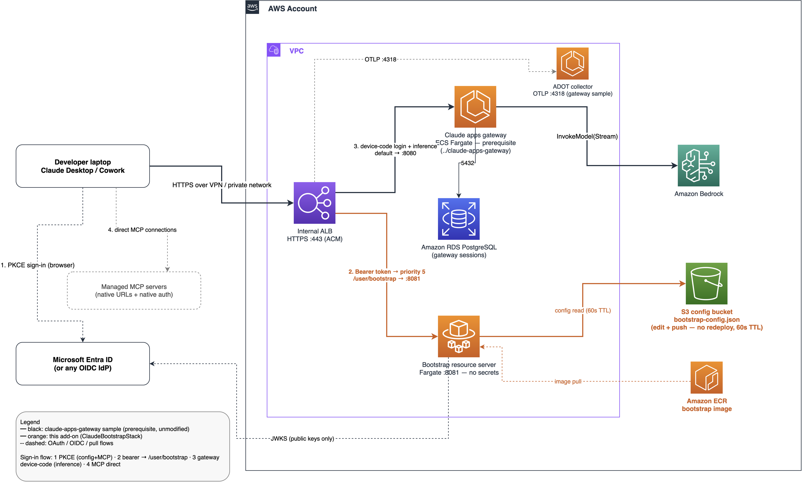

# Bootstrap add-on for the Claude apps gateway

> **Sample code — a documented add-on to [`../claude-apps-gateway`](../claude-apps-gateway).**
> Deploy that sample first; this directory adds ONE stack behind its existing ALB.
> Expect parts of this capability to be superseded as the Anthropic-native product
> evolves — see [Workarounds and expected supersession](#workarounds-and-expected-supersession).

The [`claude-apps-gateway`](../claude-apps-gateway) sample gives your organization
SSO-gated Claude **inference** on Amazon Bedrock. This add-on supplies the second half of
an enterprise **Claude Desktop** rollout: **per-user configuration delivery** — models,
surface toggles, egress allowlists, and an organization-managed **MCP server fleet**
(including the built-in Microsoft 365 connector) — served from a single JSON object in S3
that you can change at any time **without redeploying anything**.

It is a [bootstrap server](https://claude.com/docs/third-party/claude-desktop/bootstrap)
in **PKCE mode**: Claude Desktop signs in to your IdP directly (authorization-code +
PKCE), presents the access token to `GET /user/bootstrap`, and receives its configuration
overlay. PKCE mode lifts the platform's origin-pinning, so managed MCP servers are
delivered with their **native cross-origin URLs and native auth** — no reverse-proxying.



```
Sign-in flow:
(1) Entra PKCE sign-in ──▶ IdP            (configuration + MCP identity)
(2) Bearer token ──▶ /user/bootstrap      (this add-on serves the config overlay from S3)
(3) gateway device-code sign-in           (inference — the gateway sample, unchanged)
(4) direct MCP connections                (native URLs + native auth from the config)
```

**Works against your existing gateway.** The add-on consumes a deployed
`ClaudeGatewayStack` through its CloudFormation outputs; your gateway deployment is not
modified. Inference, sessions, and telemetry remain the gateway's concern. Users sign in
twice at launch — Entra PKCE for configuration and MCP, the gateway's device-code flow
for inference — with the same identity.

## What you deploy

| Piece | What it is |
| --- | --- |
| `BootstrapStack` (CDK) | Fargate service (no secrets — validates tokens against the IdP's public JWKS) + S3 config bucket + one listener rule (`/user/bootstrap`) on the gateway's existing ALB |
| `bootstrap/` | The Node resource server (~200 lines) and its Dockerfile |
| `bootstrap-config.example.json` | The S3 configuration object: models, governance keys, managed MCP fleet |

## Prerequisites

- A deployed [`../claude-apps-gateway`](../claude-apps-gateway) `ClaudeGatewayStack`
  (Entra ID walkthrough below; any OIDC IdP that issues JWKS-verifiable access tokens works).
- Note these values from that deployment:

| Context key | Where to get it |
| --- | --- |
| `publicUrl` | `PublicUrl` stack output |
| `vpcId` | The VPC the stack created (or the `vpcId` you passed it) |
| `albSgId` | The ALB's security group (EC2 console, or `describe-load-balancers`) |
| `listenerArn` | One lookup from the `AlbDnsName` output: |

```bash
ALB_ARN=$(aws elbv2 describe-load-balancers \
  --query "LoadBalancers[?DNSName=='<AlbDnsName output>'].LoadBalancerArn" --output text)
aws elbv2 describe-listeners --load-balancer-arn "$ALB_ARN" \
  --query "Listeners[?Port==\`443\`].ListenerArn" --output text
```

- Client: Claude Desktop **1.19367.0 or later**.
- Locally: Node 20+, AWS CLI v2, `az` CLI for the Entra steps. Docker is not required:
  the container image builds on AWS CodeBuild.

## Step 1 — Entra ID app registration (desktop PKCE public client)

The desktop app needs its own **public client** registration (distinct from the gateway's
confidential client). Each omission below produces a specific `AADSTS` error at sign-in,
so follow exactly:

```bash
az ad app create --display-name "Claude Desktop PKCE" --sign-in-audience AzureADMyOrg \
  --is-fallback-public-client true \
  --public-client-redirect-uris \
    "http://localhost:8990/callback" "http://127.0.0.1:8990/callback" \
    "http://localhost:8990"          "http://127.0.0.1:8990"
APP=<appId>; OBJ=$(az ad app show --id $APP --query id -o tsv)

# Expose an API + delegated scope, and require v2 access tokens (aud = bare GUID).
# Without this: AADSTS650057 "Invalid resource" at sign-in.
SCOPE=$(python3 -c "import uuid; print(uuid.uuid4())")
az rest --method PATCH --url "https://graph.microsoft.com/v1.0/applications/$OBJ" --body "{
  \"identifierUris\": [\"api://$APP\"],
  \"api\": {\"requestedAccessTokenVersion\": 2,
    \"oauth2PermissionScopes\": [{\"id\": \"$SCOPE\", \"value\": \"access_as_user\",
      \"type\": \"User\", \"isEnabled\": true,
      \"adminConsentDisplayName\": \"Access bootstrap\", \"adminConsentDescription\": \"Fetch per-user Claude config\",
      \"userConsentDisplayName\": \"Access bootstrap\", \"userConsentDescription\": \"Fetch your Claude config\"}]}}"

# Pre-authorize itself (no consent prompt), then create the service principal
# (without it: AADSTS650052 "lacks a service principal").
az rest --method PATCH --url "https://graph.microsoft.com/v1.0/applications/$OBJ" --body "{
  \"api\": {\"preAuthorizedApplications\": [{\"appId\": \"$APP\", \"delegatedPermissionIds\": [\"$SCOPE\"]}]}}"
az ad sp create --id $APP
```

Three details matter: redirect URIs **must include the `/callback` path** (bare host →
AADSTS50011); the client profile's scope uses the **bare GUID** form `<appId>/.default`,
*not* `api://<appId>/.default`; and `requestedAccessTokenVersion: 2` makes the token
audience the bare GUID this server validates.

**Optional — built-in Microsoft 365 connector.** To deliver Desktop's built-in M365
connector through the config, register one more public client with **both platform broker
redirect URIs** (the connector signs in via the OS account broker; each platform uses a
different URI, and the Windows one embeds the client id):

```bash
az ad app create --display-name "Claude M365 Connector" --sign-in-audience AzureADMyOrg \
  --is-fallback-public-client true
APP=<appId>; OBJ=$(az ad app show --id $APP --query id -o tsv)
az rest --method PATCH --url "https://graph.microsoft.com/v1.0/applications/$OBJ" --body "{
  \"publicClient\": {\"redirectUris\": [
    \"http://localhost\",
    \"msauth.com.anthropic.claudefordesktop://auth\",
    \"ms-appx-web://Microsoft.AAD.BrokerPlugin/$APP\",
    \"https://login.microsoftonline.com/common/oauth2/nativeclient\"]}}"
az ad sp create --id $APP
# Grant delegated Graph permissions matching the connector's scope (e.g. Mail.Read)
# in the Entra portal -> API permissions.
```

A missing broker URI surfaces as **AADSTS50011** at connector sign-in on that platform.

## Step 2 — Deploy

**Recommended: the deploy script.** It deploys the stack, builds the container image on
AWS CodeBuild (no Docker required on your machine), and starts the service:

```bash
cd cdk && npm ci && cd ..
cp .env.example .env    # fill in the gateway-output values from Prerequisites
./scripts/deploy.sh
```

The script creates the ECR repository, builds and pushes the image via CodeBuild, then
deploys the service and listener rule. On first run it also creates a CodeBuild project
and an S3 staging bucket (`claude-bootstrap-build-<account>`); these are reused on later
runs and are not removed by `cdk destroy` — delete them separately when tearing down.

**Alternative: build the image yourself with Docker.** If you prefer to run the build
locally, deploy the repository first, push your image, then deploy the service:

```bash
cd cdk
npx cdk deploy ClaudeBootstrapStack -c imageReady=false -c region=<region>
# note the EcrRepositoryUri output, then:
cd ../bootstrap
aws ecr get-login-password --region <region> | docker login --username AWS --password-stdin <account>.dkr.ecr.<region>.amazonaws.com
docker build --platform linux/amd64 -t <EcrRepositoryUri>:latest .
docker push <EcrRepositoryUri>:latest
cd ../cdk
npx cdk deploy ClaudeBootstrapStack \
  -c region=<region> \
  -c publicUrl=https://<your-gateway-host> \
  -c listenerArn=<from prerequisites> \
  -c albSgId=<from prerequisites> \
  -c vpcId=<from prerequisites> \
  -c entraTenantId=<tenant guid> \
  -c desktopClientId=<App id from step 1>
```

### Restricting who receives configuration

Validating the sign-in token proves who the caller is; it does not prove they are
entitled to a configuration. By default this server returns a configuration to **every
valid token from your tenant** — appropriate only when tenant membership is itself the
entitlement boundary (for example, a single-team pilot).

To restrict delivery, set one or both variables (comma-separated) in `.env` — entitled
callers receive their configuration; valid-but-unentitled callers receive `403`:

| Variable | Matched against | Entra setup |
| --- | --- | --- |
| `REQUIRED_ROLES` | The token's `roles` claim | Define an app role on the Step 1 registration (for example `bootstrap-user`) and assign users or groups under **Enterprise applications → Users and groups** |
| `REQUIRED_GROUPS` | The token's `groups` claim (group object IDs) | Enable the groups claim under **App registration → Token configuration** |

Entra emits neither claim by default, so complete the corresponding setup — a
required-roles or required-groups gate denies callers whose token lacks the claim. App
roles are the cleaner mechanism: assignment is managed per-application, and moving a
user in or out takes effect at their next sign-in without touching group structure.

## Step 3 — Publish the client configuration

```bash
cp bootstrap/config/bootstrap-config.example.json bootstrap-config.json
# edit: your models, governance keys, managed MCP servers (start with none)
aws s3 cp bootstrap-config.json s3://<ConfigBucketName output>/bootstrap-config.json
```

This object is the **live client configuration** — the service re-reads it on a 60-second
TTL. Every later change (add an MCP server, flip a governance key, change the model list)
is an S3 push + client relaunch. **No redeploys.**

Three managed-MCP entry shapes are supported (see the example file):
**no-auth remote** (plain `url`), **OAuth remote** (`oauth` block — the client runs its own
code+loopback flow against your IdP; note some IdPs reject the RFC 8707 `resource`
parameter the client sends — Cognito works, Entra does not), and **built-in**
(`server: "microsoft365"` + tenant/client IDs from step 1).

> `inferenceModels` here controls only the Desktop **picker** — the gateway still
> enforces model access server-side. See
> [Configuration model](#configuration-model-gateway-vs-bootstrap--who-owns-what)
> for how the two files divide ownership.

## Step 4 — Wire a client

Generate the import file:

```bash
./scripts/wire-client.sh <gateway-host> <entra-tenant-id> <desktop-client-id>
```

This writes `~/claude-bootstrap-import.json`. On Windows, create the same JSON at
`%USERPROFILE%\claude-bootstrap-import.json`, or deliver the same keys as REG_SZ values
under `HKLM\SOFTWARE\Policies\Claude` via Intune/GPO:

```json
{
  "bootstrapUrl": "https://<your-gateway-host>/user/bootstrap",
  "bootstrapOidc": {
    "clientId": "<App id from step 1>",
    "issuer": "https://login.microsoftonline.com/<tenant-id>/v2.0",
    "scopes": "openid offline_access <App id>/.default",
    "redirectPort": 8990
  }
}
```

In Claude Desktop: **Settings → Developer → Configure third-party inference → Import** the
file. At launch the app performs the Entra PKCE sign-in (configuration + MCP), then the
gateway's own device-code sign-in (inference).

Verify: `Help → Troubleshooting → Copy Managed Configuration Report` shows the bootstrap
source; the app log shows `bootstrap supplied config overlay { fields: [...] }`.

## Telemetry

The gateway sample already runs an ADOT collector behind its ALB (`OtelForwardTo` output,
`https://<gateway-host>:4318`). To collect Desktop/Cowork telemetry into the same
collector, set in the S3 config:

```json
"otlpEndpoint": "https://<your-gateway-host>:4318",
"otlpProtocol": "http/protobuf"
```

## Org plugins and skills (optional)

Organization plugins (skills, slash commands, agents packaged for every user) are
delivered through the filesystem: your MDM or software-distribution tool places plugin
bundles in a directory on each device. (Network plugin delivery is not available in
PKCE mode.)

| Platform | Directory |
| --- | --- |
| macOS | `/Library/Application Support/Claude/org-plugins/` |
| Windows | `C:\Program Files\Claude\org-plugins\` |

Each plugin is one subdirectory with a `.claude-plugin/plugin.json` manifest plus its
`skills/` / `commands/` / `agents/` content, e.g.:

```
org-plugins/
└── incident-runbook/
    ├── .claude-plugin/plugin.json     {"name":"incident-runbook","version":"1.0.0", ...}
    └── skills/
        └── triage-report/SKILL.md
```

The app scans the directory at launch; users see the skills immediately (`/skill-name`
in chat, or auto-invoked when relevant). To update a plugin, replace its directory and
bump the manifest `version` so the app re-syncs. Plan plugin rollouts like software
pushes: plugin content is delivered by MDM, while configuration changes flow through S3.

## Configuration model: gateway vs. bootstrap — who owns what

Some concerns appear in **both** the gateway's `gateway.yaml` and this S3 object — most
visibly models. They are not merged and they are not a union; they sit at **different
layers**:

- **`gateway.yaml` is the enforcement layer** (the *inference contract*). Its `models:`
  block defines which model ids exist and how each routes to a Bedrock inference profile;
  `managed.policies.availableModels` gates them per user group, **enforced server-side**
  at `/v1/messages`. Changing any of it means rebuilding/redeploying the gateway image —
  deliberately, since this is the security contract.
- **The S3 bootstrap object is the presentation layer** (the *client experience*). Its
  `inferenceModels` controls only which models appear in the Desktop **picker** — it
  grants nothing. Surface toggles, MCP fleet, egress allowlist, and banner live here,
  and change at business speed (S3 push, 60s TTL, no redeploy).

The set a user can actually **use** is `gateway models ∩ gateway allowlist`; what they
**see** is the bootstrap list. Keep `inferenceModels ⊆` the gateway's allowlisted set:
a model listed here but not allowed by the gateway shows in the picker and then fails
with `400 ... not in your role's availableModels allowlist`; a model the gateway allows
but this file omits works but is hidden.

The same two-layer split applies to every concern that appears in both files:

| Concern | Gateway (`gateway.yaml`) — enforced | Bootstrap (S3) — client surface | Watch out |
| --- | --- | --- | --- |
| Models | `models:` + `managed.policies.availableModels` | `inferenceModels` (picker) | Keep bootstrap ⊆ gateway allowlist (above) |
| Tool governance | `managed.policies.cli.permissions` deny/allow rules — enforced for **Claude Code** sessions | `disabledBuiltinTools` / `builtinToolPolicy` / `coworkEgressAllowedHosts` — shape the **Desktop/Cowork** surface | Denying a tool in one layer does not touch the other surface; audit both when asked "is X disabled?" |
| Telemetry | `telemetry.forward_to` — the gateway **pushes** OTLP env to CLI clients | `otlpEndpoint`/`otlpProtocol`/`otlpHeaders` — point **Desktop/Cowork** at a collector | Two settings, usually the same collector URL; set only one and the other surface reports nothing |

**Similar-sounding, but different:**

- **Three OIDC configurations, two app registrations.** The gateway's `oidc:` block is a
  *confidential client* (its own app registration + secret, for the device-code flow);
  this add-on's `ENTRA_TENANT_ID`/`ENTRA_AUDIENCE` describe the *desktop public client*
  (step 1's registration) whose tokens it validates; the client-side `bootstrapOidc`
  names that same public client. Cross-wiring the two app ids produces
  `invalid_token`/AADSTS errors that look like auth outages.
- **Three "web search" switches, three mechanisms**: `coworkWebSearchEnabled` (the
  server-side Anthropic search tool in chat), `WebSearch` inside `disabledBuiltinTools`
  (the client-side built-in tool), and `deny: [WebSearch]` in the gateway's CLI
  permissions. On Bedrock all three are typically off, for the same reason (see
  Workarounds) — but they are independent controls.
- **Expiry knobs that share a word**: the gateway's `session.ttl_hours` is the inference
  session lifetime (your offboarding lever, ≤1h); this server's 60-second config TTL and
  the response `expiresAt` are config-freshness only. Tuning one does not affect the other.
- **Email-domain gating** lives on the gateway (`allowed_email_domains`, applied at
  inference sign-in). This server's boundary is single-tenant token validation (issuer +
  audience + signature) plus the optional group/role gate in Step 2.

## Day-2 operations

| Task | How |
| --- | --- |
| Change models / MCP fleet / governance keys | Edit S3 object → `aws s3 cp` → relaunch client (60s TTL) |
| Bootstrap server code change | Re-run `./scripts/deploy.sh` (rebuilds the image on CodeBuild and rolls the service) |
| User offboarding | Disable in the IdP — both the PKCE token and the gateway session expire |
| Roll back a bad config push | The bucket is versioned: `aws s3api get-object --version-id ...` |

## Troubleshooting

- **AADSTS650057 / 650052 / 50011 at Desktop sign-in** → Step 1 incomplete (expose API +
  v2 tokens / missing service principal / redirect URI without `/callback`).
- **AADSTS50011 at Microsoft 365 connector sign-in** → missing platform broker redirect
  URI (see step 1's optional block).
- **Bootstrap 401 `invalid_token`** → token-audience mismatch: confirm
  `requestedAccessTokenVersion: 2` and the bare-GUID `.default` scope.
- **Config change not appearing** → wait for the 60s TTL and fully relaunch the client;
  confirm with `Copy Managed Configuration Report`.
- **400 `model X is not in your role's availableModels allowlist`** → an
  `inferenceModels` id in the S3 config is not in the gateway's
  `managed.policies.availableModels`. The ids must match exactly; align this file to the
  gateway's allowlist.
- **Requests to the gateway hostname hang over AWS Client VPN** (TCP never connects,
  despite a correct `ingressCidr`) → also admit the **Client VPN endpoint's security
  group** on the gateway ALB SG (`aws ec2 authorize-security-group-ingress --group-id
  <alb-sg> --protocol tcp --port 443 --source-group <vpn-sg>`). Traffic entering via the
  VPN association ENI carries the VPN SG as its source, which a client-CIDR rule may not
  match.
- **S3 config edits appear to have no effect** → confirm the object key is exactly
  `bootstrap-config.json` (the key the service reads). If the key is absent the service
  silently falls back to the image-bundled default. The stack seeds the live key at
  deploy; `Copy Managed Configuration Report` in the app shows which config was served.
- **VPN connects but the bootstrap fetch times out** (small responses work, large ones
  hang) → MTU blackhole on the tunnel: the AWS VPN Client sets MTU 1500 on connect; if
  the underlying path passes less, TLS responses are silently dropped. Interim fix
  `sudo ifconfig <utun-if> mtu 1300` (macOS) /
  `netsh interface ipv4 set subinterface "<VPN adapter>" mtu=1300 store=persistent`
  (Windows); a persistent macOS clamp ships in [`scripts/macos/`](scripts/macos/).

## Workarounds and expected supersession

The items below reflect current platform behavior. Re-check them when you upgrade
Claude Desktop:

| Item | Why it exists | Superseded when |
| --- | --- | --- |
| Desktop **1.19367.0 or later** required | Earlier builds do not instantiate managed/built-in MCP entries delivered through a bootstrap response | Keep fleets at or above this version |
| `disabledBuiltinTools: ["WebSearch"]` + `coworkWebSearchEnabled: false` in the example config | Amazon Bedrock rejects the server-side `web_search_*` tool type (HTTP 400); disabling avoids failed attempts | Remove both keys when your inference provider supports server-side web search |
| PKCE mode (vs. device-code bootstrap) | Device-code mode origin-pins the response, so cross-origin MCP URLs would require reverse-proxying; PKCE mode delivers them natively | Revisit if the platform adds cross-origin MCP delivery to device-code mode |
| Org plugins delivered via filesystem ([Org plugins and skills](#org-plugins-and-skills-optional)) | Network plugin delivery (`organizationPluginsUrl`) is not available in PKCE mode | Revisit if the platform adds network plugin delivery to PKCE mode |

## Security

Posture notes for this add-on:

- The bootstrap task holds **no secrets**: PKCE-mode token validation uses the IdP's
  public JWKS + audience/issuer/expiry checks only.
- The service is reachable only through the gateway's internal ALB (same private-network
  posture as the gateway sample); its SG admits only the ALB.
- cdk-nag (AwsSolutions) runs on every synth; error-level findings fail the build unless
  acknowledged with a written justification at the construct.
- The S3 config is data, not code — review pushes to it like configuration change
  control, since it steers every client's tool surface and egress allowlist.

To report a security issue, see
[CONTRIBUTING](../CONTRIBUTING.md#security-issue-notifications).

## License

This library is licensed under the MIT-0 License. See the [LICENSE](../LICENSE) file.
