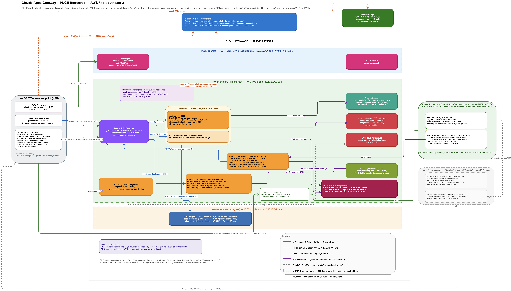

# Claude Apps Gateway + Bootstrap Server — As-Built Architecture

**Environment:** AWS account `<ACCOUNT_ID>`, region `ap-southeast-2` (Sydney)
**Primary endpoint:** `https://claude-gw.example.com`
**Document status:** As-built (reflects the deployed system)
**Audience:** Platform, security, and operations teams taking ownership of the deployment

> **This is a reference / sample deployment.** The account, region, domain, identity
> provider, and network path shown here are those of the sample build. They illustrate a
> working, production-shaped pattern that a company adopts by substituting its own
> equivalents — see **§7 Adapting this to a customer environment**. The *architecture and
> platform rules* are what carry over; the specific identifiers are examples.

---

## 1. Executive summary

This deployment lets an organization run **Claude Code** and **Claude Desktop (Cowork)** entirely on
its own AWS infrastructure, with:

- **Corporate single sign-on** — developers authenticate with the organization's Microsoft Entra ID.
  No API keys or cloud credentials are held on end-user machines.
- **Inference through Amazon Bedrock** — all model traffic is served by Anthropic models hosted in
  the customer's own Bedrock account and region, never leaving their AWS boundary.
- **Centrally governed models and settings** — the set of available models and client policy is
  defined once, server-side.
- **Organization-published skills and plugins** — a curated catalogue of capabilities is delivered to
  every signed-in Claude Desktop client automatically, replacing per-device MDM distribution.

Two cooperating services provide this:

| Service | Role |
| --- | --- |
| **Claude apps gateway** | The inference control plane. Runs its own device-code sign-in against Entra ID, holds the Bedrock credential, enforces model access and managed policy, and serves inference to Claude Code / Cowork. |
| **Bootstrap server** | An OAuth **resource server** (PKCE mode): Claude Desktop authenticates **directly to Entra ID** with its own public client (authorization-code + PKCE), then presents the Entra access token here to fetch its per-user configuration — models, egress policy, and the organization-managed MCP server fleet — validated against Entra's JWKS (`iss`/`aud`/`exp`). |

**Two sign-ins, one identity.** Claude Desktop performs an Entra PKCE sign-in for configuration and
MCP delivery, and the gateway's device-code sign-in for inference. Both authenticate the same Entra
user; the split is what allows managed MCP servers to live on **any origin** (see §7).

Both run as containers on **Amazon ECS Fargate** behind a single **internal Application Load
Balancer**, backed by **Amazon RDS for PostgreSQL**, and reachable only from inside the
organization's private network.

---

## 2. Access model — private network only

**End users reach the platform only from inside the organization's private network.** In this
deployment that private path is an **AWS Client VPN** endpoint; in a typical enterprise it would
instead be the **corporate LAN, an existing site-to-site VPN, SD-WAN, or a zero-trust / SASE access
layer**. The requirement is not "VPN" specifically — it is that the client machine can resolve and
reach the gateway over a **private IP address**. Any network path that satisfies that works
unchanged.

### 2.1 Why the endpoint must be private — the platform rule

Before Claude Code or Cowork connects to a gateway, the client performs a mandatory safety check: it
resolves the gateway's hostname and **requires every resolved IP address to be private** (RFC 1918
`10/8`, `172.16/12`, `192.168/16`; CGNAT `100.64/10`; IPv6 ULA `fc00::/7`; or loopback). If any
resolved address is public, the client refuses to connect.

This is a deliberate security control defined by the platform, not a configuration choice. A gateway
is a highly trusted component: it can push **managed settings** to every connected client, and those
settings can include commands that execute on the user's machine. Restricting gateways to private
addresses ensures a trusted-gateway relationship can only be formed with a service inside the
organization's own perimeter — one an external actor on the public internet cannot stand up and lure
users to.

Two consequences follow directly from this rule, and both are reflected in the build:

- **The load balancer is internal**, and the gateway hostname resolves (over the private network) to
  the load balancer's private IP addresses.
- **The load balancer is IPv4-only.** A dual-stack internal load balancer publishes public-range
  IPv6 (`AAAA`) records; because the client checks *every* resolved address, a single public IPv6
  answer would fail the check. IPv4-only avoids this entirely.

### 2.2 Trusted, browser-valid TLS on a private endpoint

Users see a normal, padlocked `https://` site with no certificate warnings, even though the endpoint
is private. This is achieved with **split-horizon DNS plus a publicly-issued certificate**:

- A **public AWS Certificate Manager (ACM) certificate** is issued for `claude-gw.example.com`.
  A public certificate authority attests only to control of the **domain name** — it does not require
  the server to be internet-reachable — so the certificate is trusted by every browser and OS out of
  the box. No private certificate authority, and no "trust this certificate" step on user machines.
- A **private DNS zone** of the same name resolves `claude-gw.example.com` to the load balancer's
  **private IP** for clients on the network. Publicly, that hostname is not published.

The result satisfies both platform constraints at once: a **browser-trusted certificate** (no
warnings) served on a **privately-resolving hostname** (passes the private-IP check).

---

## 3. Architecture overview

*(Editable source: `docs/architecture.drawio`)*

**Request flow, end to end:**

1. The user's machine joins the private network (Client VPN in this deployment) and resolves
   `claude-gw.example.com` to the internal load balancer's private IP via the private DNS zone.
2. The client opens the sign-in flow against the gateway. The gateway is the platform's OAuth
   authorization server; it **federates the browser sign-in to Microsoft Entra ID**. The user
   authenticates once with their corporate account.
3. The gateway issues the client a short-lived session token. From then on:
   - **Claude Code** sends inference requests to the gateway, which forwards them to **Amazon
     Bedrock** using the gateway's own credential and returns the response.
   - **Claude Desktop (Cowork)** additionally fetches its configuration from the **bootstrap server**
     (same hostname, path `/user/bootstrap`), which tells it to route inference through the gateway
     and where to find the organization plugin catalogue.
4. The bootstrap server serves the **organization plugin/skill catalogue**; Claude Desktop installs
   the published plugins automatically.

**One hostname, one sign-in.** The gateway and the bootstrap server are presented on the **same
origin** (`https://claude-gw.example.com`), separated by URL path at the load balancer. This is a
requirement of the platform: when Claude Desktop is configured this way, every URL it is handed
(inference endpoint, plugin catalogue) **must share the origin of the bootstrap URL**, or the client
discards it. Co-locating both services on one origin satisfies this and means the user signs in only
once — to the gateway — for both configuration and inference.

---

## 4. Component inventory (as-built)

### 4.1 Networking

| Component | Identifier / value | Notes |
| --- | --- | --- |
| VPC | *(created by the Network stack)* | CIDR `10.60.0.0/16`. No public ingress to any workload. |
| Public subnets | `10.60.0.0/24` (az-a), `10.60.1.0/24` (az-b) | Host only the NAT gateway and the Client VPN association. |
| Private subnets (with egress) | `10.60.4.0/22` (az-a), `10.60.8.0/22` (az-b) | Load balancer, Fargate services, build host. |
| Isolated subnets (no egress) | `10.60.12.0/24` (az-a), `10.60.13.0/24` (az-b) | Database only. |
| NAT gateway | *(created by the Network stack)* | Public `54.66.22.253`. Outbound only, for OS/package updates. |
| VPC endpoints | Bedrock runtime, Secrets Manager, ECR (api + dkr), CloudWatch Logs, SSM (+ messages), S3 | Keep inference, image pulls, and secret access on the AWS backbone. |
| Private access path | AWS Client VPN *(created by the Vpn stack)* | Client pool `10.60.128.0/22`, mutual-TLS, split-tunnel. **Replaceable** by the customer's own private network. |

### 4.2 Load balancing and DNS

| Component | Identifier / value | Notes |
| --- | --- | --- |
| Application Load Balancer | *(created by the Gateway stack)* | **Internal**, **IPv4-only**. Private IPs `10.60.7.101` (az-a), `10.60.8.148` (az-b). |
| TLS certificate | ACM public cert for `claude-gw.example.com` | Browser-trusted, auto-renewing. |
| Listener | HTTPS :443 | Path-based routing: `/user/bootstrap` and `/org-plugins*` → bootstrap service; everything else → gateway. |
| Public DNS zone | `example.com` (Route 53) | Used only to validate the ACM certificate. |
| Private DNS zone | `example.com` (Route 53, VPC-associated) | Resolves `claude-gw.example.com` → the internal load balancer for on-network clients. |

### 4.3 Compute and data

| Component | Identifier / value | Notes |
| --- | --- | --- |
| Gateway service | ECS Fargate, port 8080 | The `claude` binary run as the gateway. OIDC relying party to Entra ID; holds the Bedrock credential. |
| Bootstrap service | ECS Fargate, port 8081 | Stateless resource server: serves per-user config and the plugin catalogue; validates the gateway-issued session token. |
| Database | RDS PostgreSQL 16, `db.t4g.micro`, single-AZ, encrypted | Backs the gateway's sign-in flow and rate limiting. In isolated (no-egress) subnets. |
| Container registry | Amazon ECR: `claude-gateway`, `claude-bootstrap` | Holds the two service images. |
| Image build host | EC2 `t4g.small`, private IP `10.60.6.145`, no public IP | Managed via AWS Systems Manager; builds and publishes container images. |

### 4.4 Identity and secrets

| Component | Identifier / value | Notes |
| --- | --- | --- |
| Identity provider | Microsoft Entra ID, tenant `<ENTRA_TENANT_ID>` | Corporate SSO. |
| Application registration | "Claude Gateway + Bootstrap", `<GATEWAY_APP_CLIENT_ID>` | Single-tenant; redirect URI `https://claude-gw.example.com/oauth/callback`; emits `email` and group claims. |
| Secrets (AWS Secrets Manager) | Entra client secret, gateway session-signing secret, database URL + master credential | Injected into tasks at runtime; never stored in source or images. |

### 4.5 Models available

Served from Amazon Bedrock via the region's Anthropic inference profiles: **Claude Opus 4.8**,
**Claude Fable 5**, **Claude Sonnet 4.6**, **Claude Haiku 4.5**. The gateway grants the Bedrock
principal invoke rights scoped to these Anthropic model profiles only.

---

## 5. Security posture

- **No public ingress.** Every workload (load balancer, both services, database, build host) is
  private. The load balancer accepts traffic on 443 only from the private access network. The
  database accepts connections only from the application services. Nothing is internet-reachable.
- **Credentials stay in the platform.** Developers never hold Bedrock or Anthropic credentials. They
  authenticate with corporate SSO and receive short-lived tokens (one-hour session by default).
  Deprovisioning a user in Entra ID revokes their access within the session lifetime.
- **Corporate SSO is the identity boundary.** Only members of the organization's Entra tenant can
  authenticate. Model and settings policy can be further scoped by Entra security group.
- **Inference stays in the customer's cloud.** Model traffic goes to the customer's own Amazon
  Bedrock; it does not traverse Anthropic infrastructure.
- **Encryption in transit and at rest.** Browser-trusted TLS to the endpoint; TLS to the database;
  encrypted database storage.
- **Least-privilege access.** Security groups form a strict chain (access network → load balancer →
  services → database); the gateway's Bedrock permissions are scoped to the approved model profiles.
- **Layered tool governance.** Client tool capability is default-deny per surface and can only be
  narrowed by organization configuration — never widened. Execution tools are absent from the Chat
  surface by construction; side-effectful tools are approval-gated or network-fenced. See §7.2 for
  the full model and the selections made in this build.
- **Client telemetry minimised.** Nonessential product analytics and diagnostic-report uploads are
  disabled org-wide (`disableNonessentialTelemetry`); operational telemetry flows to the
  organization's own CloudWatch via the OTLP pipeline instead. Every client displays an
  organization banner identifying the deployment ("pilot phase").

---

## 6. Organization plugins and skills

The plugin catalogue (**22 knowledge-work plugins** — finance, legal, engineering, sales, HR, data,
design, marketing, operations, product management, and partner-built integrations) is delivered via
the **filesystem** channel: each device carries the catalogue under
`/Library/Application Support/Claude/org-plugins/` (one directory per plugin, each with
`.claude-plugin/plugin.json`; a `version.json` change triggers re-sync at next launch). The
directory is shipped through the organization's standard software-distribution/MDM channel — the
repository includes `scripts/06-install-org-plugins.sh` as the single-machine reference installer.

> **Why filesystem, not network delivery:** network plugin delivery (`organizationPluginsUrl`) is
> only available in the bootstrap's *device-code* mode. This build uses **PKCE mode** — chosen
> deliberately, because device-code mode **origin-pins** the configuration: any managed MCP server
> not on the bootstrap's own origin is dropped, which would force every MCP server through a
> reverse proxy and break "bring-your-own-auth" servers entirely. PKCE mode lifts origin pinning
> (heterogeneous MCP fleet, native URLs and native auth) at the cost of network plugin delivery.
> For an MCP-first platform this is the right trade; plugins still ship in full, via the filesystem.

---

## 7. Tools, MCP servers, and tool governance

### 7.1 Organization-managed MCP servers — the heterogeneous fleet

MCP (Model Context Protocol) servers extend Claude with external tools. This platform delivers them
**centrally**: the bootstrap response carries the managed MCP server list (`managedMcpServers`, the
key defined in the published bootstrap-config v2 schema; the nested `mcp.managedServers` form also
parses but is undocumented), so every signed-in client receives the same servers automatically,
locked so users can't remove them — and `isLocalDevMcpEnabled: false` bars users from adding their
own. Because the bootstrap runs in PKCE mode (no origin pinning), each server is delivered with its
**real URL and its native authentication** — no reverse proxy:

| Server | Hosting | Client authentication |
| --- | --- | --- |
| **web-search** | Amazon Bedrock AgentCore MCP gateway (us-east-1), Streamable HTTP | none (open endpoint) |
| **SAPBW** | Amazon Bedrock AgentCore MCP gateway (us-east-1), Streamable HTTP | **Bring-your-own OAuth**: the client runs an authorization-code + loopback flow against the server's own Amazon Cognito user pool and connects with its own bearer token |
| **spend-admin** | Amazon Bedrock AgentCore MCP gateway (**ap-southeast-2**) fronting a **Lambda in the platform VPC** | Bring-your-own OAuth against a dedicated Amazon Cognito user pool; pool membership is the admin gate (see §7.1b) |

Per-tool approval defaults are set with each entry's `toolPolicy` (`allow` / `ask` / `blocked`).
Read-only tools (web search, all spend-admin queries) are pre-approved with `allow`; tools with
side effects are left at the `ask` default (see §7.2).

MCP servers are called **from the client machine** directly (subject to the client egress
allowlist). Adding a server — including one in another AWS account, another region, or behind a
different identity provider (e.g. Databricks with its own inbound OAuth) — is a server-side S3
configuration change; no code or redeploy.

### 7.1b Spend administration in chat — the spend-admin MCP server

Administrators query per-user spend and quota state **conversationally** — "who are the top
spenders today?", "is anyone near their cap?" — and generate the standing usage report as an
interactive chart artifact ("run the spend report"). There is no separate admin frontend; the
chat surface *is* the admin UI.

**Architecture.** A read-only Lambda runs inside the platform VPC (private subnets, no public
IP) and calls the Claude apps gateway's admin API (`GET /v1/organizations/spend_limits/effective`)
over the internal load balancer using the **read-only** admin key from Secrets Manager. An Amazon
Bedrock **AgentCore MCP gateway** (ap-southeast-2 — same region as the platform) fronts that
Lambda as a Streamable-HTTP MCP server with four tools: `get_spend`, `get_top_spenders`,
`get_caps`, `get_blocked_users`. The spend data itself never gains an internet-facing API: the
only public surface is the OAuth-protected MCP endpoint, and the Lambda is the only caller of the
admin API from outside the service tier.

**Authorization.** The AgentCore gateway validates a JWT on every call (CUSTOM_JWT authorizer)
issued by a **dedicated Amazon Cognito user pool** (`claude-spend-admins`) with self-signup
disabled — *membership in the pool is the admin role*. Adding or removing an admin is a Cognito
user operation; no code or configuration changes. Non-admins see the connector but cannot complete
its sign-in.

> **Why Cognito rather than Entra ID for this connector:** the desktop client's MCP OAuth
> implementation follows the MCP specification and sends an RFC 8707 `resource` indicator (the MCP
> server's URL) on every authorization request. Microsoft Entra ID rejects requests that combine
> delegated scopes with an arbitrary resource URI (`AADSTS9010010`), and the client offers no way
> to suppress the parameter — so Entra cannot currently serve as the IdP for *any* BYO-OAuth MCP
> server used by this client. Amazon Cognito ignores the parameter and works. An enterprise
> deployment can restore single sign-on by **federating Entra ID into the Cognito pool** (Cognito
> as the OIDC front, Entra performing the actual sign-in, admin membership mapped from an Entra
> group).

**Write operations are excluded by design.** The MCP server exposes no tool that creates, raises,
or deletes caps — a prompt-injected or misbehaving session can read spend but never change policy.
Cap mutations remain a human action via `scripts/07-quota.sh` or the gateway admin API with the
write key.

**Reporting.** The `spend-admin` organization plugin ships a `spend-report` skill defining the
standard report — blocked/warning banner, top-spenders chart, cap-utilization bars with the 80%
alarm threshold, full detail table, and a footnote noting the figures are the gateway's list-price
enforcement view rather than the AWS invoice. Plugins are delivered via the filesystem channel
(§6).

### 7.1a Built-in connectors (Microsoft 365) — resolved in app v1.19367.0

Claude Desktop ships **built-in first-party connectors** (e.g. Microsoft 365, referenced as
`server: "microsoft365"` with a tenant/client ID and no URL; web search as `server: "websearch"`).

**Resolved (verified 2026-07-08, app v1.19367.0):** built-in connector entries delivered through the
bootstrap response **now instantiate correctly**. Anthropic confirmed the earlier failure was a bug in
the Bootstrap configuration layer's connector intake — one bug behind two symptoms (managed MCP
servers missing on Windows, built-in connectors missing everywhere) — fixed in Desktop v1.19367.0.
Success signature in the app log: `[office365-mcp] bundled server connected { toolCount: 9 }` followed
by `[custom3p-mcp] connected { name: 'Microsoft 365', auth: 'builtin' }`.

Two Entra requirements for the built-in connector, discovered during verification: the app
registration referenced by the entry's `clientId` must be a **public client**, and it needs **both**
broker redirect URIs registered under *Mobile and desktop applications* —
`msauth.com.anthropic.claudefordesktop://auth` (macOS broker) and
`ms-appx-web://Microsoft.AAD.BrokerPlugin/<clientId>` (Windows WAM broker; note it embeds the client
ID) — plus `http://localhost` for the browser-loopback fallback. The connector prefers the OS account
broker and falls back to loopback when the broker is absent, the parent window handle is missing
(Windows), or the server returns AADSTS50011 (redirect-URI mismatch). Missing broker URIs surface as
an AADSTS50011 dialog at first sign-in.

The remainder of this section records the pre-fix behaviour for historical context (regression
window: ~v1.15962 → v1.19367).

**Pre-fix behaviour on 1.17377.2, verified 2026-07-06 by a side-by-side control test.** The bootstrap response *does* carry the
built-in entries — the client's own `config overlay` log lists `managedMcpServers` among the accepted
fields — but after delivery the app connects **zero** of them (`setMcpServers: 0`, no
`[office365-mcp] bundled server connected`). Crucially, this was tested with **two** built-ins at
once: the Microsoft 365 connector *and* the `websearch` built-in taken verbatim from the AWS Solutions
Library reference bootstrap server
([`bootstrap_server/index.py`](https://github.com/aws-solutions-library-samples/guidance-for-claude-code-with-amazon-bedrock),
whose comment states it works on app **v1.15962.0+**). Both were dropped at instantiation. So the
limitation is **not** Microsoft-365-specific and **not** a response-level strip — it is that
**built-in `server:`-typed managed servers do not instantiate on ≥1.17377.2**, most likely a
regression since ~v1.15962 when the reference was written.

Other delivery paths tested pre-fix, for completeness:

| Delivery path | Result |
|---|---|
| Bootstrap push (`managedMcpServers` / `mcp.managedServers`) | Entry is delivered (appears in the client's `config overlay` fields) but the built-in does not instantiate — `setMcpServers: 0` |
| MDM plist *alongside* `bootstrapUrl` | Locks the settings UI but does not drive runtime MCP connections; the bootstrap overlay replaces the managed-servers value |
| Embedded in the imported profile (configLibrary JSON) | Read at the local tier, but the bootstrap overlay **replaces the key wholesale — even when the server response omits it** (`setMcpServers: 0`) |
| In-app "Add server" | The Add control is disabled on any `bootstrapUrl`-sourced profile ("Locked by bootstrap"), regardless of `isLocalDevMcpEnabled` |
| **Remote template** (`url: https://microsoft365.mcp.claude.com/mcp`) | Delivers and connects — but it is an **Anthropic-hosted Graph bridge**: mail content transits Anthropic's service, and sign-in is **not tenant-pinned** (a personal Microsoft account works). Rejected on privacy/governance grounds |

During the regression window the interim options were: full static MDM mode (no `bootstrapUrl` —
sacrifices dynamic config), the remote template (rejected above), or a self-hosted tenant-pinned
Graph MCP server delivered as an ordinary url-based managed server. The fix makes these unnecessary
for M365, though the self-hosted Graph MCP pattern remains valid where an organization wants Graph
access under its own tool policy and audit path.

**Disposition:** the built-in M365 entry in the S3 config is live and connecting. Keep the entry's
Entra app registration constraints (above) in the client-onboarding runbook — they apply to every
tenant that adopts the built-in connector. Pin desktop fleet to ≥ v1.19367.0.

### 7.2 Tool governance — how built-in tools are controlled, and what this build selects

Claude Desktop and Claude Code ship a set of **built-in tools** (file access, shell execution, code
sandboxes, web search, web fetch, task orchestration). Governance of these tools is **layered**, and
the layers can only *narrow* what a surface offers — no organization setting can grant a surface a
tool the product did not give it. From the bottom up:

| Layer | Owner | Behaviour |
| --- | --- | --- |
| **Per-surface baseline** | Anthropic (fixed in the app) | Each surface has a fixed tool universe. The **Chat** tab excludes execution and raw-fetch tools by construction (`Bash`, `REPL`, `JavaScript`, `NotebookEdit`, SDK `WebFetch` are absent); **Cowork** and **Claude Code** include them. This is default-deny by design: a compromised configuration channel cannot make Chat execute shell commands, because the tool does not exist on that surface. |
| **`disabledBuiltinTools`** (bootstrap config) | Organization | Removes named tools from **every** surface's tool list entirely. |
| **`builtinToolPolicy`** (bootstrap config) | Organization | Pins the approval state (`allow` / `ask`) of tools that remain. |
| **Per-MCP `toolPolicy`** (bootstrap config, §7.1) | Organization | `allow` / `ask` / `blocked` per tool on each managed MCP server. |
| **Gateway managed policy** (`managed.policies[].cli.permissions`) | Organization | Allow/deny rules for **Claude Code** sessions, including domain-scoped forms such as `WebFetch(domain:example.com)`. See the Claude Code permissions documentation (settings → permissions) and the Claude apps gateway configuration reference (`managed` section) at code.claude.com/docs. |
| **Cowork egress allowlist** (`coworkEgressAllowedHosts`) | Organization | A network-level fence under all of the above: whatever tools run in the Cowork sandbox, outbound connections are limited to the listed hosts. |

The bootstrap-configurable keys above are defined in the published **bootstrap-config v2 schema**
(claude.com/docs → third-party → Claude Desktop → schemas); the gateway policy keys are defined in
the **Claude apps gateway configuration reference** (code.claude.com/docs).

**Selections in this build, and the rationale for each:**

- **`disabledBuiltinTools: ["WebSearch"]`** — Claude's built-in web search executes **server-side at
  the inference provider**, and Amazon Bedrock does not support that tool type: any request carrying
  it is rejected with a client error (a documented platform limitation — *"server-side web search:
  not available"* via the gateway). Left enabled, every search costs one failed round-trip before the
  model falls back, and every genuine search registers a false client-error in Bedrock metrics.
  Disabling it removes the tool from all surfaces so search always goes **directly** to the managed
  web-search MCP server (§7.1) — an ordinary tool call Bedrock serves normally. The same intent is
  enforced for Claude Code at the gateway (`permissions.deny: [WebSearch]`); the two settings cover
  different surfaces and are both required.
- **`WebFetch` is *not* globally disabled — it is governed per surface.** On **Chat** it is absent by
  baseline (Chat performs any result retrieval through a supervised, approval-gated fetch path with a
  per-session URL allowlist, not the raw tool). On **Cowork** fetch is retained deliberately and
  fenced by the egress allowlist: fetch from approved corporate domains (including intranet
  resources) is a required capability, and the network fence — not tool removal — is the correct
  control for it. On **Claude Code**, fetch is retained for developer workflows; a customer wanting
  it restricted should use domain-scoped gateway rules (`WebFetch(domain:…)`) rather than a blanket
  deny, keeping the "allowlisted fetch" model consistent across surfaces.
- **`coworkWebSearchEnabled: false`** — the Cowork-surface switch for the same Bedrock-incompatible
  built-in search; retained alongside `disabledBuiltinTools` for defence in depth.
- **`builtinToolPolicy` is available but not set.** For a production fleet the recommended posture is
  `{"Bash": "ask", "WebFetch": "ask"}` so that execution and fetch always require user approval —
  the primary mitigation against prompt-injection-driven tool misuse. It is left unset in this
  single-user reference build.

**Prompt-injection posture (summary).** Content entering the model (email via M365, web snippets,
documents) can carry adversarial instructions. The controls above are arranged so that an injected
instruction cannot silently exfiltrate data: read-only search is pre-approved, but every
**side-effectful** channel is either absent from the surface (Chat), approval-gated (`ask`), or
network-fenced (Cowork egress). Organizations extending this build should preserve that invariant:
never set a tool that can write, send, or execute to `allow`.

---

## 8. Adapting this to a customer environment

This as-built uses AWS Client VPN as the private access path and a specific domain. A customer
adopting the pattern typically changes only the following; the rest of the architecture is unchanged:

| This deployment | Customer equivalent |
| --- | --- |
| AWS Client VPN | The customer's existing private access: corporate LAN, site-to-site VPN, Direct Connect, SD-WAN, or ZTNA/SASE. The only requirement is that user machines resolve and reach the gateway over a **private IP**. |
| `claude-gw.example.com` | A hostname in a domain the customer controls (e.g. `claude.corp.example.com`), with a public ACM certificate and a private DNS answer pointing at the internal load balancer. |
| Microsoft Entra ID tenant/app | The customer's own Entra ID (or any standards-compliant OIDC provider — Okta, Google Workspace, Ping, etc.). |
| AWS account / `ap-southeast-2` | The customer's AWS account and preferred Bedrock region (model profile identifiers are region-specific and set in the gateway configuration). |
| Single-AZ database | Multi-AZ recommended for production resilience. |

The platform rules that **must** be honoured in any environment:

1. The gateway hostname must resolve to a **private IP** for end-user machines (the `/login` check).
2. The internal load balancer must be **IPv4-only** (or otherwise never return a public IP).
3. The gateway and bootstrap server must share **one origin** (same scheme, host, and port).
4. The TLS certificate must be **trusted by client machines** — a public certificate (as used here)
   or the customer's internal CA already present in the OS trust store.

---

## 9. Client configuration

End-user machines are pointed at the platform with two small settings, distributed via the customer's
MDM or configuration tooling:

- **Claude Code (CLI):** managed settings direct login to the gateway URL
  (`forceLoginMethod: gateway`, `forceLoginGatewayUrl: https://claude-gw.example.com`).
- **Claude Desktop (Cowork):** a bootstrap configuration pointing at
  `https://claude-gw.example.com/user/bootstrap`.

After that, the user connects to the private network, signs in once with their corporate account, and
Claude Code and Claude Desktop are fully configured — models, policy, and organization plugins
included.

---

## 10. Operations at a glance

- **Configuration changes** (available models, client policy, plugin catalogue) are made server-side
  and take effect on the client's next hourly refresh or next sign-in.
- **Deploying updates:** container images are built on the private build host and published to ECR;
  the ECS services are redeployed to pick them up. Infrastructure is defined as code (AWS CDK).
- **Scaling and resilience:** the services are stateless and run behind the load balancer across two
  availability zones; the database is the shared coordination point (single-AZ in this build,
  Multi-AZ recommended for production).
- **Auditing and telemetry:** the gateway emits per-request audit events (identity, model, upstream,
  result) and can forward usage telemetry to the customer's own observability stack.
