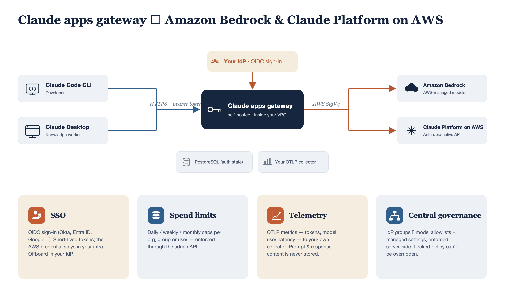

# Claude Apps Gateway

## TL;DR

Claude apps gateway is how enterprises run Claude Code (and Claude Desktop) on AWS without putting AWS credentials on every developer machine. It's a proxy that sits in the customer's AWS account, authenticates developers via corporate SSO, and routes all inference to Amazon Bedrock or Claude Platform on AWS using a single IAM role. No per-seat fee. Developers just run `claude /login` and they're in.

---

## The 30-second pitch

> "You deploy one container in your VPC. It connects to your IdP and to Amazon Bedrock or Claude Platform on AWS. Your developers sign in with corporate SSO — no AWS credentials, no API keys on their machines. You get per-user cost attribution, model access policies by team, and usage telemetry to your own collector. Offboarding is just removing someone from the IdP."

---

---

## How it works (plain English)



1. **The customer deploys a container** running `claude gateway --config gateway.yaml` on ECS, EKS, or EC2, behind an internal ALB in their VPC. The gateway is a single Linux binary run as a container, configured by one YAML file with five required sections:

```yaml
listen:       # Where the gateway listens (host, port, public_url)
oidc:         # SSO connection (issuer, client_id, client_secret)
session:      # Token lifetime (jwt_secret, ttl_hours)
store:        # PostgreSQL connection string
upstreams:    # Where inference goes (provider: bedrock or anthropicAws)
```

2. **The container connects to three things:**
   - Their OIDC identity provider (Okta, Entra, etc.) for SSO
   - A PostgreSQL database (Amazon RDS) for sign-in state
   - Amazon Bedrock or Claude Platform on AWS for inference (via an IAM role)

3. **Developers run `claude /login`** on their laptop. A browser opens, they sign in with corporate SSO, and they're connected. No API keys. No AWS profiles. Claude Code works as normal from that point.

4. **Every request goes through the gateway.** The gateway checks the developer is authenticated, verifies the model is in their allowlist, routes to the configured upstream (Amazon Bedrock or Claude Platform on AWS), and logs usage with the developer's identity attached.

---

## What the customer gets

| Capability | How it works |
|-----------|--------------|
| **SSO authentication** | OIDC against Okta, Entra, Google Workspace, Cognito, Keycloak, etc. Short-lived tokens. |
| **Model access by team** | IdP groups map to model allowlists. Engineering gets Opus, contractors get Haiku only. |
| **Per-user cost tracking** | OTLP telemetry stamped with user identity → Datadog, Splunk, CloudWatch, or any OTLP backend. |
| **Spend limits** | Daily/weekly/monthly caps per user, group, or org. Gateway blocks requests when over cap. |
| **Instant offboarding** | Remove from IdP → session expires within 1 hour (configurable). No credential rotation. |
| **No data to Anthropic** | When using Amazon Bedrock, nothing leaves the customer's AWS account boundary. When using Claude Platform on AWS, requests are processed by Anthropic with AWS IAM authentication and billing. |

---

## What the customer needs to provide

These are the prerequisites. Walk through them with the customer before starting deployment.

### 1. A private hostname for the gateway

The gateway needs a DNS hostname that resolves to a private IP address (RFC 1918 range like 10.x.x.x or 172.16.x.x). This is enforced by the Claude Code CLI at login time for security reasons: a trusted gateway can push settings that run commands on developer machines, so it must only be reachable on the internal network.

In practice, this means:
- An internal Application Load Balancer in their VPC
- A Route53 private hosted zone (or corporate DNS) pointing a hostname at the ALB
- Developers access it through their existing corporate VPN or on-premises network

Example: `claude-gateway.internal.company.com` resolving to `10.0.1.50`

### 2. An OIDC identity provider

The gateway authenticates developers using the OpenID Connect (OIDC) protocol. The customer registers one OAuth application in their IdP with the redirect URI set to `https://<gateway-hostname>/oauth/callback`.

**Supported providers:** Okta, Microsoft Entra ID, Google Workspace, Keycloak, Dex, Amazon Cognito, PingFederate, or any OIDC-compliant provider.

**Not supported:** AWS IAM Identity Center (does not support authorization_code grant for custom applications), SAML-only providers, LDAP without an OIDC bridge.

The customer will need to provide: the OIDC issuer URL, a client ID, and a client secret.

### 3. An AWS account with Amazon Bedrock access

The customer needs an AWS account where they can create the following resources:
- **Compute**: ECS cluster (Fargate), EKS cluster, or EC2 instances
- **Database**: An RDS PostgreSQL instance (db.t4g.micro is sufficient; the gateway stores only a few KB of sign-in state)
- **Networking**: A VPC with private subnets, an internal ALB, and a TLS certificate from ACM
- **IAM role**: The gateway's task role needs `bedrock:InvokeModel` and `bedrock:InvokeModelWithResponseStream` permissions on inference-profile and foundation-model ARNs

The IAM policy for the task role looks like:
```json
{
  "Effect": "Allow",
  "Action": [
    "bedrock:InvokeModel",
    "bedrock:InvokeModelWithResponseStream"
  ],
  "Resource": [
    "arn:aws:bedrock:<region>:<account>:inference-profile/us.anthropic.*",
    "arn:aws:bedrock:*::foundation-model/anthropic.*"
  ]
}
```

Cross-region inference profiles (e.g., `us.anthropic.claude-sonnet-4-6`) require model access enabled in each region the profile spans.

### 4. Claude Code v2.1.195 or later

Both the gateway server (Linux binary) and each developer's Claude Code CLI must be on v2.1.195 or later. This is the first version that includes the `claude gateway` subcommand and the Cloud gateway login flow.

Developers can update with `claude update`. The gateway server uses the same binary, downloaded from the Claude Code release page and packaged into a container image.

### 5. Device management (for pushing settings to developers)

The customer needs a way to deploy a JSON file to developer machines. This file tells Claude Code where the gateway is. Common options:
- Jamf (macOS)
- Microsoft Intune (macOS/Windows)
- Ansible/Chef/Puppet (Linux)
- Manual file placement (for testing)

Without this file, developers see the standard login picker instead of the Cloud gateway screen.

---

## The five core capabilities (what the gateway actually does)

### 1. Identity: SSO authentication

**What it does:** Developers sign in with their corporate identity provider via browser SSO. The gateway issues a short-lived bearer token (1 hour by default) that Claude Code uses for all subsequent requests. No AWS credentials, no API keys on developer machines.

**How it's configured:**

```yaml
oidc:
  issuer: https://customer.okta.com/
  client_id: 0oa1example2
  client_secret: ${OIDC_CLIENT_SECRET}
  allowed_email_domains: [customer.com]
  userinfo_fallback: true       # needed for Okta org server

session:
  jwt_secret: ${GATEWAY_JWT_SECRET}   # signs the bearer tokens
  ttl_hours: 1                        # token lifetime; also bounds offboarding latency
```

**Key points:**
- Offboarding: remove a user from the IdP, their session expires within `ttl_hours`
- Groups from the IdP token drive access control (see Policy below)
- Refresh tokens keep developers signed in across restarts without repeated browser logins

---

### 2. Policy: centralized model access and settings

**What it does:** You define policies per IdP group that control which models developers can use, which tools are allowed/denied, and what permissions apply. The gateway delivers these settings to the CLI at sign-in and enforces model access server-side.

**How it's configured:**

```yaml
managed:
  policies:
    # Contractors: restricted to Haiku, no web access
    - match: { groups: [eng-contractors] }
      cli:
        availableModels: [claude-haiku-4-5]
        enforceAvailableModels: true
        permissions:
          deny: ["WebFetch", "WebSearch"]

    # Everyone else: full access
    - match: {}
      cli:
        availableModels: [claude-opus-4-8, claude-sonnet-4-6, claude-haiku-4-5]
        permissions:
          allow: [Read, Grep, Bash, Edit]
          deny: ["Read(./.env)", "Read(./secrets/**)"]
        disableBypassPermissionsMode: disable
```

**Key points:**
- Policies are evaluated top to bottom, first match wins
- `match: {}` is the catch-all (every authenticated user)
- `availableModels` is enforced both client-side (model picker) and server-side (400 on unauthorized model)
- `disableBypassPermissionsMode: disable` prevents developers from using `--dangerously-skip-permissions`
- Settings refresh hourly; policy changes reach developers within an hour of redeployment

---

### 3. Telemetry: per-user usage attribution

**What it does:** The gateway relays OpenTelemetry Protocol (OTLP) metrics to a collector you configure. Each export is stamped with the developer's identity (user ID, email, groups), so you get per-user cost and usage breakdowns with no developer-side configuration.

**How it's configured:**

```yaml
telemetry:
  forward_to:
    - url: https://otel-collector.internal.customer.com
      headers:
        Authorization: Bearer ${OTLP_TOKEN}
      metrics: true     # token counts, latency, model (default: true)
      logs: false       # bash commands, file paths (opt-in, sensitive)
      traces: false     # full tool inputs (opt-in, most sensitive)
```

**Key points:**
- Any OTLP-compatible backend works
- Metrics include: token counts, model used, user identity, request latency
- Logs and traces are opt-in and carry sensitive data (commands, file paths)
- The gateway itself does not log or store prompt/completion content
- Configuring `telemetry.forward_to` automatically pushes OTEL environment variables to all connected clients

---

### 4. Routing: inference with failover

**What it does:** The gateway holds the upstream credential and routes inference to Amazon Bedrock or Claude Platform on AWS on behalf of developers. It translates between the Anthropic Messages API (what Claude Code speaks) and the provider's API. You can configure multiple upstreams for failover across regions or accounts.

**How it's configured:**

```yaml
# Amazon Bedrock: single region
upstreams:
  - provider: bedrock
    region: us-east-1
    auth: {}              # uses ECS task role / instance profile

auto_include_builtin_models: true
```

```yaml
# Claude Platform on AWS
upstreams:
  - provider: anthropicAws
    region: us-east-1
    workspace_id: wrkspc_01ABCDEFGHIJKLMN
    auth:
      api_key: ${ANTHROPIC_AWS_API_KEY}
    # OR use IAM role (SigV4):
    # auth: {}

auto_include_builtin_models: true
```

```yaml
# Advanced: multi-region failover with provisioned throughput (Bedrock)
upstreams:
  - name: bedrock-pt
    provider: bedrock
    region: us-east-1
    auth: {}

  - name: bedrock-od
    provider: bedrock
    region: us-west-2
    auth: {}

models:
  - id: claude-opus-4-8
    label: Claude Opus 4.8
    upstream_model:
      bedrock-pt: arn:aws:bedrock:us-east-1:111111111111:provisioned-model/abcdef
      bedrock-od: us.anthropic.claude-opus-4-8
```

**Key points:**
- Failover is automatic: 5xx, 429, and timeouts try the next upstream; 4xx does not
- Cross-region is supported (gateway in us-east-1, Amazon Bedrock in eu-west-1)
- Cross-account is supported (each upstream can have different credentials)
- `auth: {}` uses the AWS default credential chain (ECS task role, IRSA, instance profile)
- Claude Platform on AWS uses standard Anthropic model IDs (claude-sonnet-4-6), not Bedrock ARNs
- Changing providers requires only a config change and redeploy, no developer action

---

### 5. Spend caps: per-user budget enforcement

**What it does:** Set daily, weekly, or monthly spend limits per user, group, or organization. When a developer exceeds their cap, the gateway returns 429 and blocks further requests until the period resets or an admin raises the limit.

**How it's configured:**

First, enable the admin API in `gateway.yaml`:

```yaml
admin:
  write_keys:
    - { id: terraform, key: "${GATEWAY_ADMIN_WRITE_KEY}" }
  read_keys:
    - { id: reporting, key: "${GATEWAY_ADMIN_READ_KEY}" }
  blocked_message: "Contact platform-team@company.com to request a higher limit."
```

Then set caps via the admin API (not in YAML):

```bash
# Org-wide default: $500/month per developer
curl -X POST https://<gateway>/v1/organizations/spend_limits \
  -H "x-api-key: $GATEWAY_ADMIN_WRITE_KEY" \
  -H "Content-Type: application/json" \
  -d '{"scope":{"type":"organization"},"amount":"50000","period":"monthly"}'

# Contractors: $100/day each
curl -X POST https://<gateway>/v1/organizations/spend_limits \
  -H "x-api-key: $GATEWAY_ADMIN_WRITE_KEY" \
  -H "Content-Type: application/json" \
  -d '{"scope":{"type":"rbac_group","rbac_group_id":"contractors"},"amount":"10000","period":"daily"}'
```

**Key points:**
- Amounts are in USD cents (50000 = $500)
- Caps are per-seat defaults, not shared pools (each member gets their own limit)
- Spend is estimated from token counts at list price (circuit breaker, not an invoice)
- If Postgres is unavailable, enforcement fails open by default (inference continues)
- Set `enforcement.fail_closed_on_error: true` to block all requests when Postgres is down
- The admin API mirrors Anthropic's public Admin API, so existing SDK clients work with a base_url change

---

## Deployment summary

The gateway is a single Linux binary run as a container. The config is one YAML file with five required sections:

```yaml
listen:       # Where the gateway listens (host, port, public_url)
oidc:         # SSO connection (issuer, client_id, client_secret)
session:      # Token lifetime (jwt_secret, ttl_hours)
store:        # PostgreSQL connection string
upstreams:    # Where inference goes (provider: bedrock, region, auth)
```

**Deployment options:**

| Option | Best for |
|--------|----------|
| ECS Fargate + Internal ALB | Most customers. Serverless, no instances to manage. |
| EKS + Internal Ingress | Customers already on Kubernetes. Use IRSA for Amazon Bedrock auth. |
| EC2 + Internal ALB | Simple. Instance profile for Amazon Bedrock auth. |

**We have a [CDK stack](cdk/)** that deploys the full setup (ECS + ALB + RDS + IAM + DNS) in one command.

---

## How developers connect

Admins push one JSON file to developer machines via MDM (Jamf, Intune, etc.):

```json
{
  "forceLoginMethod": "gateway",
  "forceLoginGatewayUrl": "https://claude-gateway.internal.company.com"
}
```

Deploy that file to each device, typically via your MDM platform. The file path differs by platform:

| Platform | Path |
|----------|------|
| macOS | `/Library/Application Support/ClaudeCode/managed-settings.json`, or the `com.anthropic.claudecode` managed preferences domain |
| Linux and WSL | `/etc/claude-code/managed-settings.json` |
| Windows | `C:\Program Files\ClaudeCode\managed-settings.json`, or Group Policy via the HKLM registry |

After that, developers just run `claude /login` → press Enter → browser SSO → done.

---

## Quick verification after deployment

Run these in order. If any fails, the error tells you exactly where to look:

```bash
# 1. Gateway is up and OIDC is configured
curl https://<gateway>/.well-known/oauth-authorization-server

# 2. Postgres is writable (device auth flow works)
curl -X POST https://<gateway>/oauth/device_authorization

# 3. Open verification_uri_complete in browser → SSO → "signed in"
```

---

## Common customer questions

**Q: How much does it cost?**
No license fee. Approximately $37/month for minimal AWS infrastructure (ECS $9 + RDS $12 + ALB $16). Plus Amazon Bedrock inference (same as without the gateway).

**Q: Can CI/CD pipelines use the gateway?**
No. Gateway requires browser SSO. Configure CI against Amazon Bedrock directly with IAM credentials.

**Q: What about Claude Desktop / Cowork?**
Claude Desktop (including Chat, Cowork, and Claude Code) can route through the gateway. Configure the gateway URL in the desktop app's managed settings via MDM.

**Q: Can they fail over between regions?**
Yes. Configure multiple upstreams with different regions. The gateway tries them in order and fails over on 5xx/429.

**Q: Can the gateway run in one account and call Amazon Bedrock in another?**
Yes. Each upstream can have its own credentials (cross-account assumed roles).

**Q: What if Postgres goes down?**
Existing signed-in developers keep working (tokens validate locally). New sign-ins fail until Postgres recovers. Spend enforcement fails open by default.

---

## Known limitations

- Server-side web search is disabled through the gateway
- 1-hour prompt caching is not available (5-minute only)
- No Helm chart provided (use a standard Kubernetes Deployment)
- No admin UI (configuration is the YAML file; redeploy to change it)
- One OIDC issuer per gateway instance (multi-tenant needs multiple gateways)
- Claude Platform on AWS requires gateway build v2.1.198+ (provider: anthropicAws)
- CI/CD pipelines cannot authenticate through the gateway (browser SSO required)

---

## Resources

| Resource | Link |
|----------|------|
| Official docs | https://code.claude.com/docs/en/claude-apps-gateway |
| Config reference | https://code.claude.com/docs/en/claude-apps-gateway-config |
| Deployment & ops | https://code.claude.com/docs/en/claude-apps-gateway-deploy |
| Spend limits | https://code.claude.com/docs/en/claude-apps-gateway-spend-limits |
| CDK template | `../claude-gateway-cdk/` |
