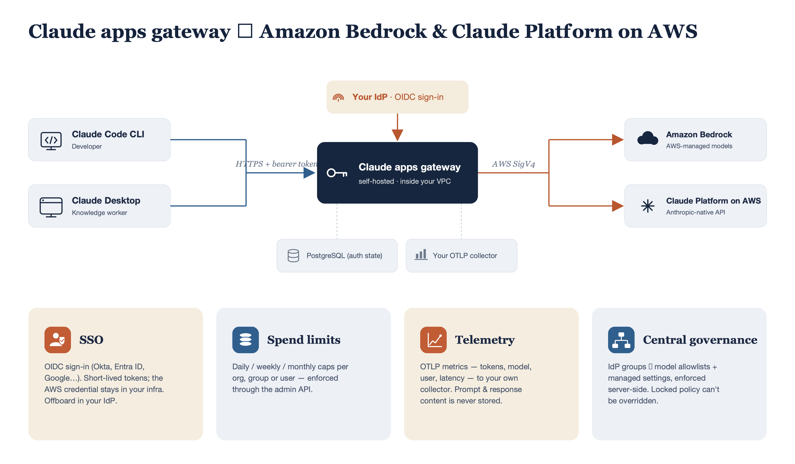

# Claude Apps Gateway

## TL;DR

Claude apps gateway is how enterprises run Claude Code (and Claude Desktop) on AWS without putting AWS credentials on every developer machine. It's a proxy that sits in your AWS account, authenticates developers via corporate SSO, and routes all inference to Amazon Bedrock or Claude Platform on AWS using a single IAM role. No per-seat fee. Developers just run `claude /login` and they're in.

---

## The 30-second pitch

> "You deploy one container in your VPC. It connects to your IdP and to Amazon Bedrock or Claude Platform on AWS. Your developers sign in with corporate SSO — no AWS credentials, no API keys on their machines. You get per-user cost attribution, model access policies by team, and usage telemetry to your own collector. Offboarding is just removing someone from the IdP."

---

---

## How it works (plain English)



1. **You deploy a container** running `claude gateway --config gateway.yaml` on ECS, EKS, or EC2, behind an internal ALB in their VPC. The gateway is a single Linux binary run as a container, configured by one YAML file with five required sections:

```yaml
listen:       # Where the gateway listens (host, port, public_url)
oidc:         # SSO connection (issuer, client_id, client_secret)
session:      # Token lifetime (jwt_secret, ttl_hours)
store:        # PostgreSQL connection string
upstreams:    # Where inference goes (provider: bedrock or anthropicAws)
```

2. **The container connects to three things:**
   - Their OIDC identity provider (Okta, Entra, etc.) for SSO
   - A PostgreSQL database (Amazon RDS) for sign-in state
   - Amazon Bedrock or Claude Platform on AWS for inference (via an IAM role)

3. **Developers run `claude /login`** on their laptop. A browser opens, they sign in with corporate SSO, and they're connected. No API keys. No AWS profiles. Claude Code works as normal from that point.

4. **Every request goes through the gateway.** The gateway checks the developer is authenticated, verifies the model is in their allowlist, routes to the configured upstream (Amazon Bedrock or Claude Platform on AWS), and logs usage with the developer's identity attached.

---

## What you get

| Capability | How it works |
|-----------|--------------|
| **SSO authentication** | OIDC against Okta, Entra, Google Workspace, Cognito, Keycloak, etc. Short-lived tokens. |
| **Model access by team** | IdP groups map to model allowlists. Engineering gets Opus, contractors get Haiku only. |
| **Per-user cost tracking** | OTLP telemetry stamped with user identity → Datadog, Splunk, CloudWatch, or any OTLP backend. |
| **Spend limits** | Daily/weekly/monthly caps per user, group, or org. Gateway blocks requests when over cap. |
| **Instant offboarding** | Remove from IdP → session expires within 1 hour (configurable). No credential rotation. |
| **No data to Anthropic** | When using Amazon Bedrock, nothing leaves your AWS account boundary. When using Claude Platform on AWS, requests are processed by Anthropic with AWS IAM authentication and billing. |

---

## Prerequisites

These are the prerequisites before starting deployment.

### 1. A private hostname for the gateway

The gateway needs a DNS hostname that resolves to a private IP address (RFC 1918 range like 10.x.x.x or 172.16.x.x). This is enforced by the Claude Code CLI at login time for security reasons: a trusted gateway can push settings that run commands on developer machines, so it must only be reachable on the internal network.

In practice, this means:
- An internal Application Load Balancer in their VPC
- A Route53 private hosted zone (or corporate DNS) pointing a hostname at the ALB
- Developers access it through their existing corporate VPN or on-premises network

Example: `claude-gateway.internal.company.com` resolving to `10.0.1.50`

### 2. An OIDC identity provider

The gateway authenticates developers using the OpenID Connect (OIDC) protocol. Register one OAuth application in their IdP with the redirect URI set to `https://<gateway-hostname>/oauth/callback`.

**Supported providers:** Okta, Microsoft Entra ID, Google Workspace, Keycloak, Dex, Amazon Cognito, PingFederate, or any OIDC-compliant provider.

**Not supported:** AWS IAM Identity Center (does not support authorization_code grant for custom applications), SAML-only providers, LDAP without an OIDC bridge.

You will need to provide: the OIDC issuer URL, a client ID, and a client secret.

### 3. An AWS account with Amazon Bedrock access

You need an AWS account where they can create the following resources:
- **Compute**: ECS cluster (Fargate), EKS cluster, or EC2 instances
- **Database**: An RDS PostgreSQL instance (db.t4g.micro is sufficient; the gateway stores only a few KB of sign-in state)
- **Networking**: A VPC with private subnets, an internal ALB, and an imported ACM TLS certificate (use a public ACM cert to skip the first-login fingerprint prompt — see [`cdk/README.md`](cdk/README.md))
- **IAM role**: The gateway's task role needs `bedrock:InvokeModel` and `bedrock:InvokeModelWithResponseStream` permissions on inference-profile and foundation-model ARNs
- **Model access**: A **one-time, account-level** enablement of each Claude model you list — a Bedrock *console/admin* action, **not** an IAM grant or a gateway responsibility. On Bedrock, Anthropic's models are AWS Marketplace offerings, so first use requires a subscription. Until it's done, invokes return a `403` (often naming `aws-marketplace:ViewSubscriptions` / `aws-marketplace:Subscribe`) even though the IAM policy above is correct. Enable it once as an admin; **do not** add Marketplace permissions to the task role (see [`docs/gotchas.md`](docs/gotchas.md) §8 for why). This is the single most common Bedrock-through-gateway failure.

The IAM policy for the task role looks like:
```json
{
  "Effect": "Allow",
  "Action": [
    "bedrock:InvokeModel",
    "bedrock:InvokeModelWithResponseStream"
  ],
  "Resource": [
    "arn:aws:bedrock:<region>:<account>:inference-profile/global.anthropic.*",
    "arn:aws:bedrock:*::foundation-model/anthropic.*"
  ]
}
```

The gateway uses **global** cross-region inference profiles (e.g., `global.anthropic.claude-opus-5`), so the IAM prefix is `global.anthropic.*` and any Bedrock region works. Enable Bedrock model access for the models you list; global profiles route to any commercial region, so enable access where global may route. (For data residency, switch the `gateway.yaml` `models:` block and this ARN to a geo prefix — `us.`/`eu.`/`au.`, and `jp.` for some models, since geo coverage varies per model — together; see [`cdk/README.md`](cdk/README.md) "Regions & data residency".)

### 4. Claude Code v2.1.195 or later

Both the gateway server (Linux binary) and each developer's Claude Code CLI must be on v2.1.195 or later. This is the first version that includes the `claude gateway` subcommand and the Cloud gateway login flow.

Developers can update with `claude update`. The gateway server uses the same binary, downloaded from the Claude Code release page and packaged into a container image.

Some gateway behaviour is version-gated: v2.1.198 added cross-upstream failover on `404` and the `anthropicAws` (Claude Platform on AWS) provider — earlier gateway builds reject that provider at boot; v2.1.203 added the Claude Desktop bootstrap endpoint (`/user/bootstrap`); v2.1.227 added the `desktop` block's `chatTabEnabled` and `chatAdvancedFileAnalysisEnabled` keys, the `oidc.use_proxy` flag, and the `pricing:` block; v2.1.229 added SSE keepalive pings on streaming responses so long thinking pauses don't trip an idle timeout on the Bedrock upstream (this example still raises the ALB idle timeout to 3600s as well, since the ALB has to outlast the stream either way), and carries the earlier fix that prices Bedrock application-inference-profile ARNs and other config-mapped upstream model IDs at the configured model's rates, directly relevant to this example's `global.anthropic.*` inference profiles.

The worked example in this repo pins **2.1.251**. Two server-side gates drove that pin past 2.1.229: **v2.1.232** widened the `desktop` block from 11 hand-listed keys to Claude Desktop's full settings schema (and added `disabledBuiltinTools`, `coworkEgressAllowedHosts`, `managedMcpServers`, plus boot-time rejection of empty `match.groups` / `admin.admin_groups` entries and malformed `email_domain` values — previously those silently matched no one or granted admin access), and **v2.1.233** made `400`/`413` responses from a cloud upstream carry the upstream's own message.

**Developers benefit from being newer than the floor, independently of the pin.** The gateway-facing client fixes worth telling your fleet about: v2.1.237 and v2.1.248 fixed prompt caching on gateway sessions (the latter a roughly hourly cache miss caused by an OAuth token refresh); v2.1.248 fixed `/login` to a gateway hanging when the managed-settings approval dialog was required, and v2.1.251 stopped that dialog re-appearing on every re-sign-in and reduced it to only the settings that changed; v2.1.247 fixed first-run setup exiting with "Unable to connect to Anthropic services" when managed settings force gateway sign-in and Anthropic's own endpoints are unreachable — the normal case on a restricted-egress network. v2.1.251 also adds a **Spend limit** bar to `/usage` for developers behind a gateway with spend limits configured; that one needs v2.1.251 on the developer's machine but nothing newer than v2.1.225 on the server.

See [`docs/upstream-watch.md`](docs/upstream-watch.md) for a checklist to stay across gateway releases.

### 5. Device management (for pushing settings to developers)

You need a way to deploy a JSON file to developer machines. This file tells Claude Code where the gateway is. Common options:
- Jamf (macOS)
- Microsoft Intune (macOS/Windows)
- Ansible/Chef/Puppet (Linux)
- Manual file placement (for testing)

Without this file, developers see the standard login picker instead of the Cloud gateway screen. If you also deploy Claude Desktop, the same MDM tool delivers Desktop's separate managed configuration (the `bootstrapUrl` key) — see ["How developers connect"](#claude-desktop).

---

## The five core capabilities (what the gateway actually does)

### 1. Identity: SSO authentication

**What it does:** Developers sign in with their corporate identity provider via browser SSO. The gateway issues a short-lived bearer token (1 hour by default) that Claude Code uses for all subsequent requests. No AWS credentials, no API keys on developer machines.

**How it's configured:**

```yaml
oidc:
  issuer: https://customer.okta.com/
  client_id: 0oa1example2
  client_secret: ${OIDC_CLIENT_SECRET}
  allowed_email_domains: [customer.com]
  userinfo_fallback: true       # needed for Okta org server

session:
  jwt_secret: ${GATEWAY_JWT_SECRET}   # signs the bearer tokens
  ttl_hours: 1                        # token lifetime; also bounds offboarding latency
```

**Key points:**
- Offboarding: remove a user from the IdP, their session expires within `ttl_hours`
- Groups from the IdP token drive access control (see Policy below)
- Refresh tokens keep developers signed in across restarts without repeated browser logins

---

### 2. Policy: centralized model access and settings

**What it does:** You define policies per IdP group that control which models developers can use, which tools are allowed/denied, and what permissions apply. The gateway delivers these settings to the CLI at sign-in and enforces model access server-side.

**How it's configured:**

```yaml
managed:
  policies:
    # Contractors: restricted to Haiku, no web access
    - match: { groups: [eng-contractors] }
      cli:
        availableModels: [claude-haiku-4-5]
        enforceAvailableModels: true
        permissions:
          deny: ["WebFetch", "WebSearch"]

    # Everyone else: full access
    - match: {}
      cli:
        availableModels: [claude-opus-4-8, claude-sonnet-4-6, claude-haiku-4-5]
        permissions:
          allow: [Read, Grep, Bash, Edit]
          deny: ["Read(./.env)", "Read(./secrets/**)"]
        disableBypassPermissionsMode: disable
```

**Key points:**
- Policies are evaluated top to bottom, first match wins
- `match: {}` is the catch-all (every authenticated user)
- `availableModels` is enforced both client-side (model picker) and server-side (400 on unauthorized model)
- `disableBypassPermissionsMode: disable` prevents developers from using `--dangerously-skip-permissions`
- Settings refresh hourly; policy changes reach developers within an hour of redeployment

**What's enforced server-side vs. client-side:** the gateway sits on the inference path (`/v1/messages`), so it hard-enforces anything about a model request; it cannot enforce what happens on a developer's machine.

| Control | Enforced | Bypassable by a patched client? |
|---|---|---|
| Identity / authentication | Server-side (signed token) | No |
| Model access (`availableModels`) | Server-side at `/v1/messages` → `400` | No |
| Spend caps | Server-side | No |
| Tool permissions / hooks / env (`cli` managed settings) | **Client-side** (delivered to the CLI) | **Yes** |

Tool/permission policies are defense-in-depth (a patched client can ignore them); for a hard boundary use MDM-locked settings on managed devices. The governance guarantees are the server-side rows.

<a id="claude-desktop-overlay"></a>
**Claude Desktop overlay.** The same gateway serves Claude Desktop, but only for policies
that explicitly opt in. `/user/bootstrap` — the endpoint Desktop fetches its config from —
returns `404` unless the matching policy carries a `desktop` key. An empty `desktop: {}`
is enough to opt a policy in, and a `desktop` key on the `match: {}` base layer opts in
every policy that inherits it. Requires the gateway server on **v2.1.203+** (this example
pins 2.1.251). Pair it with `bootstrapUrl` on the client side — see
["How developers connect"](#claude-desktop).

```yaml
managed:
  policies:
    - match: { groups: [eng-contractors] }
      cli:
        availableModels: [claude-haiku-4-5]
      desktop:                    # presence of this key is the opt-in
        isLocalDevMcpEnabled: false
        disableAutoUpdates: true
        banner: { enabled: true, text: "Contractor build: internal use only" }
```

The gateway derives most of the bootstrap response from the matched policy's `cli` block:
the model list from `availableModels`, disabled tools from **bare tool-name**
`permissions.deny` entries, the egress allowlist from `sandbox.network.allowedDomains`,
and — when `telemetry.forward_to` is set — an OTLP endpoint pointing back at the gateway,
which fans out to your destinations. Keys with no Desktop equivalent are omitted, including
`hooks` and scoped rules like `Bash(npm *)`; if a restriction matters for Desktop, express
it as a bare tool name.

The `desktop:` block itself holds the Desktop-specific settings that have no CLI
equivalent. Every key is optional (Desktop applies its own default for anything omitted),
and unknown keys **fail gateway boot**. Since gateway **2.1.232** the block accepts every
released Claude Desktop setting and is validated against Desktop's own schema, so the table
below is the useful subset for a gateway deployment, not the whole accepted set — write any
key from Claude Desktop's [managed configuration reference](https://claude.com/docs/third-party/claude-desktop/configuration)
as a flat key name:

| Key | Effect |
|---|---|
| `modelDiscoveryEnabled` | Whether Desktop fetches `/v1/models` for its picker; `false` relies solely on the policy's model list |
| `coworkTabEnabled`, `isClaudeCodeForDesktopEnabled` | Show or hide the Cowork and Code tabs; both show unless set `false` |
| `chatTabEnabled` | Show or hide the Chat tab — **hidden unless set `true`**. Needs gateway **≥ 2.1.227** |
| `chatAdvancedFileAnalysisEnabled` | Let Claude run code in a local sandbox from the Chat tab to analyse attached files it can't read natively (spreadsheets, presentations). Off unless set `true`; no effect when the policy's `permissions.deny` disables `Bash`. Needs gateway **≥ 2.1.227** |
| `isDesktopExtensionEnabled`, `isDesktopExtensionSignatureRequired` | Desktop extension loading and signature checks |
| `isLocalDevMcpEnabled` | Allow locally defined MCP servers |
| `disableAutoUpdates`, `autoUpdaterEnforcementHours` | Auto-update policy |
| `banner` | Persistent banner in the app: `enabled`, `text`, `backgroundColor`, `textColor`, `linkUrl` |
| `disabledBuiltinTools` | Extra tools to disable — **unioned** with the list derived from bare-name `permissions.deny`, so it can only disable more, never re-enable. Needs gateway **≥ 2.1.232** |
| `coworkEgressAllowedHosts` | Cowork egress allowlist — **replaces** the list derived from `sandbox.network.allowedDomains`. Needs gateway **≥ 2.1.232** |
| `managedMcpServers` | The only way to push MCP servers from a policy: the gateway rejects `mcpServers` inside a `cli` block at boot, but Desktop clients can receive them here. Needs gateway **≥ 2.1.232** |

Three traps bite here — a banner that renders nothing, a silently missing Chat tab, and an
unknown key that crash-loops the ECS task; all three are written up in
[`docs/gotchas.md`](docs/gotchas.md#20-three-ways-the-desktop-block-itself-bites).

If you don't deploy Claude Desktop, leave `desktop` out entirely — `/user/bootstrap` then
returns `404` for every user, which is the safe default. Either way, `/user/bootstrap` is
on the same host and port as everything else, so the internal ALB needs no new listener
rule or target group.

**Audit events.** Each bootstrap fetch is logged as `desktop_bootstrap.serve` or
`desktop_bootstrap.denied`; the denial carries a reason (`not_configured`,
`policy_not_opted_in`, or `no_policy_matched`) plus the user's identity. Those land in the
task's stderr → CloudWatch (`/claude-gateway/gateway`) alongside `session.mint`,
`inference`, and the rest.

---

### 3. Telemetry: per-user usage attribution

**What it does:** The gateway relays OpenTelemetry Protocol (OTLP) metrics to a destination you configure. Each export is stamped with the developer's identity (user ID, email, groups), so you get per-user cost and usage breakdowns with no developer-side configuration.

**How it's configured:** this example ships with a ADOT collector sidecar in the same Fargate task — the gateway sends OTLP to localhost, and the collector forwards to CloudWatch via SigV4 using the task role:

```yaml
telemetry:
  forward_to:
    - url: http://localhost:4318
      metrics: true     # token counts, latency, model (default: true)
      logs: false       # bash commands, file paths (opt-in, sensitive)
      traces: false     # full tool inputs (opt-in, most sensitive)
```

See [`docs/deployment.md`](docs/deployment.md#telemetry) for deployment details. Any OTLP-compatible backend works — swap `url` (and add `headers` if needed) for Datadog, Splunk, or a self-hosted collector.

**Key points:**
- Metrics include: token counts, model used, user identity, request latency
- Logs and traces are opt-in and carry sensitive data (commands, file paths)
- The gateway itself does not log or store prompt/completion content
- Configuring `telemetry.forward_to` automatically pushes OTEL environment variables to all connected clients

---

### 4. Routing: inference with failover

**What it does:** The gateway holds the upstream credential and routes inference to Amazon Bedrock or Claude Platform on AWS on behalf of developers. It translates between the Anthropic Messages API (what Claude Code speaks) and the provider's API. You can configure multiple upstreams for failover across regions or accounts.

**How it's configured:**

```yaml
# Amazon Bedrock — any region (global inference profiles)
upstreams:
  - provider: bedrock
    region: us-east-1     # any region; global profiles resolve everywhere
    auth: {}              # uses ECS task role / instance profile

# Explicit catalog → global cross-region inference profiles, so the config is
# region-agnostic. (For data residency, swap global. for a geo prefix: us./eu./au.,
# and jp. for some models — geo coverage varies per model.)
auto_include_builtin_models: false
models:
  - id: claude-opus-5
    label: Claude Opus 5
    upstream_model: { bedrock: global.anthropic.claude-opus-5 }
  - id: claude-haiku-4-5
    label: Claude Haiku 4.5   # no short alias — dated profile id
    upstream_model: { bedrock: global.anthropic.claude-haiku-4-5-20251001-v1:0 }
```

```yaml
# Claude Platform on AWS
upstreams:
  - provider: anthropicAws
    region: us-east-1
    workspace_id: wrkspc_01ABCDEFGHIJKLMN
    auth:
      api_key: ${ANTHROPIC_AWS_API_KEY}
    # OR use IAM role (SigV4):
    # auth: {}

auto_include_builtin_models: true
```

```yaml
# Advanced: multi-region failover with provisioned throughput (Bedrock)
upstreams:
  - name: bedrock-pt
    provider: bedrock
    region: us-east-1
    auth: {}

  - name: bedrock-od
    provider: bedrock
    region: us-west-2
    auth: {}

models:
  - id: claude-opus-4-8
    label: Claude Opus 4.8
    upstream_model:
      bedrock-pt: arn:aws:bedrock:us-east-1:111111111111:provisioned-model/abcdef
      bedrock-od: us.anthropic.claude-opus-4-8
```

**Key points:**
- Failover is automatic: 5xx, 429, and timeouts try the next upstream; 4xx does not (except on gateway v2.1.198+, where a `404` also fails over — so a model missing from one upstream falls through to one that has it)
- Cross-region is supported (gateway in us-east-1, Amazon Bedrock in eu-west-1)
- Cross-account is supported (each upstream can have different credentials)
- `auth: {}` uses the AWS default credential chain (ECS task role, IRSA, instance profile)
- Claude Platform on AWS uses standard Anthropic model IDs (claude-sonnet-4-6), not Bedrock ARNs
- Changing providers requires only a config change and redeploy, no developer action

---

### 5. Spend caps: per-user budget enforcement

**What it does:** Set daily, weekly, or monthly spend limits per user, group, or organization. When a developer exceeds their cap, the gateway returns 429 and blocks further requests until the period resets or an admin raises the limit.

**Why it's off by default:** the admin API is disabled in the shipped config
because enabling it turns Postgres into the durable system of record for spend
counters, an audit log, and per-developer PII. The example's RDS is deliberately
disposable (`removalPolicy: DESTROY`, `deletionProtection: false`, 1-day backups,
single-AZ), so turning this on is a conscious opt-in, not a default.

**How to enable it** — three steps. This is a deliberate opt-in, so neither track
provisions the admin keys for you; the code you need is below.

> [!IMPORTANT]
> All three steps must land **together**, in the same deploy. The gateway expands
> `${GATEWAY_ADMIN_WRITE_KEY}` when it reads the config, so a half-applied change
> fails in one of two ways:
> - **Config block without the secrets injected** → the container dies at boot with
>   `undefined env var in config: GATEWAY_ADMIN_WRITE_KEY` (a crash-loop, not a 401).
> - **Secrets injected without the config block** → the admin routes are never
>   mounted, and requests fall through to developer-session auth, so `curl` gets
>   `auth.denied` / `missing_token` even though the key is correct.

**1. Mint the admin keys as secrets** (≥32 chars each — `openssl rand -base64 32`
gives 44), the same way the JWT/OIDC secrets are created:

```bash
aws secretsmanager create-secret --name claude-gateway-admin-write-key \
  --secret-string "$(openssl rand -base64 32)" --region "$AWS_REGION"
aws secretsmanager create-secret --name claude-gateway-admin-read-key \
  --secret-string "$(openssl rand -base64 32)" --region "$AWS_REGION"
```

**2. Inject them into the container**, alongside `GATEWAY_JWT_SECRET` /
`OIDC_CLIENT_SECRET`. Note it is the **execution** role that reads secrets (the ECS
agent resolves them before the container starts), not the task role.

- **CDK** (`cdk/lib/claude-gateway-stack.ts`) — look up the two secrets and add them
  to the container's `secrets:` map. `ecs.Secret.fromSecretsManager` grants the
  execution role `secretsmanager:GetSecretValue` for you, so there is no separate
  IAM edit:
  ```ts
  const adminWriteSecret = secretsmanager.Secret.fromSecretNameV2(
    this, 'AdminWriteKey', `${gatewayName}-admin-write-key`);
  const adminReadSecret = secretsmanager.Secret.fromSecretNameV2(
    this, 'AdminReadKey', `${gatewayName}-admin-read-key`);

  // ...then inside the container definition's `secrets:` map:
  GATEWAY_ADMIN_WRITE_KEY: ecs.Secret.fromSecretsManager(adminWriteSecret),
  GATEWAY_ADMIN_READ_KEY:  ecs.Secret.fromSecretsManager(adminReadSecret),
  ```
- **`setup.sh`** — resolve the two ARNs next to the existing ones (phase 4), add them
  to the exec-role secrets policy (phase 5a), and add them to the container `secrets`
  array (phase 6):
  ```bash
  # phase 4, alongside JWT_SECRET_ARN / OIDC_SECRET_ARN:
  ADMIN_WRITE_ARN="$(aws_q secretsmanager describe-secret \
    --secret-id "${PROJECT}-admin-write-key" --query ARN)"
  ADMIN_READ_ARN="$(aws_q secretsmanager describe-secret \
    --secret-id "${PROJECT}-admin-read-key" --query ARN)"
  ```
  ```diff
   # phase 5a — EXEC_SECRETS_POLICY Resource list:
  -   "Resource":["${JWT_SECRET_ARN}","${OIDC_SECRET_ARN}","${DB_SECRET_ARN}"]},
  +   "Resource":["${JWT_SECRET_ARN}","${OIDC_SECRET_ARN}","${DB_SECRET_ARN}",
  +               "${ADMIN_WRITE_ARN}","${ADMIN_READ_ARN}"]},
  ```
  ```diff
   # phase 6 — container `secrets` array (add --arg adminWriteArn/adminReadArn to
   # the surrounding `jq` call so these expand):
     {name: "DB_PASSWORD", valueFrom: ($dbArn + ":password::")}
  +   ,{name: "GATEWAY_ADMIN_WRITE_KEY", valueFrom: $adminWriteArn}
  +   ,{name: "GATEWAY_ADMIN_READ_KEY", valueFrom: $adminReadArn}
  ```

**3. Uncomment the `admin:` block** in **`cdk/gateway.yaml.template`** — not the
generated `gateway.yaml`, which `stamp-config.sh` overwrites on every deploy — then
redeploy:

```yaml
admin:
  write_keys:
    - { id: terraform, key: "${GATEWAY_ADMIN_WRITE_KEY}" }
  read_keys:
    - { id: reporting, key: "${GATEWAY_ADMIN_READ_KEY}" }
  # Optional. `admin_groups` lets members of an IdP group call the admin API with
  # their session bearer token instead of a key; `blocked_message` is appended to
  # the 429 a capped developer sees. The block is validated strictly — unknown
  # keys are rejected at boot.
  blocked_message: "Contact platform-team@company.com to request a higher limit."
```

Because the config is **baked into the image**, editing the template only takes
effect once a new image is built and the service points at it. `setup.sh` handles
this automatically (its default image tag hashes the stamped config, so a config
edit produces a new tag and a real rebuild). On the CDK track, build and push a new
tag and re-run pass 2 with `-c imageTag=<new-tag>` — see
[`docs/deployment.md`](docs/deployment.md#track-b--cdk-two-pass).

> ⚠️ **Harden RDS before relying on this.** Enabling admin makes Postgres hold
> durable spend + audit + PII. The shipped database is disposable — enable deletion
> protection, a longer backup window, and multi-AZ first. See
> [cdk/README.md → "Before going to production"](cdk/README.md#before-going-to-production).

Then set caps via the admin API (not in YAML):

```bash
# Org-wide default: $500/month per developer
curl -X POST https://<gateway>/v1/organizations/spend_limits \
  -H "x-api-key: $GATEWAY_ADMIN_WRITE_KEY" \
  -H "Content-Type: application/json" \
  -d '{"scope":{"type":"organization"},"amount":"50000","period":"monthly"}'

# Contractors: $100/day each
curl -X POST https://<gateway>/v1/organizations/spend_limits \
  -H "x-api-key: $GATEWAY_ADMIN_WRITE_KEY" \
  -H "Content-Type: application/json" \
  -d '{"scope":{"type":"rbac_group","rbac_group_id":"contractors"},"amount":"10000","period":"daily"}'
```

**Key points:**
- Amounts are in USD cents (50000 = $500)
- Caps are per-seat defaults, not shared pools (each member gets their own limit)
- Spend is estimated from token counts at list price (circuit breaker, not an invoice)
- If Postgres is unavailable, enforcement fails open by default (inference continues)
- Set `enforcement.fail_closed_on_error: true` to block all requests when Postgres is down
- The admin API mirrors Anthropic's public Admin API, so existing SDK clients work with a base_url change

---

## Deployment summary

The gateway is a single Linux binary run as a container. The config is one YAML file with five required sections:

```yaml
listen:       # Where the gateway listens (host, port, public_url)
oidc:         # SSO connection (issuer, client_id, client_secret)
session:      # Token lifetime (jwt_secret, ttl_hours)
store:        # PostgreSQL connection string
upstreams:    # Where inference goes (provider: bedrock, region, auth)
```

**Deployment options:**

| Option | Best for |
|--------|----------|
| ECS Fargate + Internal ALB | Most customers. Serverless, no instances to manage. |
| EKS + Internal Ingress | Customers already on Kubernetes. Use IRSA for Amazon Bedrock auth. |
| EC2 + Internal ALB | Simple. Instance profile for Amazon Bedrock auth. |

**We have a [CDK stack](cdk/)** that deploys the full setup (ECS + ALB + RDS + IAM + DNS), and an idempotent [`setup.sh`](cdk/scripts/setup.sh) that provisions the same deployment via the AWS CLI. The step-by-step walkthrough for both — prerequisites, deploy, verify — is **[`docs/deployment.md`](docs/deployment.md)**.

---

## How developers connect

Admins push one JSON file to developer machines via MDM (Jamf, Intune, etc.):

```json
{
  "forceLoginMethod": "gateway",
  "forceLoginGatewayUrl": "https://claude-gateway.internal.company.com",
  "parentSettingsBehavior": "merge"
}
```

The first two keys point `/login` at the gateway. The third is the one that's easy to
miss: Claude Desktop delivers the gateway's policy to the Claude Code sessions it
launches as *parent settings*, and Claude Code **ignores parent settings** on any
machine that has an admin-deployed managed source unless the highest-priority source
sets `parentSettingsBehavior: "merge"`. Without it, those embedded sessions run with
none of the gateway's restrictions and **nothing warns you**. Machines where developers
sign in through `/login` don't need it (every invocation fetches policy from the gateway
directly), but it's harmless there — so push all three keys everywhere.

Deploy that file to each device, typically via your MDM platform. The file path differs by platform:

| Platform | Path |
|----------|------|
| macOS | `/Library/Application Support/ClaudeCode/managed-settings.json`, or the `com.anthropic.claudecode` managed preferences domain |
| Linux and WSL | `/etc/claude-code/managed-settings.json` |
| Windows | `C:\Program Files\ClaudeCode\managed-settings.json`, or Group Policy via the HKLM registry |

Only the **highest-priority** admin source's value counts, and these are not merged
across sources: an HKLM registry policy or a macOS managed-preferences plist outranks
the `managed-settings.json` file, and the gateway's own `managed.policies[].cli` block
outranks both. So if you deliver policy via Group Policy or a configuration profile, put
all three keys *there* rather than in the file — and mirror `parentSettingsBehavior` into
the gateway policy's `cli` block too, since that's what wins on connected machines.

After that, developers just run `claude /login` → press Enter → browser SSO → done.

### Claude Desktop

Claude Desktop connects to the same gateway through a **different** MDM key, in Desktop's
own managed configuration — not the two `forceLogin*` keys above:

```json
{ "bootstrapUrl": "https://claude-gateway.internal.company.com/user/bootstrap" }
```

Desktop derives the OIDC issuer from that URL, runs the same browser SSO, and fetches its
configuration from the gateway instead of from Anthropic. It needs a **server-side opt-in
as well**: `/user/bootstrap` returns `404` unless the policy matching the user carries a
`desktop` key. See ["Claude Desktop" under capability 2](#claude-desktop-overlay) for that half.

A developer who uses both the CLI and Desktop signs in to each separately; the gateway
session isn't shared between them.

---

## Quick verification after deployment

Run these in order. If any fails, the error tells you exactly where to look:

```bash
# 1. Gateway is up and OIDC is configured
curl https://<gateway>/.well-known/oauth-authorization-server

# 2. Postgres is writable (device auth flow works)
curl -X POST https://<gateway>/oauth/device_authorization

# 3. Open verification_uri_complete in browser → SSO → "signed in"
```

---

## FAQ

**Q: How much does it cost?**
No license fee. Approximately $37/month for minimal AWS infrastructure (ECS $9 + RDS $12 + ALB $16). Plus Amazon Bedrock inference (same as without the gateway).

**Q: Can CI/CD pipelines use the gateway?**
No. Gateway requires browser SSO. Configure CI against Amazon Bedrock directly with IAM credentials.

**Q: What about Claude Desktop / Cowork?**
Supported, with an opt-in on both sides. Client side: set `bootstrapUrl` to `<public_url>/user/bootstrap` in Claude Desktop's own managed configuration — that's a different key from the CLI's `forceLoginGatewayUrl`. Server side: the policy matching the user must carry a `desktop` key, or `/user/bootstrap` returns `404`. Model access and policy then follow the same per-group rules as the CLI. See ["Claude Desktop overlay"](#claude-desktop-overlay). Separately, if Desktop launches embedded Claude Code sessions, `parentSettingsBehavior: "merge"` must be in the winning managed source or those sessions get none of the gateway's policy.

**Q: Can they fail over between regions?**
Yes. Configure multiple upstreams with different regions. The gateway tries them in order and fails over on 5xx/429.

**Q: Can the gateway run in one account and call Amazon Bedrock in another?**
Yes. Each upstream can have its own credentials (cross-account assumed roles).

**Q: What if Postgres goes down?**
Existing signed-in developers keep working (tokens validate locally). New sign-ins fail until Postgres recovers. Spend enforcement fails open by default.

---

## Known limitations

- Server-side web search is disabled through the gateway
- 1-hour prompt caching is not available (5-minute only)
- No Helm chart provided (use a standard Kubernetes Deployment)
- No admin UI (configuration is the YAML file; redeploy to change it)
- One OIDC issuer per gateway instance (multi-tenant needs multiple gateways)
- Claude Platform on AWS requires gateway build v2.1.198+ (provider: anthropicAws)
- CI/CD pipelines cannot authenticate through the gateway (browser SSO required)

---

## Resources

| Resource | Link |
|----------|------|
| **Deployment guide (this repo)** | [`docs/deployment.md`](docs/deployment.md) |
| Field guide to deployment traps (this repo) | [`docs/gotchas.md`](docs/gotchas.md) |
| Official docs | https://code.claude.com/docs/en/claude-apps-gateway |
| Config reference | https://code.claude.com/docs/en/claude-apps-gateway-config |
| Deployment & ops | https://code.claude.com/docs/en/claude-apps-gateway-deploy |
| Spend limits | https://code.claude.com/docs/en/claude-apps-gateway-spend-limits |
| CDK stack (this repo) | [`cdk/`](cdk/) |
