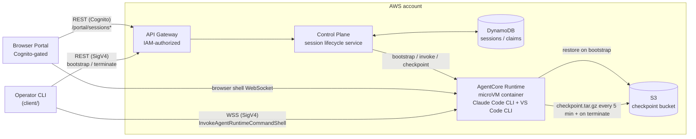

# Claude Code on Amazon Bedrock AgentCore Runtime

A private, governed Claude Code developer sandbox: each session provisions
an isolated [Amazon Bedrock AgentCore Runtime](https://docs.aws.amazon.com/bedrock/latest/userguide/agentcore.html)
microVM (Claude Code CLI + VS Code CLI pre-installed) behind an IAM-authorized
API, with an interactive shell and S3-backed checkpoint/restore so a
workspace survives across sessions.

This is a sibling to
[`claude-code-on-lambda-microvm`](../claude-code-on-lambda-microvm): same
governed developer-sandbox architecture and API shape, but running on
AgentCore Runtime (microVM compute type) instead of Lambda MicroVMs. See that
sample's README for a longer discussion of the underlying access-pattern
tradeoffs; this README only covers what's specific to the AgentCore Runtime
implementation.

## Architecture



## What gets deployed

- a VPC, KMS key, S3 checkpoint bucket, and DynamoDB sessions/claims tables;
- a private, IAM-authorized API Gateway backed by the control-plane Lambda;
- an `AWS::BedrockAgentCore::Runtime` on AgentCore Runtime V2
  (`PlatformVersion: V2`, which restores sessions from a snapshot of the
  healthy container for faster cold starts) running the `agent-runtime/`
  container image (Claude Code CLI + VS Code CLI);
- optionally (`enablePortal`, **on by default**), a Cognito user pool and a
  small portal Lambda that serves a single-page browser terminal behind a
  Cognito user pool authorizer.
- optionally, a separate `GithubGatewayStack` -- an AgentCore Gateway
  giving Claude Code sessions a per-user-authorized GitHub tool; see
  "GitHub integration setup" below. Not deployed unless you run
  `npm run setup:github-gateway`.

## Prerequisites

- Node.js 22+, Docker (for the container image build/push), and the AWS CDK
  CLI (`npx cdk`, bundled via `devDependencies`).
- An AWS account/region with access to the AgentCore Runtime service and the
  Bedrock model configured in `bedrockModelId`.
- An AWS CLI profile with permission to deploy the stack, push to ECR, and
  (for the portal) manage the Cognito user pool.

## Quick start

Install and validate:

```bash
npm ci
npm run build
npm test
npm run test:agent-runtime   # agent.py unit tests (python3)
```

Copy and edit the deployment configuration:

```bash
cp deployment.example.json deployment.json
```

At minimum, review `region`, `vpcCidr`, `trustedClientCidr` (the CIDR allowed
to reach the private API), `bedrockModelId`, and `enablePortal`.

Deploy (builds/pushes the container image, then `cdk deploy`s the stack):

```bash
npm run deploy -- --config deployment.json --profile <profile> --require-approval never
```

Confirm the container is healthy without going through the control-plane API
or the portal:

```bash
npm run smoke-test -- --profile <profile> --region <region>
```

## Portal setup and first login

`enablePortal` defaults to `true`. When the stack finishes deploying, read
the `PortalUrl` and `PortalUserPoolId` outputs:

```bash
aws cloudformation describe-stacks \
  --stack-name ClaudeAgentCoreRuntimeStack \
  --profile <profile> --region <region> \
  --query "Stacks[0].Outputs"
```

The portal's Cognito user pool has **self-signup disabled** — there's no
public signup page, by design. Create the first user yourself:

```bash
aws cognito-idp admin-create-user \
  --user-pool-id <PortalUserPoolId> \
  --username '<user@example.com>' \
  --user-attributes \
    Name=email,Value='<user@example.com>' \
    Name=email_verified,Value=true \
  --region <region> \
  --profile <profile>
```

Cognito emails a temporary password and requires setting a new one at first
sign-in (password policy: 12+ characters, upper/lower/digit/symbol). To skip
email delivery and set the temporary password yourself instead, add
`--message-action SUPPRESS --temporary-password '<TempPassw0rd!>'` to the
command above — you're still forced to change it on first sign-in.

To log in:

1. Open the `PortalUrl` from the stack outputs.
2. Choose **Sign in** and complete the Cognito hosted UI flow (temporary
   password, then a new permanent password on first login).
3. Back on the portal, choose **Create environment**, name a workspace, and
   wait for it to reach `RUNNING`.
4. Choose **Connect** to open the terminal in the browser. From
   `/workspace`, run `claude`.

The portal only exposes terminal access (`accessMode: "terminal"`). VS Code
access and other lifecycle operations (`suspend`, `resume`, JSON output) are
available through the operator CLI — see below.

Only the `/portal/*` static asset routes (the SPA shell) are unauthenticated;
every route that touches session or workspace data requires either the
Cognito authorizer (portal) or SigV4/IAM (CLI).

## Public access

The API this portal is served from is a **private** API Gateway: its resource
policy rejects any request that doesn't arrive through the stack's
`execute-api` VPC interface endpoint. A freshly deployed stack is therefore
unreachable from a laptop — including the `PortalUrl` — until you give
yourself a network path into the VPC. `trustedClientCidr` only widens the
endpoint's security group; on its own it does not create connectivity.

Two ways to get one:

1. **Network into the VPC** — Client VPN, Site-to-Site VPN, Direct Connect,
   or a Transit Gateway attachment, with `trustedClientCidr` set to the
   routed client range. Keeps everything private, no public surface.
2. **Front it with CloudFront** — a distribution using a
   [VPC origin](https://docs.aws.amazon.com/AmazonCloudFront/latest/DeveloperGuide/private-content-vpc-origins.html)
   pointed at an internal ALB whose IP target group is the `execute-api` VPC
   endpoint's ENIs. CloudFront reaches the ALB over AWS's private network, so
   the ALB stays internal and the API stays private. Three details matter:
   - CloudFront must inject an `x-apigw-api-id: <rest-api-id>` origin header.
     Once the request no longer arrives with the `execute-api` hostname in
     `Host`, that header is what API Gateway resolves the API from.
   - Use an ALB rather than an NLB. The ALB re-encrypts to the VPC endpoint
     without validating its certificate, which sidesteps the certificate
     mismatch you'd hit passing TLS straight through to a hostname the
     endpoint's certificate doesn't cover.
   - Register the CloudFront portal URL as a Cognito callback/logout URL with
     `portalPublicUrls` in `deployment.json`, or the OAuth redirect is
     rejected. Set `albSecurityGroupId` to the ALB's security group so the
     relay accepts its WebSocket traffic:

     ```json
     {
       "portalPublicUrls": ["https://<distribution>.cloudfront.net/v1/portal"],
       "albSecurityGroupId": "sg-0123456789abcdef0"
     }
     ```

     Declaring them here rather than editing the user pool client by hand
     keeps the callback list intact across redeploys.

   Caveat: VPC endpoint ENI IPs are not contractually stable, so a static IP
   target group can go stale if AWS rescales the endpoint. For anything
   long-lived, refresh the target group from `describe-vpc-endpoints` on a
   schedule.

## Operator CLI

```bash
npm run client -- --profile <profile> --region <region> start
```

`start` creates or reuses a terminal session and attaches. `list`, `status`,
`suspend`, `resume`, and `terminate` manage sessions from the same IAM
principal. Run `npm run client -- --help` for the full command reference.

## Lifecycle and checkpointing

AgentCore Runtime has no native pause primitive and no session
list/describe API, so `control-plane/` emulates suspend/resume itself.
While a session runs, the container checkpoints `/workspace` to S3 as a
`.tar.gz` every 5 minutes (`CHECKPOINT_INTERVAL_SECONDS` in
`agent-runtime/agent.py`; an unchanged workspace is not re-uploaded), and
again on `suspend` and `terminate`. The next `start` for the same workspace
restores it, and the portal's "saved" time and download link reflect the
latest checkpoint. Sessions are checkpoint-terminated 45 minutes before the
8h AgentCore Runtime hard cap. There is no idle-based termination yet:
`idleAfterSeconds` is passed to AgentCore Runtime's own idle timeout, but the
control plane's once-a-minute liveness probe counts as activity, so sessions
run until terminated or the cap. The interactive shell connection itself
has a 1h TTL — the CLI and portal both reconnect automatically.

To ship a change to `agent-runtime/`, rerun `npm run deploy`. It pushes the
image and pins the runtime to its digest. AgentCore Runtime V2 starts new
sessions from a snapshot of the deployed runtime version, so pushing an
image with `npm run provision-image` alone does not reach new sessions.

## Security and limitations

- The API is private and IAM-authorized by default; the portal path adds a
  Cognito user pool authorizer on top, scoped to `/portal/sessions*`. Static
  portal assets (HTML/JS/CSS/`config.json`) are intentionally public, since
  a browser needs to load them before it has a Cognito token.
- `cdk-nag` (AwsSolutions) is clean with documented suppressions in
  `infra/lib/nag-acks.ts`, including the portal-specific ones (Cognito
  advanced-security tier, MFA, and the public static-asset routes above).
- Advanced security features and MFA on the Cognito user pool are deferred
  to production hardening, matching the baseline-cost posture of the rest of
  the sample.

## GitHub integration setup

An optional, separate feature: once set up, a Claude Code session can call
two real GitHub tools -- list the logged-in portal user's own open pull
requests, and create an issue -- authorized as that specific GitHub
account via that account's own OAuth consent, never a shared service
token. Deliberately limited to GitHub and to these two operations; see
"Design" below for why.

This requires `enablePortal: true` (see "Portal setup and first login"):
the feature identifies the already-logged-in portal user to the gateway
below, so it has no meaning for the IAM-only operator CLI path.

### How it works

- [Amazon Bedrock AgentCore Gateway](https://docs.aws.amazon.com/bedrock-agentcore/latest/devguide/gateway.html)
  exposes an MCP server backed by an **OpenAPI target** that calls
  `api.github.com` directly (`infra/github-tools-openapi.json`,
  `infra/lib/github-gateway-stack.ts`).
- Gateway's **inbound** auth reuses the portal's existing Cognito user
  pool (no second user pool): a session's Claude Code CLI presents a
  Cognito **access token** from the same login the portal already did,
  as a bearer token -- not the ID token the portal itself uses to call
  its own API (see "The security tradeoff, plainly" below for exactly
  why these have to be two different tokens; confirmed live, not
  assumed from docs).
- Gateway's **outbound** auth to GitHub is an
  [AgentCore Identity `GithubOauth2` credential provider](https://docs.aws.amazon.com/bedrock-agentcore/latest/devguide/identity-idp-github.html):
  on a user's first GitHub tool call, AgentCore redirects them through a
  real GitHub OAuth consent screen, then stores that one user's GitHub
  access token in AWS's Token Vault, scoped to that Cognito identity.
  Later calls from the same user reuse it; a different user gets their
  own separate consent and token.

### Design: why an OpenAPI target, not a Lambda target

AgentCore Gateway supports several target types. A Lambda target was the
obvious first guess (custom code, full control) -- it turns out to be the
wrong choice for this specific requirement, confirmed against AWS's own
current outbound-authorization support table
([gateway-outbound-auth.html](https://docs.aws.amazon.com/bedrock-agentcore/latest/devguide/gateway-outbound-auth.html)):
**Lambda targets only support the gateway's own IAM service role for
outbound auth -- no OAuth of any kind.** Confirmed from the other
direction too: the real [Lambda target invocation
contract](https://docs.aws.amazon.com/bedrock-agentcore/latest/devguide/gateway-add-target-lambda.html)
passes the Lambda function only `bedrockAgentCore{MessageVersion,
AwsRequestId, McpMessageId, GatewayId, TargetId, ToolName}` in the
invocation context -- no caller identity, no token, nothing a Lambda
function could use to look up a per-user GitHub token even if it tried.
There is no way to get a specific end user's own GitHub OAuth token to a
Lambda target today.

An **OpenAPI target**, by contrast, supports OAuth authorization-code
(3-legged, per-user) outbound auth natively, and needs no Lambda at all:
Gateway calls `api.github.com` directly, resolving the right user's
token from Token Vault per call. For this specific requirement (identify
the calling user, get a token scoped to that one user, call a plain REST
API), the OpenAPI target isn't just simpler -- it's the only one of the
two that actually implements per-user OAuth.

### Set up your GitHub OAuth App

1. In GitHub: profile picture -> **Settings** -> **Developer settings** ->
   **OAuth Apps** -> **New OAuth App**.
2. Fill in:
   - **Application name**: anything recognizable, e.g. "Claude Code
     AgentCore sample (yourname)".
   - **Homepage URL**: your deployment's `PortalUrl` stack output (any
     `https://` URL is accepted here; GitHub does not validate it against
     your Authorization callback URL).
   - **Authorization callback URL**: leave this **blank for now**. AWS
     issues a unique callback URL per credential provider (see below) --
     you cannot know it before creating the AWS side.
3. Click **Register application**.
4. On the app's page, click **Generate a new client secret**. Copy both
   the **Client ID** and this **client secret** immediately -- GitHub
   only shows the secret once.

### Run the setup script

Set `"enableGithubGatewayDnsEndpoint": true` in `deployment.json` and run
`npm run deploy` once (no other changes needed). This adds one VPC interface
endpoint (`com.amazonaws.<region>.bedrock-agentcore.gateway`) that the
sandbox needs to resolve AgentCore Gateway's own hostname -- confirmed
live: without it, the platform stack's existing
`com.amazonaws.<region>.bedrock-agentcore` endpoint (needed for the
Runtime data plane, always present) makes this VPC privately
authoritative for all of `bedrock-agentcore.<region>.amazonaws.com`,
which silently breaks DNS resolution for Gateway's distinct
`<id>.gateway.bedrock-agentcore.<region>.amazonaws.com` hostnames from
inside the sandbox (`curl: Could not resolve host`) even though the
exact same hostname resolves fine from outside the VPC. This endpoint
is opt-in (`enableGithubGatewayDnsEndpoint`) specifically so a
deployment that never uses this feature doesn't pay for it.

Then:

```bash
GITHUB_CLIENT_SECRET=<the secret from step 4> \
  npm run setup:github-gateway -- \
  --client-id <the client ID from step 4> \
  --region us-east-1 \
  --profile default \
  --project-name claude-agentcore
```

(Match `--region`/`--project-name` to your existing deployment; see
`deployment.json`.) This:

1. Registers a `GithubOauth2` AgentCore Identity credential provider via
   `CreateOauth2CredentialProvider` and prints the **callback URL** AWS
   issued for it.
2. Deploys `GithubGatewayStack` (the AgentCore Gateway + OpenAPI target),
   importing your existing portal's Cognito user pool by ID -- this does
   **not** touch or redeploy `ClaudeAgentCoreRuntimeStack`.

Then go back to your GitHub OAuth App's settings and paste the printed
callback URL into **Authorization callback URL** (it looks like
`https://bedrock-agentcore.<region>.amazonaws.com/identities/oauth2/callback/<uuid>`).
Save.

That's it -- no changes to the platform stack, no redeploy of it, and no
manual IAM or raw `aws` CLI calls. The already-deployed control plane
picks up the new gateway automatically: it reads the gateway's URL from
an SSM parameter (`/<projectName>/github-gateway/url`) that
`GithubGatewayStack` publishes, at the moment each new session starts.
Existing running sessions do not get the tool retroactively; start a new
session (or reconnect, which starts fresh) to pick it up.

### What changes in the portal/session

Nothing visible changes in the portal UI. Inside a session, Claude Code
now has an MCP server named `github` registered
(`$CLAUDE_CONFIG_DIR/.claude.json`, written by
`agent-runtime/agent.py`'s `configure_github_mcp_server()`). Ask it
something like "what are my open pull requests?" or "create an issue on
`<owner>/<repo>` titled ...". The first call for a given GitHub account
returns an OAuth consent URL; after you approve it once in a browser,
follow-up calls (from any session, as long as the Cognito access token
below hasn't expired) just work.

### The security tradeoff, plainly

- The credential that actually reaches the sandbox is the user's own
  **Cognito access token** (minted at session start from the same login
  the portal already did -- not the ID token the portal itself uses for
  its own API calls; see the "inbound auth" bullet above for why an ID
  token doesn't work here), written in cleartext into `.claude.json`
  inside `/workspace` -- which is itself encrypted at rest (KMS) and
  checkpointed to the workspace S3 bucket, but readable in cleartext by
  anything running as the `developer` user inside that session's
  container.
- That token is short-lived: Cognito's default access token lifetime is
  **60 minutes** from mint time, and it is minted once, at session start
  -- this sample does not refresh it. A session left running past that
  window has a GitHub tool that starts failing with 401s until the user
  starts a new session.
- The token's blast radius if read by a compromised Claude Code session
  (a malicious MCP server, a prompt-injected tool result, etc.) is
  bounded: it is only valid as a bearer token against this one AgentCore
  Gateway's Cognito authorizer, for calling exactly the two GitHub
  operations defined in `infra/github-tools-openapi.json`, until it
  expires. It is **not** a GitHub credential -- the actual GitHub OAuth
  access token never leaves AWS's Token Vault and is not retrievable from
  inside the sandbox, directly or indirectly. A compromised session
  within that one hour could list the user's open PRs and create issues
  (and whatever else the `repo` OAuth scope allows if the tool set were
  ever widened) as that user, but could not read, exfiltrate, or reuse
  the underlying GitHub token itself outside that one hour.
- `repo` is a broad GitHub OAuth scope (reads and writes across public
  and private repos the user can access). The two operations here only
  need read access to the user's own PRs and issue-create on one repo at
  a time; a narrower `public_repo` scope would work if you don't need
  the tools to see private repos, at the cost of GitHub's search API
  then only returning the user's public-repo pull requests. Change it
  with `--scope public_repo` on the setup script.
