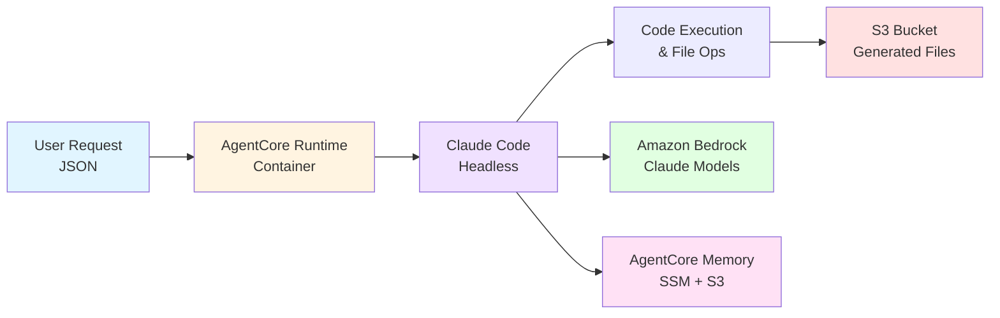

# Claude Code on Amazon Bedrock AgentCore

Deploy Claude Code as an autonomous agent on Amazon Bedrock AgentCore with integrated memory capabilities.

## Table of Contents

- [Overview](#overview)
- [Memory Integration](#memory-integration)
- [Architecture](#architecture)
- [Prerequisites](#prerequisites)
- [Quick Start](#quick-start)
- [Memory Setup Guide](#memory-setup-guide)
- [Deployment](#deployment)
- [Usage](#usage)
- [Advanced Configuration](#advanced-configuration)
- [Project Structure](#project-structure)
- [Monitoring](#monitoring)
- [Troubleshooting](#troubleshooting)
- [Git Workflow](#git-workflow)
- [Cleanup](#cleanup)

## Overview

Claude Code is an AI-powered coding assistant that can autonomously complete programming tasks. This integration packages Claude Code as an AgentCore-compatible agent that:

- Runs autonomously without interactive UI
- Deploys to AgentCore for serverless execution
- Uses Amazon Bedrock (no Anthropic API key required)
- **Integrated with AgentCore Memory** for session continuity and learning
- Handles multi-step tasks with file operations
- Single script deploys all infrastructure

## Memory Integration

The agent includes **Amazon Bedrock AgentCore Memory** integration following the [customer-support-assistant pattern](https://github.com/awslabs/amazon-bedrock-agentcore-samples/tree/main/02-use-cases/customer-support-assistant):

### Short-Term Memory
- Maintains conversation context within sessions
- Enables session continuation when agent restarts
- Stores last 3-5 conversation turns for immediate context
- Available immediately after each interaction

### Long-Term Memory
- **Semantic Memory**: Extracts and stores coding patterns, solutions, and technical knowledge
- **Summary Memory**: Summarizes completed projects and sessions for future reference
- **User Preference Memory**: Learns coding preferences, styles, and frameworks
- Automatic background processing (5-10 minutes after conversations)

### Memory Benefits
- **Session Continuity**: Pick up where you left off in coding projects
- **Learning**: Agent remembers your coding style and preferences
- **Context Awareness**: Better understanding of project requirements over time
- **Personalization**: Tailored responses based on past interactions

### Key Features
- ✅ Single memory resource (no duplicates)
- ✅ Memory ID stored in SSM Parameter Store
- ✅ Session-based file persistence in S3
- ✅ Scripts to view short-term and long-term memories
- ✅ Automatic memory setup during deployment

## Architecture



## Prerequisites

- **AWS Account** with appropriate permissions
- **AWS CLI** configured (`aws configure`)
- **Python 3.10+** with boto3 installed
- **Docker** with buildx support
- **jq** - For JSON parsing in scripts
- **Amazon Bedrock** model access enabled for Claude models

## Quick Start

The fastest way to get started:

```bash
# 1. Deploy everything (one-time setup)
cd headless-mode
./deploy.sh

# 2. Invoke the agent (interactive mode)
./invoke_claude_code.sh "Create a simple hello world Python app"

# 3. View conversation history (short-term memory)
./view_conversation_history.sh user123 session1

# 4. View extracted memories (long-term memory, wait 5-10 minutes)
./view_memories.sh user123

# 5. Download generated files
./download_outputs.sh
```

---

## Memory Setup Guide

### Problem Solved

Previously, the implementation was creating **multiple memory IDs (3-7+)** on each deployment because:
1. Memory was being created in the agent initialization code
2. Each container/invocation would try to create its own memory
3. Files were ephemeral and didn't persist between invocations

### Solution

The correct approach:
1. **Create memory ONCE** using a setup script (now automated in deploy.sh)
2. **Store the memory ID** in AWS Systems Manager Parameter Store
3. **Reuse the same memory ID** across all agent invocations
4. **Session-based S3 storage** for file persistence

### Memory Architecture

#### ❌ Old Approach (Incorrect)
```
Agent Startup → Create Memory → Store in SSM
Agent Startup → Create Memory → Store in SSM  (Duplicate!)
Agent Startup → Create Memory → Store in SSM  (Duplicate!)
```

#### ✅ New Approach (Correct)
```
Deploy Script → Create Memory (if not exists) → Store in SSM
                              ↓
Agent Invocations → Load Memory ID from SSM → Reuse Same Memory
```

### Memory Strategies

The memory resource is configured with three strategies:

#### 1. Semantic Strategy
- **Purpose**: Extracts and stores factual information
- **Namespace**: `coding/user/{actorId}/facts`
- **Use Case**: Technical knowledge, coding patterns, project-specific facts

#### 2. Summary Strategy
- **Purpose**: Captures conversation summaries
- **Namespace**: `coding/user/{actorId}/{sessionId}`
- **Use Case**: Session-specific conversation history

#### 3. User Preference Strategy
- **Purpose**: Stores user preferences and settings
- **Namespace**: `coding/user/{actorId}/preferences`
- **Use Case**: Coding style preferences, tool preferences, etc.

### Manual Memory Setup (Optional)

The deployment script automatically creates memory, but you can also manage it manually:

```bash
# Create memory manually
cd headless-mode
python setup_memory.py create --region us-east-1

# Verify memory creation
aws ssm get-parameter --name /claude-code-agent/memory-id --region us-east-1

# Delete memory (cleanup)
python setup_memory.py delete --region us-east-1
```

---

## Deployment

### What Gets Created

The `headless-mode/deploy.sh` script creates:

1. **CloudFormation Stack** (`claude-code-agent-memory-stack`):
   - IAM Role with Bedrock, S3, ECR, AgentCore Memory permissions
   - S3 Bucket for output files
   - ECR Repository for Docker image

2. **AgentCore Memory** (if not exists):
   - Single memory resource with three strategies
   - Memory ID stored in SSM Parameter Store

3. **Docker Image**:
   - Built for ARM64/Graviton
   - Includes Node.js 20+ and Claude Code CLI
   - Pushed to ECR

4. **AgentCore Runtime**:
   - Deployed with the container image
   - Receives invocations via AWS CLI

### Deploy Steps

```bash
cd headless-mode
chmod +x *.sh
./deploy.sh
```

The script:

1. Deploys CloudFormation stack (IAM, S3, ECR)
2. **Creates AgentCore Memory** (if it doesn't exist)
3. Builds Docker image for ARM64
4. Pushes image to ECR
5. Creates/updates AgentCore runtime
6. Saves deployment info to deployment.json

**Output:**

```
✅ DEPLOYMENT SUCCESSFUL!

📝 Quick start:
  ./invoke_claude_code.sh "Create a simple hello world app"

📊 View deployment info:
  ./show_agent_info.sh

📥 Download generated files:
  ./download_outputs.sh
```

---

## Usage

### Invoke the Agent with Memory

```bash
# Interactive mode (generates random session ID)
./invoke_claude_code.sh "Create a Python calculator app"

# With specific user and session for memory continuity
./invoke_claude_code.sh "Create a Python calculator app" "user123" "project_calc"

# Continue previous session
./invoke_claude_code.sh "Add unit tests to the calculator" "user123" "project_calc"

# Type /quit to exit interactive mode
```

The script:
- Reads runtime ARN from deployment.json
- Invokes the agent with memory parameters
- Displays response with duration, turns, and memory status
- Runs in interactive mode until you type `/quit`

### View Memories

#### Short-Term Memory (Conversation History)
Available immediately after interactions:

```bash
./view_conversation_history.sh user123 session1
```

Shows:
- Recent conversation turns
- User prompts and agent responses
- Immediate context from the session

#### Long-Term Memory (Extracted Knowledge)
Available 5-10 minutes after conversations:

```bash
./view_memories.sh user123
```

Shows:
- **Semantic memories**: Facts and technical knowledge
- **User preferences**: Coding styles and preferences
- **Summaries**: Conversation summaries (session-specific)

### Memory Parameters

- **actor_id**: Unique identifier for the user (default: "default_user")
- **session_id**: Session identifier for conversation continuity (default: timestamp-based)
- Using the same actor_id and session_id enables memory continuity

### Download Generated Files

```bash
./download_outputs.sh
```

### View Deployment Info

```bash
./show_agent_info.sh
```

---

## Advanced Configuration

### Environment Variables

The Dockerfile sets these defaults (can be overridden):

| Variable                        | Description                | Default     |
| ------------------------------- | -------------------------- | ----------- |
| `CLAUDE_CODE_USE_BEDROCK`       | Enable Bedrock integration | `1`         |
| `AWS_REGION`                    | AWS region for Bedrock     | `us-east-1` |
| `CLAUDE_CODE_MAX_OUTPUT_TOKENS` | Maximum output tokens      | `4096`      |
| `MAX_THINKING_TOKENS`           | Maximum thinking tokens    | `1024`      |
| `MEMORY_MAX_TURNS`              | Conversation turns to load | `3`         |

### Response Format

```json
{
  "output": {
    "success": true,
    "result": "Task completed successfully. Created files...",
    "session_id": "uuid",
    "actor_id": "user123",
    "timestamp": "2025-10-08T22:00:00.123Z",
    "model": "claude-sonnet-4.5",
    "metadata": {
      "duration_ms": 180000,
      "num_turns": 58,
      "memory_enabled": true,
      "uploaded_files": [
        {
          "file_name": "app.py",
          "s3_url": "s3://bucket/outputs/20251008_220000/app.py",
          "console_url": "https://console.aws.amazon.com/s3/..."
        }
      ]
    }
  }
}
```

### IAM Permissions

The CloudFormation stack creates an IAM role with these permissions:

- **Bedrock**: InvokeModel, InvokeModelWithResponseStream
- **AgentCore Memory**: CreateMemory, GetMemory, QueryMemory, SaveConversation
- **S3**: PutObject, GetObject to output bucket and session storage
- **SSM**: GetParameter for memory ID retrieval
- **CloudWatch**: Logs for monitoring
- **ECR**: Access to pull container image

All permissions are configured in `headless-mode/infrastructure.yaml`.

---

## Project Structure

```
claude-code-on-agentcore/
├── README.md                                    # This file
├── .gitignore                                   # Git exclusions
└── headless-mode/
    ├── agent.py                                 # FastAPI agent with memory
    ├── memory_manager.py                        # Memory integration
    ├── setup_memory.py                          # Memory creation script
    ├── deploy.sh                                # Unified deployment script
    ├── infrastructure.yaml                      # CloudFormation template
    ├── invoke_claude_code.sh                    # Interactive invocation
    ├── view_conversation_history.sh             # Short-term memory viewer
    ├── view_memories.sh                         # Long-term memory viewer
    ├── show_agent_info.sh                       # Display deployment info
    ├── download_outputs.sh                      # Download files from S3
    ├── Dockerfile                               # Container definition
    ├── pyproject.toml                           # Python dependencies
    └── uv.lock                                  # Dependency lock file
```

---

## Monitoring

### CloudWatch Logs

View logs:

```bash
# Find your log group
aws logs describe-log-groups --log-group-name-prefix /aws/bedrock-agentcore

# Tail logs
aws logs tail /aws/bedrock-agentcore/runtimes/claude_code_agent_runtime --follow
```

### Memory Status

Check memory in AWS Console:
1. Go to [Amazon Bedrock Console](https://console.aws.amazon.com/bedrock/)
2. Navigate to "Memory" section
3. View memory resource and strategies

Or via CLI:
```bash
# Get memory ID
aws ssm get-parameter --name /claude-code-agent/memory-id --region us-east-1

# List memories (requires memory ID)
aws bedrock-agentcore list-memories --memory-id <memory-id>
```


## Cleanup

### Delete All Resources

```bash
# Delete CloudFormation stack (removes IAM, S3, ECR)
aws cloudformation delete-stack --stack-name claude-code-agent-memory-stack --region us-east-1

# Delete AgentCore runtime
aws bedrock-agentcore delete-agent-runtime --agent-runtime-id <runtime-id>

# Delete memory resource
cd headless-mode
python setup_memory.py delete --region us-east-1
```

### Clean Up S3 Bucket

```bash
# Empty S3 bucket before deleting stack
aws s3 rm s3://your-bucket-name --recursive
```

---

