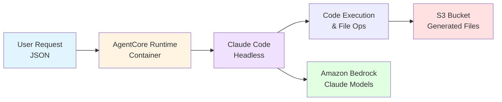

# Claude Code on Amazon Bedrock AgentCore

Deploy Claude Code as an autonomous agent on Amazon Bedrock AgentCore.

## Overview

Claude Code is an AI-powered coding assistant that can autonomously complete programming tasks. This integration packages Claude Code as an AgentCore-compatible agent that:

- Runs autonomously without interactive UI
- Deploys to AgentCore for serverless execution
- Uses Amazon Bedrock (no Anthropic API key required)
- Handles multi-step tasks with file operations
- Single script deploys all infrastructure

## Architecture



## Prerequisites

- **AWS Account** with appropriate permissions
- **AWS CLI** configured (`aws configure`)
- **Python 3.10+** with boto3 installed
- **Docker** with buildx support
- **jq** - For JSON parsing in scripts
- **Amazon Bedrock** model access enabled for Claude models

## Quick Start

The fastest way to get started:

```bash
# 1. Deploy everything (one-time setup)
cd headless-mode
./deploy.sh

# 2. Invoke the agent
./invoke_claude_code.sh "Create a simple hello world Python app"

# 3. Download generated files
./download_outputs.sh
```

## Deployment

### What Gets Created

The `headless-mode/deploy.sh` script creates:

1. **CloudFormation Stack** (`claude-code-agent-stack`):

   - IAM Role with Bedrock, S3, ECR permissions
   - S3 Bucket for output files
   - ECR Repository for Docker image

2. **Docker Image**:

   - Built for ARM64/Graviton
   - Includes Node.js 20+ and Claude Code CLI
   - Pushed to ECR

3. **AgentCore Runtime**:
   - Deployed with the container image
   - Receives invocations via AWS CLI

### Deploy Steps

```bash
cd headless-mode
chmod +x deploy.sh
./deploy.sh
```

The script:

1. Deploys CloudFormation stack (IAM, S3, ECR)
2. Builds Docker image for ARM64
3. Pushes image to ECR
4. Creates/updates AgentCore runtime
5. Saves deployment info to deployment.json

**Output:**

```
✅ DEPLOYMENT SUCCESSFUL!

📝 Quick start:
  ./invoke_claude_code.sh "Create a simple hello world app"

📊 View deployment info:
  ./show_agent_info.sh

📥 Download generated files:
  ./download_outputs.sh
```

## Usage

### Invoke the Agent

```bash
./invoke_claude_code.sh "Create a Python calculator app"
```

The script:

- Reads runtime ARN from deployment.json
- Invokes the agent
- Displays response with duration and turns
- Saves response to timestamped file

### Download Generated Files

```bash
./download_outputs.sh
```

### View Deployment Info

```bash
./show_agent_info.sh
```

## Advanced Configuration

### Environment Variables

The Dockerfile sets these defaults (can be overridden):

| Variable                        | Description                | Default     |
| ------------------------------- | -------------------------- | ----------- |
| `CLAUDE_CODE_USE_BEDROCK`       | Enable Bedrock integration | `1`         |
| `AWS_REGION`                    | AWS region for Bedrock     | `us-east-1` |
| `CLAUDE_CODE_MAX_OUTPUT_TOKENS` | Maximum output tokens      | `4096`      |
| `MAX_THINKING_TOKENS`           | Maximum thinking tokens    | `1024`      |

### Response Format

```json
{
  "output": {
    "result": "Task completed successfully. Created files...",
    "session_id": "uuid",
    "timestamp": "2025-10-01T14:42:41.123Z",
    "model": "claude-sonnet-4.5",
    "metadata": {
      "duration_ms": 180000,
      "num_turns": 58,
      "uploaded_files": [
        {
          "file_name": "app.py",
          "s3_url": "s3://bucket/outputs/20251001_144241/app.py"
        }
      ]
    }
  }
}
```

## IAM Permissions

The CloudFormation stack (`headless-mode/infrastructure.yaml`) creates an IAM role with these permissions:

### Core Permissions

- **Bedrock**: InvokeModel, InvokeModelWithResponseStream
- **S3**: PutObject to output bucket
- **CloudWatch**: Logs for monitoring
- **ECR**: Access to pull container image

All permissions are configured in `headless-mode/infrastructure.yaml`.

## Project Structure

```
headless-mode/
├── deploy.sh              # Unified deployment script
├── infrastructure.yaml    # CloudFormation template (IAM, S3, ECR)
├── agent.py              # Main agent implementation
├── invoke_claude_code.sh # Invoke the agent
├── show_agent_info.sh    # Display deployment info
├── download_outputs.sh   # Download files from S3
├── Dockerfile            # Container with Node.js and Claude Code CLI
├── pyproject.toml        # Python dependencies
└── uv.lock               # Dependency lock file
```

## Local Testing

Test the container locally:

```bash
cd headless-mode

# Build container
docker build --no-cache -t claude-code-agent .

# Create output directory for generated files
mkdir -p output

# Run with AWS credentials (choose one method):

# Method 1: Mount AWS credentials directory (recommended)
docker run -d --name claude-code-test \
  -p 8080:8080 \
  -v ~/.aws:/root/.aws:ro \
  -v $(pwd)/output:/app/workspace \
  -e AWS_REGION=us-east-1 \
  claude-code-agent

# Method 2: Pass credentials as environment variables
docker run -d --name claude-code-test \
  -p 8080:8080 \
  -v $(pwd)/output:/app/workspace \
  -e AWS_ACCESS_KEY_ID=$AWS_ACCESS_KEY_ID \
  -e AWS_SECRET_ACCESS_KEY=$AWS_SECRET_ACCESS_KEY \
  -e AWS_SESSION_TOKEN=$AWS_SESSION_TOKEN \
  -e AWS_REGION=us-east-1 \
  claude-code-agent

# Method 3: Use AWS profile
docker run -d --name claude-code-test \
  -p 8080:8080 \
  -v ~/.aws:/root/.aws:ro \
  -v $(pwd)/output:/app/workspace \
  -e AWS_PROFILE=your-profile-name \
  -e AWS_REGION=us-east-1 \
  claude-code-agent

# Test endpoint
curl -X POST http://localhost:8080/invocations \
  -H "Content-Type: application/json" \
  -d '{"input":{"prompt":"Create a hello.py file that prints Hello, World!"}}' | jq

# View generated files immediately in ./output directory
ls -la output/
cat output/hello.py

# View container logs
docker logs -f claude-code-test

# Clean up
docker stop claude-code-test
docker rm claude-code-test
```

## Monitoring

View CloudWatch logs:

```bash
# Find your log group
aws logs describe-log-groups --log-group-name-prefix /aws/bedrock-agentcore

# Tail logs
aws logs tail /aws/bedrock-agentcore/runtimes/claude_code_agent_runtime --follow
```

### Clean Up

To delete everything:

```bash
# Delete CloudFormation stack (removes IAM, S3, ECR)
aws cloudformation delete-stack --stack-name claude-code-agent-stack --region us-east-1

# Delete AgentCore runtime
aws bedrock-agentcore delete-agent-runtime --agent-runtime-id <runtime-id>
```

## What Gets Deployed

After running `./deploy.sh`:

- CloudFormation stack with IAM role, S3 bucket, ECR repository
- Docker image in ECR containing Claude Code CLI
- AgentCore runtime executing the container
- Configuration saved to `headless-mode/deployment.json`
