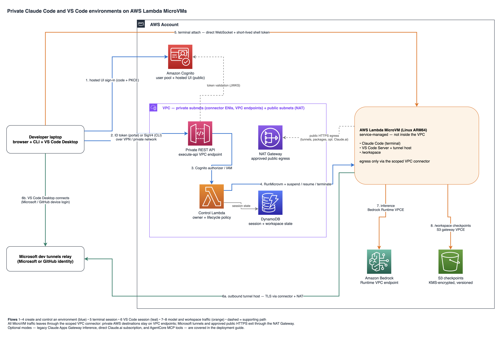

# Private Claude Code and VS Code environments on Lambda MicroVMs

This sample runs one private Claude Code development environment per developer
workspace on AWS Lambda MicroVMs. Developers use a small laptop CLI: control
requests are SigV4-signed calls to a private API Gateway reachable only over a
VPN or equivalent routed network, and the interactive terminal is a direct
WebSocket to the MicroVM's native shell endpoint using a short-lived service
token. The same Linux ARM64 image also supports VS Code Desktop on macOS or
Windows through outbound Microsoft Remote Tunnels. VS Code Server, the Linux
workspace, terminals, language tooling, and the Claude Code extension execute
inside the MicroVM; the laptop remains the user-interface endpoint.

Amazon Bedrock is the default Claude provider. The MicroVM execution role
supplies temporary AWS credentials and model traffic stays on the private
Bedrock Runtime endpoint. An operator can explicitly permit a developer's
direct Claude.ai subscription, whose login and model traffic then originate
from the MicroVM through NAT. The earlier Claude Apps Gateway mode remains
available for compatibility. Amazon Bedrock AgentCore Gateway optionally
provides the governed MCP tool path over IAM and SigV4.

Running MicroVMs attach a scoped VPC connector. Private AWS destinations stay
on VPC endpoints; Microsoft Remote Tunnels, VS Code downloads, approved Git
and package services, and optional Claude.ai traffic exit through an
AWS-managed NAT Gateway.

The laptop client never invokes, reads, or modifies a laptop Claude
installation or its configuration. For terminal sessions it attaches the
local terminal to Claude Code in the MicroVM. For VS Code sessions it performs
an interactive tunnel login and opens the assigned remote Linux workspace.

> **Validation status:** terminal mode is validated end to end on Amazon
> Bedrock, including Cognito portal sign-in, environment creation, and a
> live Claude Code session. VS Code mode has completed Microsoft Remote
> Tunnels registration from a live MicroVM; editor acceptance on macOS and
> Windows, including the graphical Claude Code extension and lifecycle
> tests, has not yet been exercised.

## What is included

- One CDK stack (`ClaudeMicrovmStack`) with a private VPC, private REST API,
  control Lambda, DynamoDB session state, and KMS-encrypted S3 buckets
- One VPC egress connector and one AWS-managed NAT Gateway, with no
  self-managed proxy or egress instance
- Per-workspace terminal or VS Code access modes, with atomic owner/workspace
  claims that prevent duplicate active sessions or provider changes in place
- Official outbound VS Code Remote Tunnels with a supervised tunnel process,
  interactive Microsoft or GitHub device login, and no SSH daemon,
  `ALL_INGRESS`, public IP, bastion, or custom protocol bridge
- One Linux ARM64 image for VS Code Desktop on Windows, macOS Intel, and
  macOS Apple Silicon; no Windows or macOS binaries are baked into the image
- Native MicroVM idle suspend, auto-resume, and suspended-retention policies
  for terminal sessions; VS Code sessions intentionally omit native idle
  policy because outbound tunnel activity is not endpoint activity
- A per-minute reconciler that re-drives stuck transitions,
  checkpoint-terminates sessions before the eight-hour MicroVM limit, and
  sweeps orphaned MicroVMs
- Encrypted, versioned S3 workspace checkpoints restored on the next start,
  with in-VM presigned-URL refresh through the control API
- Root-owned, mutually exclusive Claude provider configuration: Bedrock by
  default, optional Claude.ai subscription, or legacy Claude Apps Gateway
- Pinned Linux ARM64 VS Code CLI and Claude Code releases, with VS Code Server
  and the pinned remote Claude extension initialized at runtime
- An unprivileged `developer` user for Claude Code, VS Code Server, extensions,
  terminals, language servers, and the Remote Tunnels host
- Optional IAM/SigV4 stdio MCP bridge to one AgentCore Gateway
- Optional browser minting portal using an Amazon Cognito user pool created
  by the stack, with hosted UI authorization code + PKCE sign-in and a
  native API Gateway Cognito authorizer (see the
  [deployment guide](docs/deployment-guide.md#configure-portal-identity-amazon-cognito))
- Optional sample mutual-TLS AWS Client VPN endpoint with generated PKI
- Deploy, provision, client, and cleanup scripts that run on macOS, Linux, and
  stock Windows (no WSL2, no local Docker)

The default Region is `us-east-1` (CDK context `region`). Lambda MicroVM
availability is Region-specific, and this sample uses ARM64/Graviton images.
The connector model follows the AWS
[networking](https://docs.aws.amazon.com/lambda/latest/dg/microvms-networking.html)
guidance: a customer-managed VPC connector routes MicroVM traffic through VPC
subnets. Although the
[API shape](https://docs.aws.amazon.com/lambda/latest/microvm-api/API_RunMicrovm.html)
is a list, the live service currently accepts one egress connector per
MicroVM. This sample therefore uses the VPC connector as the sole runtime
egress path and the AWS-documented
[private-subnet NAT Gateway](https://docs.aws.amazon.com/vpc/latest/userguide/vpc-nat-gateway.html)
pattern for public HTTPS.
Service-side image builds separately use Lambda-managed `INTERNET_EGRESS`.

## Architecture



```text
Control flow:
(1) Cognito hosted UI sign-in ──▶ browser        (authorization code + PKCE)
(2) ID token or SigV4 ──▶ private REST API       (over VPN / private network)
(3) Cognito authorizer / IAM ──▶ control Lambda  (owner + lifecycle policy)
(4) RunMicrovm / suspend / resume / terminate    (Lambda MicroVM service)

Session flow:
(5) terminal attach                              (direct WebSocket + shell token)
(6) VS Code Remote Tunnels                       (outbound relay, MS/GitHub login)

Data flow:
(7) inference ──▶ Bedrock Runtime VPC endpoint   (private, default mode)
(8) /workspace checkpoints ──▶ S3 gateway VPCE   (KMS-encrypted, versioned)
```

The editable diagram source is [images/architecture.drawio](images/architecture.drawio).
Terminal sessions need no identity beyond AWS (SigV4) or the stack's Cognito
user pool; only VS Code sessions add a Microsoft or GitHub device login for
the tunnel relay. Portal and CLI callers deliberately map to disjoint owner
namespaces (`oidc:<sub>` versus the IAM caller ARN hash), so an environment
created in the portal is managed in the portal, and a CLI environment through
the CLI.

The system-wide reference is the
[architecture and deployment guide](docs/deployment-guide.md).
The guide also covers identity, networking, deployment, VS Code, acceptance,
operations, and troubleshooting.

## Prerequisites

- Node.js 20 or later
- Python 3.12 for the local MicroVM agent tests (standard library only)
- AWS CLI v2 and an AWS `default` profile
- CDK bootstrap resources in the target account and Region
- A private route from developer machines to the VPC's execute-api endpoint
  (or enable the sample Client VPN)
- Visual Studio Code Desktop for VS Code sessions; the client installs the
  pinned Microsoft Remote Tunnels extension into isolated local VS Code state
  and supports standard macOS and Windows installation paths
- OpenSSL on PATH when the sample Client VPN is enabled (Git for Windows
  bundles a usable `openssl.exe`)
- Amazon Bedrock model access for the default mode
- Optional enterprise approval for Microsoft Remote Tunnels and its relay
  endpoints
- A separately deployed Claude Apps Gateway only when legacy
  `claude-gateway` mode is selected
- A separately deployed IAM-authorized AgentCore MCP Gateway, if MCP is
  enabled

Docker is never required. The MicroVM image is built service-side by the
Lambda MicroVM service from a plain source ZIP.

## Quick start

Install and verify the source:

```bash
npm ci
npm --prefix microvm ci
npm test
npm run build
npm --prefix microvm run build
npm run synth -- --quiet
```

Bootstrap CDK with the default profile:

```bash
ACCOUNT_ID="$(aws sts get-caller-identity \
  --profile default \
  --query Account \
  --output text)"
npx cdk bootstrap "aws://${ACCOUNT_ID}/us-east-1" --profile default
```

Create deployment configuration:

```bash
cp deployment.example.json deployment.json
```

Edit every value for your environment. `agentCoreGatewayUrl` and
`agentCoreGatewayArn` must either both be set or both be omitted.

Deploy:

```bash
npm run deploy -- --config deployment.json
```

The deploy command:

1. Generates and imports Client VPN PKI when `createClientVpn` is true.
2. Deploys `ClaudeMicrovmStack` with `cdk deploy`.
3. Creates or reuses the VPC egress network connector.
4. Uploads the `microvm/` source ZIP and builds the MicroVM image
   service-side.
5. Writes the image and connector ARNs to SSM parameters.

The client requires a private route to the VPC's execute-api endpoint, so
connect through your organization's standard network access first.

Then start a workspace:

```bash
npm run client -- list
npm run client -- start my-workspace
```

With `enablePortal: true`, the stack's `PortalUrl` output is the browser
portal address; create portal users first (see the
[deployment guide](docs/deployment-guide.md#configure-portal-identity-amazon-cognito)).

Start a Bedrock-backed VS Code workspace:

```bash
npm run client -- vscode my-workspace
```

The client creates or reuses a VS Code-mode MicroVM, opens a native shell
solely for `code tunnel user login`, asks the developer to complete the
Microsoft device flow, prepares isolated laptop-side VS Code state under
`~/.claude-microvm/vscode-user-data`, installs the pinned local Remote Tunnels
extension, disables the native Microsoft account broker in favor of browser
authentication, and opens `/workspace`. The first launch can also require the
same Microsoft identity inside that isolated VS Code window. Use GitHub tunnel
identity with `--tunnel-provider github`. Direct Claude.ai access requires
both deployment approval (`allowClaudeAiSubscription: true`) and explicit
selection:

```bash
npm run client -- vscode my-workspace \
  --claude-provider claude-ai
```

Use `--no-login --no-launch` to separate creation from login and local launch,
then authenticate later with:

```bash
npm run client -- tunnel-login SESSION_ID
```

The client defaults to the AWS `default` profile and `us-east-1`. Override
either with explicit `--profile` or `--region` options.

## Operations

```bash
npm run client -- status SESSION_ID
npm run client -- suspend SESSION_ID
npm run client -- resume SESSION_ID
npm run client -- terminate SESSION_ID
```

Press `Ctrl-]` to detach from a terminal without terminating the environment.
Use `start WORKSPACE --no-connect` to launch without attaching.
Closing VS Code only disconnects the editor; it does not terminate the
MicroVM. Use the lifecycle commands explicitly. After termination or the
eight-hour replacement boundary, a new VS Code session restores `/workspace`
but requires a new tunnel device login.

For updates, rerun `npm run deploy -- --config deployment.json`. For ordered
cleanup:

```bash
npm run cleanup -- --yes --config deployment.json
```

Cleanup retains the encrypted workspace bucket, sessions table, and KMS key.
Follow the
[teardown procedure](docs/deployment-guide.md#teardown)
before deleting retained data.

## Documentation

- [Architecture and deployment guide](docs/deployment-guide.md)
- [Architecture PNG](images/architecture.png)
- [Editable Draw.io source](images/architecture.drawio)

## Important limitations

- This is a single-Region sample. Multi-Region, quotas, alarms, and cost
  guardrails are out of scope.
- The shell WebSocket framing is based on live service validation because AWS
  does not currently document those frame details. Revalidate it when changing
  the Lambda MicroVM service or SDK version.
- NAT egress permits outbound HTTPS to any IPv4 destination. The sample relies
  on managed provider settings to route Bedrock inference privately; it does
  not claim hostname-level filtering for Microsoft, package, Git, or optional
  Anthropic traffic. A production allowlist requires AWS Network Firewall or
  an organization-managed central egress VPC.
- VS Code source, terminal, and editor protocol traffic traverse Microsoft's
  dev-tunnels relay. Enterprise identity, data-residency, relay, proxy, and
  TLS-inspection approval are prerequisites for production use.
- Remote Tunnels supports interactive Microsoft or GitHub user login in this
  implementation. No service-account or shared unattended tunnel credential
  is baked into the image.
- Tunnel credentials, VS Code Server files, and remote extensions under
  `/home/developer` are intentionally ephemeral and excluded from checkpoints.
  `/workspace` is checkpointed, but a hard loss can still lose changes since
  the last successful checkpoint; Git remains the source-of-record control.
- The sample creates one NAT Gateway to control cost. Production deployments
  that require zonal egress resilience should use one NAT Gateway per
  Availability Zone.
- Each MicroVM invocation has an eight-hour maximum duration. The reconciler
  checkpoint-terminates 45 minutes early by default; starting the same
  workspace again restores the encrypted checkpoint in a fresh invocation.
  Suspended time counts toward the limit, and editor sessions cannot migrate
  across replacement invocations.
- The portal manages environment lifecycle and VS Code tunnel authentication
  but has no browser terminal. Interactive terminal attach requires the CLI,
  and because portal (`oidc:<sub>`) and CLI (IAM ARN hash) owners are
  disjoint, the CLI cannot attach to a portal-created environment; use the
  CLI end to end for terminal workflows.
- Workspace ownership is a SHA-256 hash of the caller ARN. Assumed-role ARNs
  embed the role-session name, so session names must be stable per user. IAM
  Identity Center sets stable names; ad-hoc `sts:AssumeRole` calls with
  varying session names create distinct owners.
- The sample configures AgentCore access but does not create AgentCore
  targets, policies, interceptors, or guardrails.
- The optional Client VPN is demonstration access: a locally generated
  ten-year offline CA with no revocation. Production corporate VPN, Transit
  Gateway, Direct Connect, and DNS integrations remain external.

## License

Licensed under the Apache License 2.0. See the repository
[LICENSE](../LICENSE).
