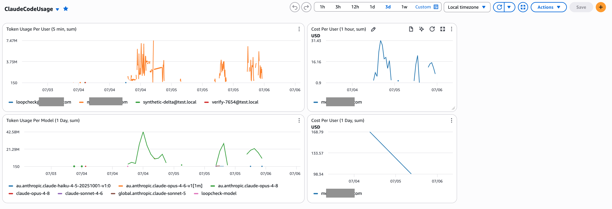

# Deploy OpenTelemetry for Claude Code on the Gateway

This guide adds **usage telemetry** to a working [Claude apps gateway](./README.md)
deployment. When it's done, every Claude Code developer's token usage lands in
Amazon CloudWatch, attributed per user, model, and token type — with no
developer-side configuration.

> **Prerequisite:** a running gateway from the [main README](./README.md). This
> guide reuses its cluster, namespace (`claude-gateway`), Secrets Store CSI
> driver, and Pod Identity setup.

## What you'll build

```
   Claude Code CLI              gateway auto-pushes OTEL_* env vars via
   stamps user.id /             /managed/settings (endpoint = public_url)
   user.email from the                        │
   gateway JWT                                ▼
        │                             ┌─────────────────┐
        └──────── OTLP/HTTPS ────────▶│  Claude Gateway │  telemetry.forward_to
                  (to public_url)     │    (relay)      │  relays verbatim +
                                      └────────┬────────┘  adds Bearer header
                                               │ OTLP/HTTPS (TLS + Bearer)
                                               ▼
                                          Internal ALB  otel.<your-domain>
                                          (ACM cert; gateway resolves it to
                                           the ALB private IP via hostAliases)
                                               │
                                               ▼
                                     OTEL Collector (Deployment)
                                     bearertokenauth validates
                                               │
                                        ┌──────┴──────┐
                                        ▼             ▼
                                   awsemf (EMF)  otlphttp + sigv4
                                   CloudWatch    CloudWatch
                                   namespace: ClaudeCode
```

**Design choice — gateway relay (`telemetry.forward_to`).** This is the
documented, first-class telemetry path: the CLI sends OTLP **to the gateway**
(endpoint built from `listen.public_url`), and the gateway **relays it verbatim**
to the collector. The CLI still stamps `user.id` / `user.email` / `user.groups`
from its gateway-issued JWT, so per-user attribution is preserved. Relay means
**clients need zero OTEL configuration** — no `/etc/hosts`, no bearer token —
because the gateway auto-pushes the `OTEL_*` env vars and holds the token
server-side.

> **History:** an earlier revision of this guide used client **direct-send**
> (push `OTEL_EXPORTER_OTLP_ENDPOINT=<collector ALB>` to clients via a
> `managed.policies` env block). That endpoint is **not on the CLI safe list**
> and direct-send proved unreliable in practice — the CLI never POSTed to the
> ALB. The relay below replaces it. See
> [`docs/otel-e2e-verification.md`](./docs/otel-e2e-verification.md) for the
> end-to-end debugging and evidence, and
> [`docs/superpowers/specs/2026-07-03-otel-collector-direct-send-design.md`](./docs/superpowers/specs/2026-07-03-otel-collector-direct-send-design.md)
> for the original (superseded) direct-send rationale.

## Prerequisites

- A working gateway deployment (main README, Steps 1–7).
- An **ACM certificate** covering the collector's hostname (e.g. a wildcard
  `*.example.com` that covers `otel.example.com`), in the **same region** as the
  cluster.
- **Terraform** ≥ 1.5 and the AWS CLI, both authenticated to your account.
- Private subnets tagged/known for an **internal** ALB (reuse the same subnets
  as the gateway ingress).

Set these shell variables — every step below uses them:

```bash
export AWS_REGION=us-east-1                            # your cluster's region
export AWS_ACCOUNT_ID=$(aws sts get-caller-identity --query Account --output text)
export CLUSTER_NAME=claude-gateway                     # your EKS cluster name
export OTEL_HOST=otel.example.com                     # collector hostname (must match the ACM cert)
export ACM_CERT_ARN=arn:aws:acm:${AWS_REGION}:${AWS_ACCOUNT_ID}:certificate/<your-cert-id>
export ALB_SUBNETS=subnet-aaaa,subnet-bbbb            # same private subnets as the gateway ingress
```

## Step 1: Create the bearer token secret

Clients authenticate to the collector with a bearer token. Generate one and
store it in Secrets Manager (the same store the gateway already uses):

```bash
aws secretsmanager create-secret \
  --region "$AWS_REGION" \
  --name claude-gateway/otel-bearer-token \
  --description "Bearer token clients present to the OTEL collector ALB" \
  --secret-string "$(openssl rand -hex 32)"
```

> **Rotation:** the collector reads this token from a mounted file, and the
> gateway injects the same token into clients. To rotate, update the secret
> value, then restart both the collector and gateway pods so they re-read it.

## Step 2: Provision IAM with Terraform

The collector's pods need an IAM role that can write to CloudWatch and read the
bearer token. The Terraform in [`terraform/otel-collector/`](./terraform/otel-collector/)
creates the role, its policy, and the EKS Pod Identity association.

```bash
cd terraform/otel-collector

terraform init

terraform apply \
  -var "region=${AWS_REGION}" \
  -var "cluster_name=${CLUSTER_NAME}"

# Note the output — you'll use it in Step 3.
terraform output collector_role_arn
```

This creates the role `claude-otel-collector-pod-identity-role`, trusting **both**
EKS Pod Identity and IRSA (the Secrets Store CSI provider resolves the role via
the IRSA annotation, while the collector runtime uses Pod Identity for
CloudWatch — the role must trust both). Its policy grants:

- `cloudwatch:PutMetricData` (for the `otlphttp` sigv4 exporter)
- `logs:*` scoped to `/aws/claude-code/*` (for the `awsemf` EMF exporter)
- `secretsmanager:GetSecretValue` scoped to `claude-gateway/otel-bearer-token-*`

## Step 3: Deploy the collector

The manifest [`k8s/otel-collector.template.yaml`](./k8s/otel-collector.template.yaml)
contains the ServiceAccount, SecretProviderClass, ConfigMap (collector pipeline),
Deployment, Service, and the internal ALB Ingress. It is a **template**: account-
specific values are `${VARIABLES}` you supply via a `deploy.env` file, so nothing
account-specific is committed.

**Create your `deploy.env`** from the example and fill in your values:

```bash
cp deploy.env.example deploy.env
$EDITOR deploy.env      # set AWS_ACCOUNT_ID, AWS_REGION, OTEL_HOST, ACM_CERT_ARN,
                        # ALB_SUBNETS, ALB_LOGS_BUCKET (+ ALB_PRIVATE_IP,
                        # GATEWAY_IMAGE_TAG for the gateway manifests in Step 5)
```

| Variable | What it is |
| --- | --- |
| `AWS_ACCOUNT_ID` | account owning the cluster/role/metrics (SA role ARN + `resource.aws.account_id`) |
| `AWS_REGION` | region of the cluster/ALB/CloudWatch (`awsemf.region`) |
| `OTEL_HOST` | collector hostname, covered by the ACM cert SAN (Ingress `rules[].host`) |
| `ACM_CERT_ARN` | ACM cert ARN for the ALB (Ingress `certificate-arn`) |
| `ALB_SUBNETS` | comma-separated private subnet IDs (Ingress `subnets`) |
| `ALB_LOGS_BUCKET` | S3 bucket for ALB access logs |

> The SA role ARN in the template is built from `AWS_ACCOUNT_ID` and the fixed
> role name `claude-otel-collector-pod-identity-role` (Step 2's
> `collector_role_arn`). If you renamed the role, edit the template's SA
> annotation.

**Render and apply** with `envsubst` (part of `gettext`; `brew install gettext`
on macOS if missing):

The easiest way is the [`deploy.sh`](./deploy.sh) helper, which loads
`deploy.env`, checks that every required variable is set, renders **all** the
manifest templates, and applies them:

```bash
./deploy.sh --render    # print the rendered YAML (inspect it first)
./deploy.sh --dry-run   # kubectl apply --dry-run=client (validate, no changes)
./deploy.sh --diff      # kubectl diff (what would change on the cluster)
./deploy.sh             # render + kubectl apply
```

Under the hood that is just `envsubst` piped to `kubectl` — you can run a single
template by hand if you prefer:

```bash
set -a && . ./deploy.env && set +a                      # export your values
envsubst < k8s/otel-collector.template.yaml | kubectl apply -f -

# To review before applying, drop the pipe:
#   envsubst < k8s/otel-collector.template.yaml | less
```

> `envsubst` ships with `gettext` (`brew install gettext` on macOS if it's
> missing). It replaces every `${VAR}` from your environment — `deploy.sh`
> passes an explicit allow-list so only the intended variables are substituted.

Wait for the collector to be ready:

```bash
kubectl rollout status deploy/otel-collector -n claude-gateway --timeout=120s
kubectl logs -n claude-gateway -l app=otel-collector --tail=20
# Expect: "Everything is ready. Begin running and processing data."
```

> **Collector image:** this uses `otel/opentelemetry-collector-contrib`, **not**
> the AWS-curated ADOT image. ADOT does not bundle the `bearertokenauth`
> extension; the contrib distro includes `bearertokenauth` + `sigv4auth` +
> `awsemf`, all three of which this pipeline needs.

## Step 4: Verify the ALB and TLS

```bash
# The ALB hostname:
ALB=$(kubectl get ingress otel-collector -n claude-gateway \
  -o jsonpath='{.status.loadBalancer.ingress[0].hostname}')
echo "$ALB"

# Confirm the HTTPS:443 listener and a healthy target:
LBARN=$(aws elbv2 describe-load-balancers --region "$AWS_REGION" \
  --query "LoadBalancers[?DNSName=='$ALB'].LoadBalancerArn" --output text)
aws elbv2 describe-listeners --region "$AWS_REGION" --load-balancer-arn "$LBARN" \
  --query "Listeners[].{port:Port,proto:Protocol}" --output table
TG=$(aws elbv2 describe-target-groups --region "$AWS_REGION" --load-balancer-arn "$LBARN" \
  --query "TargetGroups[0].TargetGroupArn" --output text)
aws elbv2 describe-target-health --region "$AWS_REGION" --target-group-arn "$TG" \
  --query "TargetHealthDescriptions[].TargetHealth.State" --output text
# Expect: healthy
```

## Step 5: Point the gateway at the collector (the relay)

Update the gateway's `gateway.yaml` (stored in Secrets Manager as
`claude-gateway/config`) to add a `telemetry.forward_to` block that relays to the
collector's internal ALB. See [`gateway.template.yaml`](./gateway.template.yaml)
for the fully-commented block:

```yaml
telemetry:
  forward_to:
    - url: https://otel.example.com                       # your $OTEL_HOST (internal ALB; must match its ACM cert SAN)
      headers:
        Authorization: "Bearer <YOUR_OTEL_BEARER_TOKEN>"  # inline literal — see GOTCHA 2
      metrics: true
      logs: false
      traces: false
```

Two things trip people up — both learned the hard way (see
[`docs/otel-e2e-verification.md`](./docs/otel-e2e-verification.md)):

- **GOTCHA 1 — `url` must be `https://`.** The gateway schema rejects `http://`
  except for loopback, so you **cannot** relay to the plain-HTTP in-cluster
  Service (`http://otel-collector...svc:4318`). Relay to the ALB (which
  terminates TLS), and make the **gateway pod** resolve the ALB hostname to its
  private IP via `hostAliases` (Step 5a). Connecting by hostname — not IP — is
  required so TLS validates against the `*.<domain>` cert.
- **GOTCHA 2 — `${file:...}` is NOT expanded in `forward_to.headers`.** The
  gateway sends it as a literal string and the collector returns `401`. **Inline
  the bearer token literal** in the header. It's the gateway's own config (never
  pushed to clients), so inlining is safe; it must equal the collector's mounted
  token.

### Step 5a: Let the gateway resolve the ALB hostname

The gateway Deployment ([`k8s/deployment.template.yaml`](./k8s/deployment.template.yaml))
carries a `hostAliases` entry mapping `$OTEL_HOST` to an ALB private IP:

```yaml
spec:
  template:
    spec:
      hostAliases:
        - ip: "${ALB_PRIVATE_IP}"         # set in deploy.env; from: dig +short $ALB
          hostnames:
            - ${OTEL_HOST}
```

Set `ALB_PRIVATE_IP` in your `deploy.env` (pick one of the ALB's private IPs):

```bash
ALB=$(kubectl get ingress otel-collector -n claude-gateway \
  -o jsonpath='{.status.loadBalancer.ingress[0].hostname}')
dig +short "$ALB"        # copy one IP into deploy.env as ALB_PRIVATE_IP
```

> The ALB is internal, so its private IPs can change if it's recreated — update
> `ALB_PRIVATE_IP` and re-apply (or move to a private Route 53 alias record for
> the ALB) if the collector ingress is rebuilt.

### Step 5b: Push the config and roll the gateway

```bash
# Push the updated config (assumes you have your gateway.yaml locally):
aws secretsmanager put-secret-value --region "$AWS_REGION" \
  --secret-id claude-gateway/config \
  --secret-string "$(cat gateway.yaml)"

# Render + apply the gateway Deployment (and Ingress) with the hostAliases entry:
set -a && . ./deploy.env && set +a
envsubst < k8s/deployment.template.yaml | kubectl apply -f -
envsubst < k8s/ingress.template.yaml    | kubectl apply -f -

# Roll the gateway to pick up the new config:
kubectl rollout restart deploy/claude-gateway -n claude-gateway
kubectl rollout status  deploy/claude-gateway -n claude-gateway --timeout=150s

# Confirm a clean boot:
kubectl logs -n claude-gateway -l app=claude-gateway -c gateway --tail=20 \
  | grep -E "config.load|managed settings|telemetry relay"
# Expect: "telemetry relay: 1 destination(s), signals enabled: metrics"
#         "managed settings: configured"
```

> **The gateway's IAM role must be able to read the bearer-token secret** (it's
> mounted for the collector; the gateway only needs it if you prefer to source
> the literal from the mount — this guide inlines it). The main-README
> `secrets-manager-read` policy scoped to `claude-gateway/*` already covers it.

## Step 6: (No per-client DNS needed)

With the relay, **clients talk only to the gateway** (`public_url`), which they
already resolve and reach — the same endpoint they use for inference. The
internal ALB is reached by the **gateway pod**, not by developer machines, so
there is **no per-client `/etc/hosts` or private DNS** to set up. (This is the
main operational win over the old direct-send approach.)

## Step 7: Roll it out to developers

The gateway **automatically** pushes the five telemetry env vars
(`CLAUDE_CODE_ENABLE_TELEMETRY`, `OTEL_METRICS_EXPORTER`, `OTEL_LOGS_EXPORTER`,
`OTEL_TRACES_EXPORTER`, `OTEL_EXPORTER_OTLP_ENDPOINT=<public_url>`) through
**managed settings** the moment `telemetry.forward_to` + `listen.public_url` are
set — no `managed.policies` block required. Each client fetches them on its next
poll (within ~1 hour) or on the next `claude` restart / `/login`. Because the
pushed OTLP endpoint can influence the client, Claude Code shows a **one-time
approval dialog** the first time on **interactive** clients — developers must
accept it. (Non-interactive `-p` runs skip the dialog.)

To verify on your own machine, restart Claude Code, use it briefly, then check
CloudWatch (allow ~1–2 minutes for the [metric delay](#metric-delay)):

```bash
aws cloudwatch list-metrics --region "$AWS_REGION" --namespace ClaudeCode \
  --query "Metrics[].{M:MetricName,D:Dimensions}" --output json
```

## Viewing metrics

### Default dashboard

The Terraform in [`terraform/otel-collector`](./terraform/otel-collector) creates
a CloudWatch dashboard named **`ClaudeCodeUsage`** with two per-user widgets out
of the box — **Token Usage Per User** (5-minute sum) and **Cost Per User**
(1-hour sum). Open it under **CloudWatch → Dashboards → `ClaudeCodeUsage`**.



### Ad-hoc queries

Console: **CloudWatch → Metrics → All metrics → Custom namespaces →
`ClaudeCode`** → pick a dimension set → select `claude_code.token.usage` → set
the statistic to **Sum**.

| Dimension set | What you get |
| --- | --- |
| `[user.email]` | Total tokens per user |
| `[user.email, model, type]` | Per-user, per-model, input vs output (most granular) |
| `[model]` | Tokens per model across all users |

CLI example — token usage for one user over the last day:

```bash
aws cloudwatch get-metric-statistics --region "$AWS_REGION" \
  --namespace ClaudeCode --metric-name claude_code.token.usage \
  --dimensions Name=user.email,Value=dev@example.com \
  --start-time "$(date -u -v-1d +%Y-%m-%dT%H:%M:%SZ)" \
  --end-time "$(date -u +%Y-%m-%dT%H:%M:%SZ)" \
  --period 3600 --statistics Sum
```

> **Always use the `Sum` statistic.** `claude_code.token.usage` is a monotonic
> counter; the collector emits deltas. A cumulative counter's **first**
> datapoint establishes a baseline and emits nothing — you need at least two
> points before a value appears. (This is why a single test request may look
> like "no data.")

## Metric delay

End-to-end latency is roughly **1–2.5 minutes**, the sum of:

| Stage | Delay | Why |
| --- | --- | --- |
| Client export interval | 0–60s | Claude Code exports every 60s (`OTEL_METRIC_EXPORT_INTERVAL` default) |
| Gateway relay | ~instant | gateway forwards each received export verbatim |
| Collector batch | 0–60s | `batch/metrics.timeout: 60s` in the ConfigMap |
| EMF → CloudWatch ingestion | ~5–15s | EMF log event parsed into a metric |

To tighten to ~20–30s, add `OTEL_METRIC_EXPORT_INTERVAL=10000` via a
`managed.policies` `env` block (it is on the CLI safe list) and set
`batch/metrics.timeout: 10s` in the ConfigMap (at the cost of more, smaller
CloudWatch writes).

> **Short-lived `claude -p` runs may not export at all.** A one-shot that
> finishes in a couple of seconds can exit before the first export tick fires.
> When testing end-to-end, either lower `OTEL_METRIC_EXPORT_INTERVAL` (e.g.
> `2000`) **and** give the run enough work to live past a tick, or just verify
> against organic interactive usage. This is a client-side timing artifact, not
> a pipeline fault.

## Troubleshooting

| Symptom | Cause | Fix |
| --- | --- | --- |
| Collector pod stuck `ContainerCreating`, event `An IAM role must be associated with service account` | The SA lacks the IRSA annotation, or the role doesn't trust IRSA | Ensure the SA has `eks.amazonaws.com/role-arn` and the Terraform role includes the `IRSA` trust statement (it does by default) |
| Collector event `Failed to fetch secret ... Verify secret exists and required permissions` | Role can't read the bearer token | Confirm Step 1 created `claude-gateway/otel-bearer-token` and the Terraform `SecretsManagerRead` statement covers it |
| Collector boots but `bearertokenauth` is an `unknown type` | Using the ADOT image instead of contrib | Use `otel/opentelemetry-collector-contrib` (Step 3 note) |
| Gateway logs `otel forward to https://… failed: 401` | `${file:...}` used in `forward_to.headers` (sent literally), or the inlined token ≠ collector's mounted token | Inline the literal token in the header (GOTCHA 2); confirm it equals `aws secretsmanager get-secret-value --secret-id claude-gateway/otel-bearer-token` |
| Gateway boot fails: `forward_to.url must be https:// (http:// allowed for loopback only)` | Relaying to the plain-HTTP in-cluster Service | Relay to the ALB over `https://` + add `hostAliases` (GOTCHA 1 / Step 5a) |
| Gateway logs `otel forward … failed` with a TLS/hostname error | Gateway can't resolve `$OTEL_HOST` to the ALB, or connects by IP so TLS won't validate | Add/fix the `hostAliases` entry (Step 5a); the ALB cert SAN must cover `$OTEL_HOST` |
| Collector boots but `bearertokenauth` is an `unknown type` | Using the ADOT image instead of contrib | Use `otel/opentelemetry-collector-contrib` (Step 3 note) |
| Collector event `Failed to fetch secret ...` | Role can't read the bearer token | Confirm Step 1 created `claude-gateway/otel-bearer-token` and the Terraform `SecretsManagerRead` statement covers it |
| `list-metrics` empty after a single test request | Cumulative-counter baselining, or the `-p` run exited before an export tick | Send at least two increasing datapoints; use a longer run + low `OTEL_METRIC_EXPORT_INTERVAL`, or verify against organic usage |
| ALB target `unhealthy` | Health check misconfigured | The Ingress health-checks port `13133` path `/`; confirm the collector's `health_check` extension is listening |
| No client user-agent in ALB logs, only `curl` | Direct-send was configured (superseded) | Switch to the relay (Step 5); with relay the ALB sees `ua="Bun/..."` from the gateway pod, not the client |

**How to verify end-to-end** (what "working" looks like):

```bash
# 1. Gateway relaying with no errors:
kubectl logs -n claude-gateway -l app=claude-gateway -c gateway --since=15m | grep -c 401   # expect 0

# 2. ALB access log shows gateway-origin POSTs returning 200 (ua = the gateway runtime, e.g. Bun):
#    (decode the newest object under s3://<alb-logs-bucket>/otel/AWSLogs/.../elasticloadbalancing/...)
#    each line: ... "POST https://$OTEL_HOST/v1/metrics" ... 200 ... "Bun/x.y.z" ...

# 3. Fresh datapoints in CloudWatch for a real user:
aws cloudwatch get-metric-statistics --region "$AWS_REGION" --namespace ClaudeCode \
  --metric-name claude_code.token.usage --dimensions Name=user.email,Value=you@example.com \
  --start-time "$(date -u -v-15M +%Y-%m-%dT%H:%M:%SZ)" --end-time "$(date -u +%Y-%m-%dT%H:%M:%SZ)" \
  --period 60 --statistics Sum
```

## Rollback

To disable telemetry: remove the `telemetry.forward_to` block from `gateway.yaml`
and roll the gateway (boot log will show `telemetry relay: not configured`, and
the gateway stops auto-pushing the `OTEL_*` env vars). The collector Deployment
and ALB can stay running (harmless if nothing points at them) or be removed with
`kubectl delete -f k8s/otel-collector.yaml` and `terraform destroy`. You may also
want to drop the `hostAliases` entry from `k8s/deployment.yaml`.
