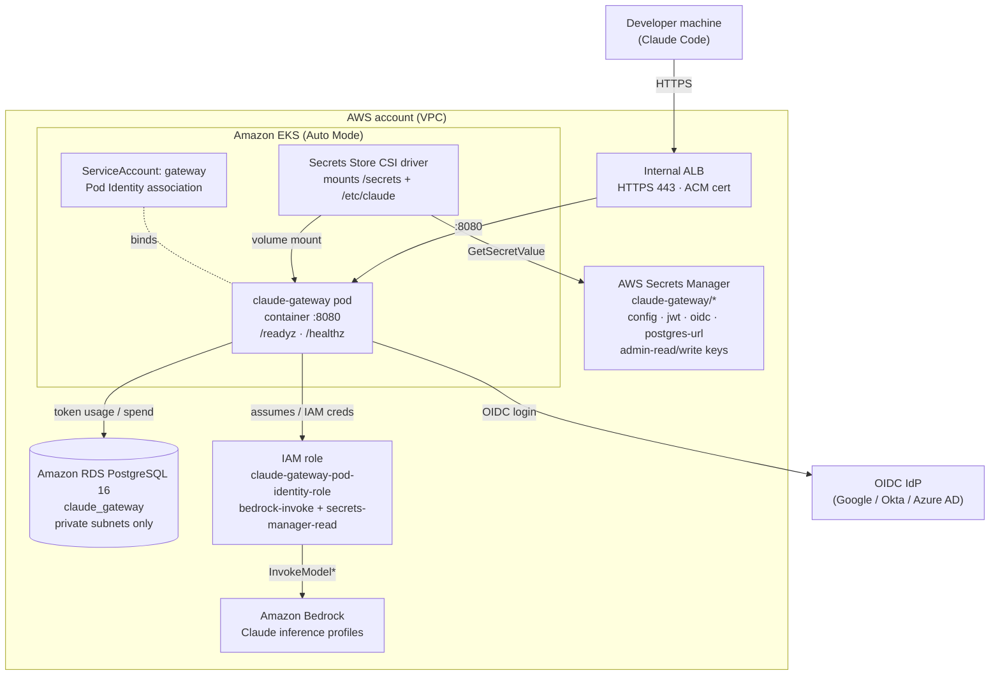

# Claude Apps Gateway on AWS — Quick Start

> **Note:** This is a working example for customer-managed infrastructure, not a
> supported production deployment — use it to see how the pieces fit together
> before adapting it to your own environment. For the platform-agnostic
> requirements, see the
> [deployment guide](https://code.claude.com/docs/en/claude-apps-gateway-deploy).

This deploys the whole gateway stack on AWS. **Terraform** provisions everything
except the VPC (EKS Auto Mode cluster, RDS PostgreSQL, ECR, IAM Pod Identity
role, and Secrets Manager); you then build the image and apply a handful of
Kubernetes manifests. End to end is ~25 minutes, most of it EKS + RDS creation.

For usage telemetry, see [README-OTEL.md](./README-OTEL.md).



## Prerequisites

- `aws` CLI (authenticated), `terraform` ≥ 1.5, `kubectl`, `helm`, `docker`,
  and `envsubst` (`brew install gettext`).
- An **existing VPC** with **≥ 2 private subnets** in different AZs, each with
  **NAT egress** (EKS nodes and RDS live here). The VPC is *not* created or
  destroyed by Terraform.
- **Bedrock model access** enabled in your region for the Claude models you need.
- An **OIDC provider** (Google/Okta/Azure AD) with a web client and redirect URI
  `https://<gateway-host>/oauth/callback`.
- An **ACM certificate** whose SAN covers your gateway hostname, in the same region.
- The gateway container binary at `build/claude` (see [Dockerfile](./Dockerfile)).

## Step 1 — Provision infrastructure with Terraform

```bash
cd terraform/gateway
cp terraform.tfvars.example terraform.tfvars
$EDITOR terraform.tfvars        # set vpc_id + private_subnet_ids (and region)

terraform init
terraform apply                 # ~15-20 min (EKS + RDS)
```

Terraform creates (all prefixed `claude-gateway-tf` by default — change
`name_prefix` to run multiple isolated stacks):

| Resource | Name |
| --- | --- |
| EKS Auto Mode cluster | `claude-gateway-tf-test` |
| RDS PostgreSQL 16 | `claude-gateway-tf-db` (private, encrypted) |
| ECR repository | `claude-gateway-tf/claude-gateway` |
| Gateway IAM role (Pod Identity) | `claude-gateway-tf-pod-identity-role` |
| Secrets | `claude-gateway-tf/{jwt-secret,admin-read-key,admin-write-key,postgres-url,oidc-client-secret,config}` |

`jwt-secret`, `admin-*`, and `postgres-url` are generated by Terraform.
`oidc-client-secret` and `config` are created as **placeholders** you overwrite
in Step 3 (so real IdP secrets and config never sit in Terraform state).

Save the outputs:

```bash
export AWS_REGION=$(terraform output -raw region)
export CLUSTER_NAME=$(terraform output -raw cluster_name)
export ECR_URL=$(terraform output -raw ecr_repository_url)
eval "$(terraform output -raw update_kubeconfig_cmd)"   # writes kubeconfig
cd ../..
```

## Step 2 — Build and push the gateway image

```bash
AWS_ACCOUNT_ID=$(aws sts get-caller-identity --query Account --output text)
aws ecr get-login-password --region "$AWS_REGION" \
  | docker login --username AWS --password-stdin "${AWS_ACCOUNT_ID}.dkr.ecr.${AWS_REGION}.amazonaws.com"

docker build --platform=linux/amd64 -t "${ECR_URL}:v1" .
docker push "${ECR_URL}:v1"
```

## Step 3 — Write and store `gateway.yaml`

Fill in your IdP and hostname, then overwrite the two placeholder secrets:

```bash
# 1. OIDC client secret from your IdP:
aws secretsmanager put-secret-value --region "$AWS_REGION" \
  --secret-id claude-gateway-tf/oidc-client-secret \
  --secret-string "<your-oidc-client-secret>"

# 2. gateway.yaml — see gateway.template.yaml for a fully-commented example.
#    listen.public_url must be your internal gateway hostname (HTTPS).
aws secretsmanager put-secret-value --region "$AWS_REGION" \
  --secret-id claude-gateway-tf/config \
  --secret-string "$(cat gateway.yaml)"
```

The `store.postgres_url`, `session.jwt_secret`, and `admin.*` keys in
`gateway.yaml` use `${file:/secrets/...}` — those files are mounted from the
Terraform-created secrets by the CSI driver in Step 4.

## Step 4 — Deploy on EKS

The gateway ServiceAccount is already bound to the IAM role via a Terraform
**Pod Identity association**, so you only create the namespace + SA (no
annotation needed).

```bash
kubectl create namespace claude-gateway
kubectl create serviceaccount gateway -n claude-gateway

# The Secrets Store CSI AWS provider resolves the role via IRSA (the SA's
# role-arn annotation), so annotate the SA even though Pod Identity is also
# associated. (Terraform created the IAM OIDC provider + IRSA trust for you.)
GATEWAY_ROLE_ARN=$(cd terraform/gateway && terraform output -raw gateway_role_arn)
kubectl annotate serviceaccount gateway -n claude-gateway \
  eks.amazonaws.com/role-arn="$GATEWAY_ROLE_ARN"

# Secrets Store CSI driver + AWS provider (EKS Auto Mode does NOT bundle these).
# IMPORTANT: tokenRequests[0].audience is REQUIRED — without it, mounts fail with
# "serviceAccount.tokens not provided - ensure tokenRequests is configured".
helm repo add secrets-store-csi-driver https://kubernetes-sigs.github.io/secrets-store-csi-driver/charts
helm install csi-secrets-store secrets-store-csi-driver/secrets-store-csi-driver \
  --namespace kube-system \
  --set syncSecret.enabled=true \
  --set 'tokenRequests[0].audience=sts.amazonaws.com'
kubectl apply -f https://raw.githubusercontent.com/aws/secrets-store-csi-driver-provider-aws/main/deployment/aws-provider-installer.yaml

# EKS Auto Mode has a built-in LB controller (controller name eks.amazonaws.com/alb)
# but does NOT pre-create an IngressClass — create one so the ALB Ingress works:
kubectl apply -f - <<'EOF'
apiVersion: networking.k8s.io/v1
kind: IngressClass
metadata:
  name: alb
  annotations:
    ingressclass.kubernetes.io/is-default-class: "true"
spec:
  controller: eks.amazonaws.com/alb
EOF

# SecretProviderClasses (secret names already match the claude-gateway-tf/* prefix
# if you kept the default name_prefix; otherwise edit k8s/secret-provider-class.yaml):
kubectl apply -f k8s/secret-provider-class.yaml
```

Deploy the workload and internal ALB Ingress. These are templated —
render them with your values via `deploy.sh` (see [README-OTEL.md](./README-OTEL.md#step-3-deploy-the-collector)
for the `envsubst`/`deploy.env` pattern):

```bash
cp deploy.env.example deploy.env
$EDITOR deploy.env      # AWS_ACCOUNT_ID, AWS_REGION, OTEL_HOST(=gateway host),
                        # ACM_CERT_ARN, ALB_SUBNETS(=private subnets),
                        # ALB_PRIVATE_IP, GATEWAY_IMAGE_TAG
./deploy.sh --dry-run   # validate the rendered manifests
./deploy.sh             # apply Deployment + Ingress
```

> **AWS Load Balancer Controller:** EKS Auto Mode includes the controller — once
> the `alb` IngressClass above exists, the internal ALB is created directly from
> the Ingress, no separate `helm install` needed.

## Step 5 — Verify

```bash
kubectl rollout status deploy/claude-gateway -n claude-gateway --timeout=180s
kubectl logs -n claude-gateway -l app=claude-gateway -c gateway --tail=20
# Expect: "claude gateway listening on http://0.0.0.0:8080"

# ALB provisioned + target healthy:
ALB=$(kubectl get ingress claude-gateway -n claude-gateway \
  -o jsonpath='{.status.loadBalancer.ingress[0].hostname}')
echo "$ALB"
```

> **⚠️ The gateway URL must resolve to a private address.** The gateway is
> fronted by an **internal** ALB. At `/login`, Claude Code requires the gateway's
> hostname or IP to resolve **only** to private addresses: RFC 1918 (`10/8`,
> `172.16/12`, `192.168/16`), CGNAT (`100.64.0.0/10`), IPv6 ULA (`fc00::/7`), or
> loopback. The check runs on *each* resolved IP — if the name resolves to **any**
> public address, `/login` rejects the URL.
>
> If developer machines route HTTPS through a corporate proxy, sign-in also
> requires the **proxy host** to resolve to private addresses. If it doesn't, add
> the gateway host to `NO_PROXY` so the CLI connects directly.

Point your gateway hostname at the ALB's **private** IP (private Route 53 alias
or `/etc/hosts`), then browse `https://<gateway-host>/` — the OIDC login should
start.

## Step 6 — Point Claude Code at the gateway

Configure each developer's Claude Code to log in through the gateway with a
**managed settings** file. This forces the gateway login method and pins the
gateway URL, so users can't accidentally bypass it. Create
`managed-settings.json`:

```json
{
  "forceLoginMethod": "gateway",
  "forceLoginGatewayUrl": "https://<gateway-host>"
}
```

Replace `<gateway-host>` with your gateway's hostname (the same one covered by
the ACM cert and resolving to the ALB's private IP). Place the file at the
OS-specific managed-settings path — these are read-only, enterprise-managed
locations that take precedence over user settings:

| OS | Path |
| --- | --- |
| macOS | `/Library/Application Support/ClaudeCode/managed-settings.json` |
| Linux / WSL | `/etc/claude-code/managed-settings.json` |
| Windows | `C:\ProgramData\ClaudeCode\managed-settings.json` |

For fleet-wide rollout, distribute this file via your MDM/configuration
management (Jamf, Intune, Ansible, etc.) rather than by hand.

With that in place, `claude /login` sends users straight to the gateway's OIDC
flow. Because the gateway URL must resolve to a private address (see the warning
above), developers must be on the VPC network (VPN or private DNS) for login to
succeed.

## Step 7 (optional) — Usage telemetry

Follow [README-OTEL.md](./README-OTEL.md) to add per-user token metrics in
CloudWatch.

## Tear down

```bash
# Remove the k8s workload first (deletes the ALB):
kubectl delete -f k8s/ingress.yaml -f k8s/deployment.yaml --ignore-not-found
# Then the infrastructure:
cd terraform/gateway && terraform destroy
```

`terraform destroy` removes only Terraform-created resources — **the VPC and its
subnets are referenced read-only and are never deleted.**

> RDS uses `skip_final_snapshot = true` and secrets use
> `recovery_window_in_days = 0`, so destroy is clean and immediate — suited to a
> test stack. For production, take a final snapshot and add a secret recovery
> window.
