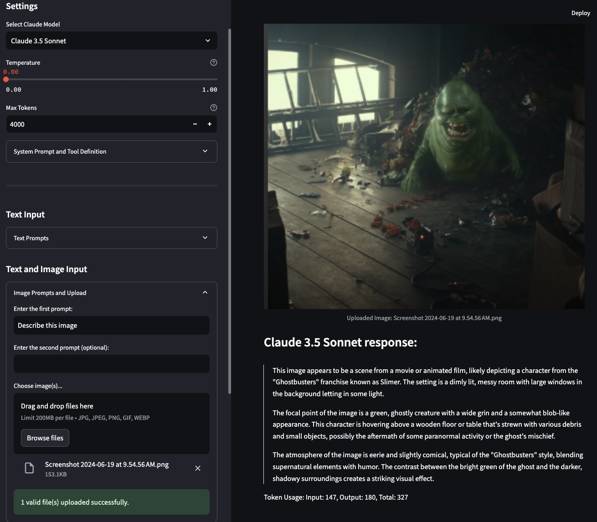
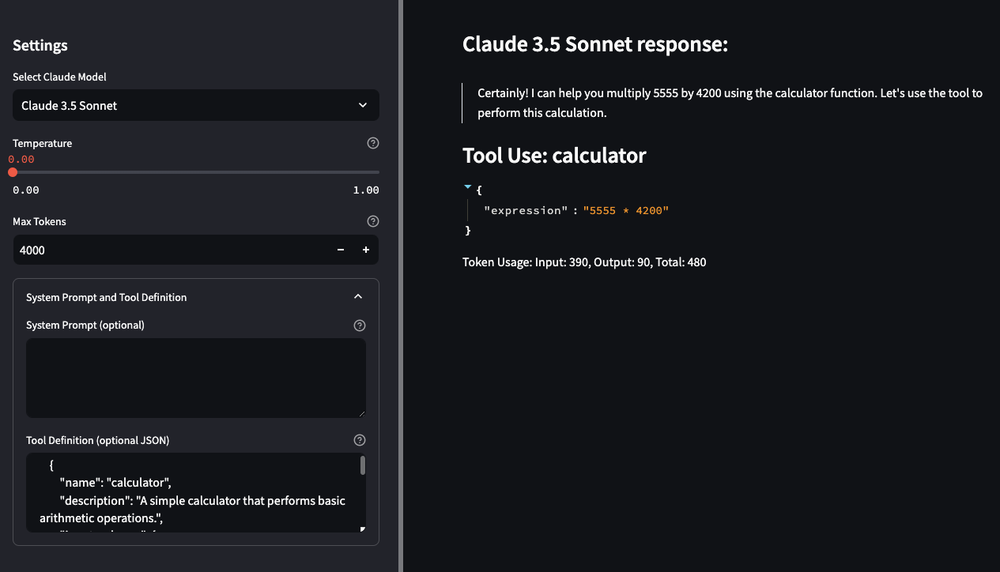

# Claude 3.5 Streamlit Multimodal LLM Playground

## Overview

This repository contains a Streamlit-based application for interacting with Claude 3 and 3.5, a powerful language model developed by Anthropic. The application provides a user-friendly interface for exploring the capabilities of Claude 3, supporting both text-only and image+text inputs, custom system prompts, and tool usage (function calling).

## Application Versions

We offer two versions of this application, each tailored to different deployment scenarios:

1. [Anthropic API Version](./anthropic/README.md)
2. [Amazon Bedrock Version](./bedrock/README.md)

### Anthropic API Version

This version interacts directly with the Anthropic API. It's suitable for users who have an Anthropic API key and want to use Claude 3 models without additional cloud infrastructure.

[Learn more about the Anthropic API version](./anthropic/README.md)

### Amazon Bedrock Version

This version is designed to work with Claude 3 and 3.5 models through Amazon Bedrock. It's ideal for users who prefer to leverage AWS infrastructure or have existing workflows in the AWS ecosystem.

[Learn more about the Amazon Bedrock version](./bedrock/README.md)

## Key Features

Both versions of the application offer:

- Support for multiple Claude 3 models (Opus, Sonnet, Haiku)
- Text-only and image+text query capabilities
- Customizable system prompts
- Tool definition for function calling
- Temperature and max tokens adjustment
- Multiple text input fields for complex prompts
- Image upload functionality
- Display of AI responses in markdown format
- Visualization of tool use results in JSON format
- Token usage display

## Choosing a Version

- Choose the **Anthropic API version** if you have direct access to the Anthropic API and prefer a standalone solution.
- Opt for the **Amazon Bedrock version** if you're using AWS services or need the additional features and integrations provided by Amazon Bedrock.

Please refer to the README files in each respective folder for detailed setup instructions, usage guidelines, and version-specific information.

### Combine Text with Vision to create multimodal inputs for Claude 3.5

### Test with your own Tool definitions

## Contributing

We welcome contributions to both versions of the application. Please read our [CONTRIBUTING.md](../CONTRIBUTING.md) file for guidelines on how to submit contributions.

## License

This project is licensed under the MIT-0 License - see the [LICENSE.md](../LICENSE) file for details.