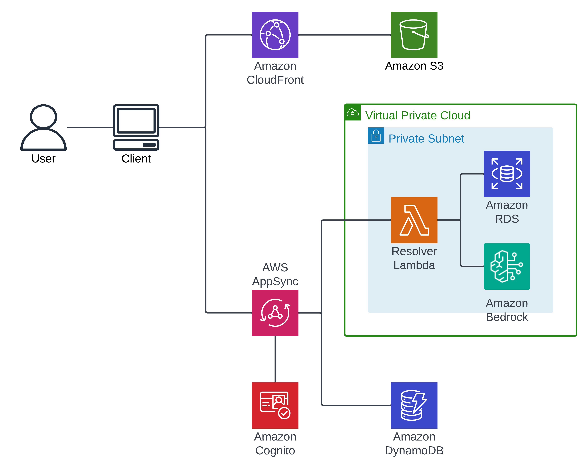
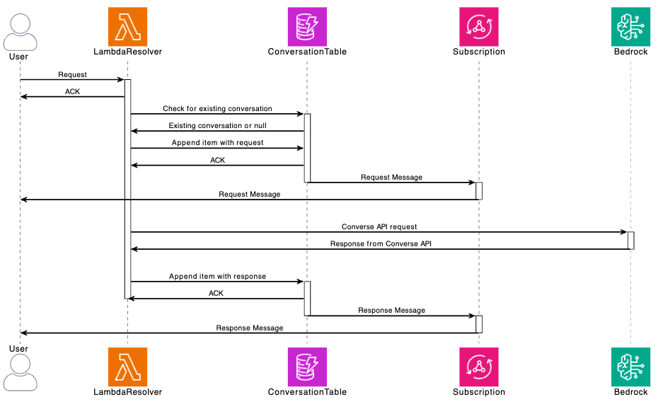
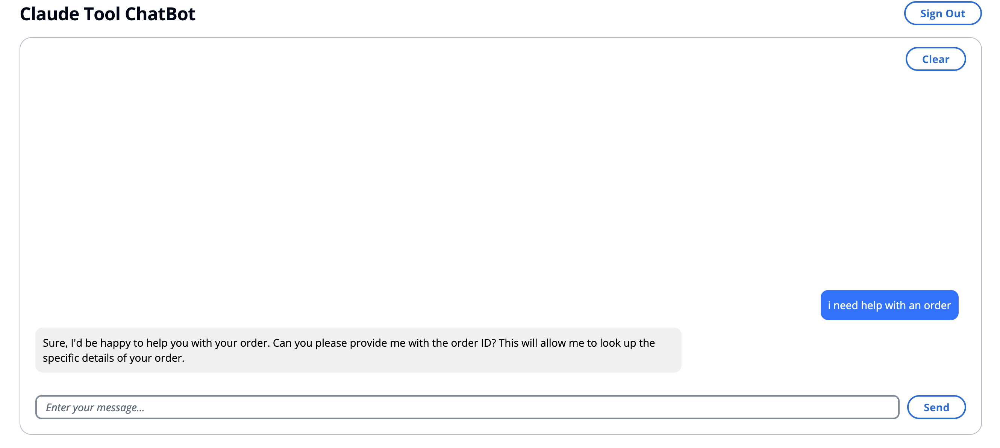
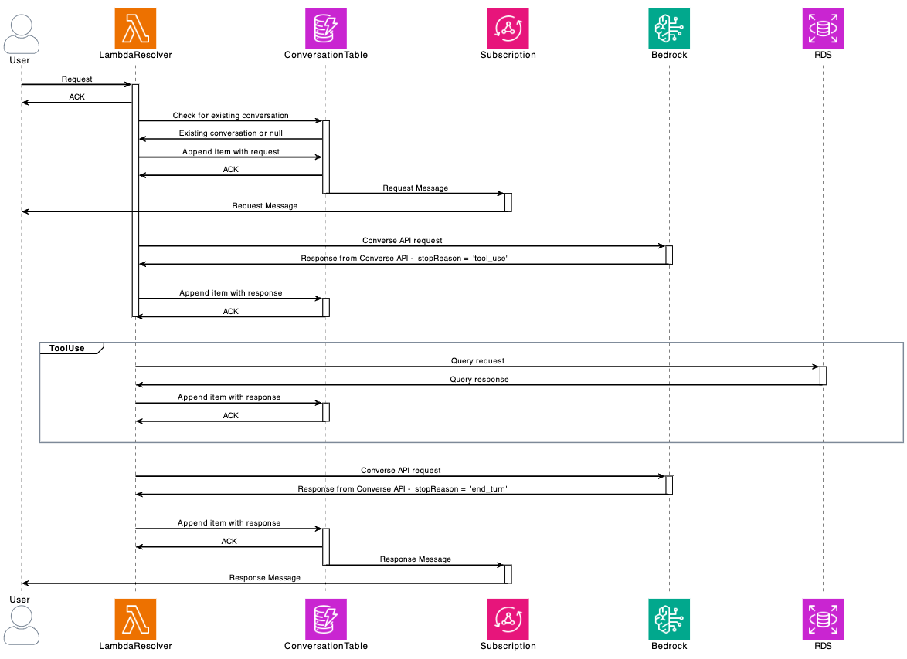
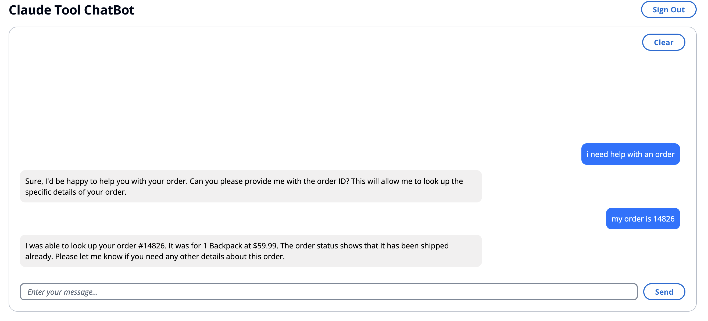
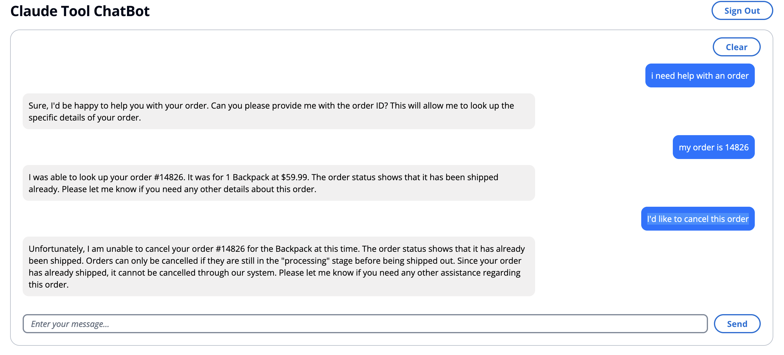
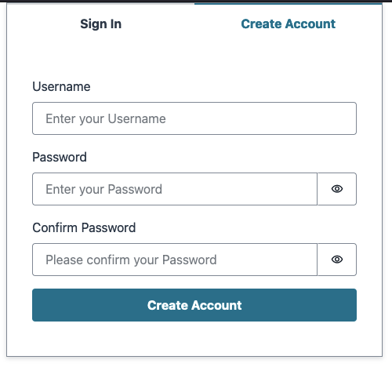

# Creating a ChatBot with Claude Tool use and Amazon Bedrock Converse API

This example will demonstrate how to build a simple ChatBot application using [Claude Tools](https://docs.anthropic.com/en/docs/tool-use) and the [Amazon Bedrock](https://aws.amazon.com/bedrock/) [Converse API](https://docs.aws.amazon.com/bedrock/latest/userguide/conversation-inference.html).



This demo will deploy a simple client that will interact with an [AWS AppSync](https://aws.amazon.com/appsync/) GraphQL API. This API will use an [AWS Lambda resolver](https://docs.aws.amazon.com/appsync/latest/devguide/tutorial-lambda-resolvers.html) to make requests to Amazon Bedrock with the [Amazon Bedrock Converse API](https://docs.aws.amazon.com/bedrock/latest/userguide/conversation-inference.html). These requests and responses are stored in an [Amazon DynamoDB](https://aws.amazon.com/dynamodb/) table via the AppSync API that allows for easy updates in the client. With these tools, we can create a chat bot that is able to look up orders in a database by using the [tool use](https://docs.aws.amazon.com/bedrock/latest/userguide/tool-use.html) feature of Amazon Bedrock.

- [Creating a ChatBot with Claude Tool use and Amazon Bedrock Converse API](#creating-a-chatbot-with-claude-tool-use-and-amazon-bedrock-converse-api)
  - [Infrastructure](#infrastructure)
    - [AppSync](#appsync)
    - [VPC](#vpc)
    - [RDS](#rds)
    - [Lambda Resolver](#lambda-resolver)
  - [Chat Bot Interactions](#chat-bot-interactions)
    - [Bedrock Converse Client Configuration](#bedrock-converse-client-configuration)
      - [Basic configuration](#basic-configuration)
      - [Tool Config](#tool-config)
      - [System Prompt](#system-prompt)
      - [Messages](#messages)
    - [Basic Flow](#basic-flow)
    - [Tools Required](#tools-required)
    - [Using the tool](#using-the-tool)
    - [Continued conversation](#continued-conversation)
  - [Using the Demo](#using-the-demo)
    - [Deploying](#deploying)
    - [Logging In](#logging-in)
    - [Example Conversations](#example-conversations)
      - [Order Lookup](#order-lookup)
      - [Cancel Order](#cancel-order)
      - [Account Lookup](#account-lookup)
      - [Combining Requests](#combining-requests)
    - [Cleanup](#cleanup)

## Infrastructure

The infrastructure in this demo is deployed using [AWS Cloud Development Kit](https://aws.amazon.com/cdk/) (CDK) and creates all of the necessary components for you.

### AppSync

```typescript
this.graphqlApi = new GraphqlApi(this, 'graphqlApi', {
  name: 'ClaudeTools',
  definition: {
    schema: SchemaFile.fromAsset('./src/resources/graphql/schema.graphql'),
  },
  logConfig: {
    retention: RetentionDays.ONE_WEEK,
    fieldLogLevel: FieldLogLevel.ALL,
  },
  authorizationConfig: {
    defaultAuthorization: {
      authorizationType: AuthorizationType.USER_POOL,
      userPoolConfig: {
        userPool: props.userPool,
      },
    },
    additionalAuthorizationModes: [
      {
        authorizationType: AuthorizationType.API_KEY,
        apiKeyConfig: {
          expires: Expiration.after(Duration.days(365)),
        },
      },
    ],
  },
  xrayEnabled: true,
});
```

To create the AppSync API, we will use the defined [schema](src/resources/graphql/schema.graphql). [The schema](https://docs.aws.amazon.com/appsync/latest/devguide/schema-components.html) is the foundation of the GraphQL API and serves as a blueprint for the data will be using.

Next we will define two data sources for our API:

```typescript
const messageProcessorDataSource = this.graphqlApi.addLambdaDataSource(
  'MessageProcessorDataSource',
  props.messageProcessorLambda,
);

const conversationDataSource = this.graphqlApi.addDynamoDbDataSource(
  'ConversationDataSource',
  props.conversationTable,
);
```

The `messageProcessorLambda` will be where all of the interactions with Bedrock occur. When a user interacts with the client, the messages they type will be sent to this Lambda function. The `conversationTable` is where the chat messages are stored. This is also used to pass the information back to the client through an [AppSync subscription](https://docs.aws.amazon.com/appsync/latest/devguide/aws-appsync-real-time-data.html). When a mutation occurs, the subscription will be triggered and the client updated with the new data.

We control this by adding resolvers to the data sources:

```typescript
messageProcessorDataSource.createResolver('ProcessMessage', {
  typeName: 'Mutation',
  fieldName: 'processMessage',
  requestMappingTemplate: MappingTemplate.fromFile(
    './src/resources/graphql/Mutation.ProcessMessage.req.vtl',
  ),
  responseMappingTemplate: MappingTemplate.fromFile(
    './src/resources/graphql/Mutation.ProcessMessage.res.vtl',
  ),
});

conversationDataSource.createResolver('UpdateConversation', {
  typeName: 'Mutation',
  fieldName: 'updateConversation',
  requestMappingTemplate: MappingTemplate.fromFile(
    './src/resources/graphql/Mutation.UpdateConversation.req.vtl',
  ),
  responseMappingTemplate: MappingTemplate.fromFile(
    './src/resources/graphql/Mutation.UpdateConversation.res.vtl',
  ),
});
```

Now, when the `processMessage` API is invoked it will use the `messageProcessorDataSource` and when the `updateConversation` API is invoked it will use the `conversationDataSource`.

### VPC

This demo uses an [AWS PrivateLink](https://docs.aws.amazon.com/bedrock/latest/userguide/usingVPC.html) to access Bedrock. Later we will deploy other services to this [Amazon Virtual Private Cloud](https://docs.aws.amazon.com/vpc/latest/userguide/what-is-amazon-vpc.html) (Amazon VPC).

```typescript
this.vpc = new Vpc(this, 'VPC', {
  natGateways: 1,
  subnetConfiguration: [
    {
      cidrMask: 24,
      name: 'PrivateWithEgress',
      subnetType: SubnetType.PRIVATE_WITH_EGRESS,
    },
    {
      cidrMask: 24,
      name: 'Public',
      subnetType: SubnetType.PUBLIC,
    },
  ],
});

this.securityGroup = new SecurityGroup(this, 'SecurityGroup', {
  vpc: this.vpc,
  description: 'Security Group',
  allowAllOutbound: true,
});

this.bedrockInterfaceEndpoint = this.vpc.addInterfaceEndpoint(
  'BedrockAccessPoint',
  {
    service: InterfaceVpcEndpointAwsService.BEDROCK_RUNTIME,
    privateDnsEnabled: true,
  },
);

this.bedrockInterfaceEndpoint.addToPolicy(
  new PolicyStatement({
    principals: [new AnyPrincipal()],
    actions: ['bedrock:InvokeModel'],
    resources: ['arn:aws:bedrock:*::foundation-model/*'],
  }),
);
```

This VPC creates two [Subnets](https://docs.aws.amazon.com/vpc/latest/userguide/configure-subnets.html) - a Public and Private with Egress subnet. This will also create a [NAT Gateway](https://docs.aws.amazon.com/vpc/latest/userguide/vpc-nat-gateway.html) in this VPC. Most importantly though, it create an [interface VPC endpoint](https://docs.aws.amazon.com/vpc/latest/privatelink/create-interface-endpoint.html) that will allow access to Bedrock within the VPC. Now, when a resource within the VPC makes a request to Bedrock, it will do so over a private connection.

### RDS

This demo includes a database that we will use as one of our tools. This database will store customer and order information that will be retrieved by our Lambda resolver function. We will put this database in the same private subnet in our VPC with our Lambda function so all of the communication occurs over our private connection.

```typescript
this.database = new DatabaseInstance(this, 'database', {
  engine: DatabaseInstanceEngine.POSTGRES,
  vpc: props.vpc,
  vpcSubnets: { subnetType: SubnetType.PRIVATE_WITH_EGRESS },
  instanceType: InstanceType.of(
    InstanceClass.BURSTABLE4_GRAVITON,
    InstanceSize.MEDIUM,
  ),
  multiAz: false,
  allowMajorVersionUpgrade: true,
  autoMinorVersionUpgrade: true,
  backupRetention: Duration.days(0),
  securityGroups: [props.securityGroup],
});

this.database.connections.allowInternally;
```

This database will be built with [Amazon Relational Database Service](https://aws.amazon.com/rds/) (RDS) and use [PostgreSQL](https://aws.amazon.com/rds/postgresql/) as the database system. During deployment of the CDK, we will also [initialize](src/resources/initializerLambda/index.py) the database with our fake customer and order data using a [Custom Resource](https://docs.aws.amazon.com/AWSCloudFormation/latest/UserGuide/template-custom-resources.html).

```python
def on_create(event):
    try:
        create_tables()
        load_data()
        physical_id = "CreateTablesAndLoadData"
        return {"PhysicalResourceId": physical_id}
    except Exception as e:
        print(f"Error in on_create: {e}")
        raise e
```

With the database created and initialized, we will have access to it from our other resources.

### Lambda Resolver

As noted above, our Lambda resolver will be used to interact with Bedrock and our database. All of these resources are created in a private subnet of our VPC and will need access to those resources through the private connection.

To ensure that the Lambda uses this private connection when making requests to Bedrock, we will assign it an [IAM Role](https://docs.aws.amazon.com/IAM/latest/UserGuide/id_roles.html) with a conditional [IAM Policy](https://docs.aws.amazon.com/IAM/latest/UserGuide/access_policies.html) that allows `InvokeModel` only through the specific VPC interface endpoint.

```typescript
const resolverLambdaRole = new Role(this, 'resolverLambdaRole', {
  assumedBy: new ServicePrincipal('lambda.amazonaws.com'),
  inlinePolicies: {
    ['bedrock']: new PolicyDocument({
      statements: [
        new PolicyStatement({
          resources: ['*'],
          actions: ['bedrock:InvokeModel'],
          conditions: {
            'ForAnyValue:StringEquals': {
              'aws:sourceVpce': [props.bedrockInterfaceEndpoint.vpcEndpointId],
            },
          },
        }),
      ],
    }),
  },
});
```

Because the [boto3](https://pypi.org/project/boto3/) version in our Lambda uses the `Converse` API feature and the current default Lambda runtime might not include this, we need to build our Lambda function using [Docker](https://www.docker.com/) before deploying it with our CDK. This requires running [Docker daemon](https://docs.docker.com/config/daemon/start/) on the device deploying the CDK, but ensures that the Lambda has all of the necessary and up to date packages for using the latest features.

```typescript
this.resolverLambda = new Function(this, 'resolverLambda', {
  code: Code.fromAsset(path.join(__dirname, 'resources/resolverLambda'), {
    bundling: {
      image: Runtime.PYTHON_3_12.bundlingImage,
      command: [
        'bash',
        '-c',
        'pip install -r requirements.txt -t /asset-output && cp -au . /asset-output',
      ],
    },
  }),
  runtime: Runtime.PYTHON_3_12,
  vpc: props.vpc,
  vpcSubnets: { subnetType: SubnetType.PRIVATE_WITH_EGRESS },
  architecture: Architecture.ARM_64,
  handler: 'index.handler',
  timeout: Duration.minutes(5),
  role: resolverLambdaRole,
  environment: {
    RDS_SECRET_NAME: props.database.secret?.secretName!,
  },
});
```

Now, when we deploy our CDK, we will install the dependencies in our `requirements.txt` file before bundling and zipping the Lambda function.

## Chat Bot Interactions

### Bedrock Converse Client Configuration

With our infrastructure deployed, we're ready to interact with our chat bot. To do this, we will make a request from our client. Every request we make will follow the same basic pattern and use the same request.

```python
    response = bedrock_client.converse(
        modelId=model_id,
        messages=converted_messages,
        system=system_prompts,
        toolConfig=tool_config,
        inferenceConfig=inference_config,
        additionalModelRequestFields=additional_model_fields,
    )
```

Each time we make this request, we will provide Claude the information it needs to process the request.

#### Basic configuration

```python
temperature = 0
top_k = 10
max_tokens = 4096
inference_config = {"temperature": temperature, "maxTokens": max_tokens}
additional_model_fields = {"top_k": top_k}
```

Each of these are statically defined for every request.

#### Tool Config

Next we will tell Claude what tools it has access to with [`toolConfig`](src/resources/resolverLambda/tools.py):

```python
tool_config = {
    "toolChoice": {"auto": {}},
    "tools": [
        {
            "toolSpec": {
                "name": "get_user",
                "description": "Looks up a user by email, phone, or username.",
                ...
            },
        },
        {
            "toolSpec": {
                "name": "get_order_by_id",
                "description": "Retrieves the details of a specific order based on the order ID. Returns the order ID, product name, quantity, price, and order status.",
                ...
            },
        },
        {
            "toolSpec": {
                "name": "get_customer_orders",
                "description": "Retrieves the list of orders belonging to a user based on a user's customer id.",
                ...
            },
        },
        {
            "toolSpec": {
                "name": "cancel_order",
                "description": "Cancels an order based on a provided order_id.  Only orders that are 'processing' can be cancelled",
                ...
            },
        },
    ],
}
```

Each of these tools has a defined schema and description that tells Claude what it can do and what is required to use. For example:

```python
{
    "toolSpec": {
        "name": "get_order_by_id",
        "description": "Retrieves the details of a specific order based on the order ID. Returns the order ID, product name, quantity, price, and order status.",
        "inputSchema": {
            "json": {
                "type": "object",
                "properties": {
                    "order_id": {
                        "type": "string",
                        "description": "The unique identifier for the order.",
                    }
                },
                "required": ["order_id"],
            },
        },
    },
}
```

This tells Claude that it has access to a function that can look up an order if it knows what the `order_id` is. This also defines the `inputSchema` so that Claude knows what the properties the tool uses and what is required. We'll see how to use this later.

#### System Prompt

Next, wee will define a system prompt that lets Claude know that tools are available to use if needed, but aren't necessary.

```python
system_prompt = """
You are a customer support chat bot for an online retailer called AnyCompany.
Your job is to help users look up their account, orders, and cancel orders.
Be helpful and brief in your responses.
You have access to a set of tools, but only use them when needed.
If you do not have enough information to use a tool correctly, ask a user follow up questions to get the required inputs.
Do not call any of the tools unless you have the required data from a user.

In each conversational turn, you will begin by thinking about your response.
Use <thinking></thinking> to think through the process step by step ensuring that you have all of the required input.
Once you're done, you will write a user-facing response.
It's important to place all user-facing conversational responses in <reply></reply> XML tags to make them easy to parse.
"""
```

#### Messages

Finally, we will define the `messages` as the entire turn by turn history of the conversation. This will change each time we make a request by appending the latest request with all of the previous requests so that Claude has the entire context of the conversation.

### Basic Flow

In a basic flow where tool use is not required:

- The user sends a request to the Lambda resolver through the AppSync API
- The Lambda resolver queries the conversation Table for the `conversationId`
- The Lambda resolver appends to (for an existing conversation) or creates (for a new conversation) an item in the conversation Table
- This mutation triggers the AppSync subscription to update the client
- The Lambda resolver makes a request to Bedrock using the Converse API with the entire conversation
- Bedrock responds
- The Lambda resolver appends the existing item in the conversation Table with the response
- This mutation triggers the AppSync subscription to update the client



For example:

```text
User: I need help with an order
```

This message is passed to Bedrock along with the system prompt. The response from Bedrock will look something like this:

```json
{
  "output": {
    "message": {
      "role": "assistant",
      "content": [
        {
          "text": "Okay, let's see how I can assist you with your order. <thinking>\nTo look up details about an order, I will need the order ID. I should ask the user for that first.\n</thinking>\n\n<reply>\nSure, I'd be happy to help you with your order. Can you please provide me with the order ID? This will allow me to look up the specific details of your order.\n</reply>"
        }
      ]
    }
  },
  "stopReason": "end_turn"
}
```

We can see that Claude used `<thinking>` to determine that it needs additional information to help the user. However, the `stopReason` is still `end_turn` because Claude has been instructed to only use tools when all of the information required is available. In this case, it still needs an order ID.

```text
Bot:  Sure, I'd be happy to help you with your order. Can you please provide me with the order ID? This will allow me to look up the specific details of your order.
```



### Tools Required

At this point in the flow, Claude has prompted the user to provide an Order ID because it needs that information in order to retrieve the order details.

```text
User: my order is 14826
```

As we continue to append the conversation with each turn, we now send this to Bedrock:

```json
[
  {
    "content": [
      {
        "text": "i need help with an order"
      }
    ],
    "role": "user"
  },
  {
    "content": [
      {
        "text": "Okay, let's see how I can assist you with your order. <thinking>\nTo look up details about an order, I will need the order ID. I should ask the user for that first.\n</thinking>\n\n<reply>\nSure, I'd be happy to help you with your order. Can you please provide me with the order ID? This will allow me to look up the specific details of your order.\n</reply>"
      }
    ],
    "role": "assistant"
  },
  {
    "content": [
      {
        "text": "my order is 14826"
      }
    ],
    "role": "user"
  }
]
```

This `messages` contains the entire history of the conversation so that Claude has all of the information needed. Because Claude has no "memory" of previous interactions, each time we make a new request, we need to tell it everything that has happened already.

Because Claude knows that it has tools available to it (as defined in the `toolConfig`) and it has the required information (the order ID), the response from Bedrock will have a `stopReason` of `tool_use` and the information needed to use the tool.

```json
{
  "output": {
    "message": {
      "role": "assistant",
      "content": [
        {
          "text": "Okay, got it. <thinking>\nThe user provided the order ID 14826. I can use the \"get_order_by_id\" tool to retrieve the details for this order:"
        },
        {
          "toolUse": {
            "toolUseId": "tooluse_D37XtLaVTOCceSv_GMn1wA",
            "name": "get_order_by_id",
            "input": {
              "order_id": "14826"
            }
          }
        }
      ]
    }
  },
  "stopReason": "tool_use"
}
```

### Using the tool

Now our code knows that Claude wants to use a tool. But Claude cannot use the tool itself. This is where we need to step in and process the request for Claude. This changes the flow to include a direct request to our database.



We continue to update the conversation Table with each turn, but because these steps do not need to be exposed to the user, we do not need to include updates to the subscription.

We will make an SQL request to our database using the `order_id` provided to us by Claude. Because Claude knows the input schema of our tool, it is able to provide a response in the desired shape. This was defined [here](src/resources/resolverLambda/tools.py) as part of the `toolConfig` passed to Claude:

```json
        "inputSchema": {
            "json": {
                "type": "object",
                "properties": {
                    "order_id": {
                        "type": "string",
                        "description": "The unique identifier for the order.",
                    }
                },
                "required": ["order_id"],
            },
        },
```

That allows us to extract the information from the response:

```json
{
  "toolUse": {
    "toolUseId": "tooluse_D37XtLaVTOCceSv_GMn1wA",
    "name": "get_order_by_id",
    "input": {
      "order_id": "14826"
    }
  }
}
```

Now, when we call our [`process_tool_call`](src/resources/resolverLambda/message_processing.py) function, we are able to determine what the SQL should look like based on the `tool_name` that Claude wants to use and return the results.

```python
            elif tool_name == "get_order_by_id":
                order_id = tool_input["order_id"]
                query = "SELECT * FROM orders WHERE id = %s"
                logging.info(
                    f"Executing query: {query} with order_id: {order_id}"
                )
                cursor.execute(query, (order_id,))
                order = cursor.fetchone()
                if order:
                    order_dict = dict(
                        zip(
                            [
                                "id",
                                "customer_id",
                                "product",
                                "quantity",
                                "price",
                                "status",
                            ],
                            order,
                        )
                    )
                    logging.info(f"Order found: {order_dict}")  # Log the found order
                    return order_dict
                else:
                    logging.info(f"Order not found with ID: {order_id}")
                    return None
```

```SQL
SELECT * FROM orders WHERE id = %s with order_id: 14826
```

After we get the response from our database, we will append that message as a `user` turn and send it back to Bedrock.

```json
[
  {
    "content": [
      {
        "text": "i need help with an order"
      }
    ],
    "role": "user"
  },
  {
    "content": [
      {
        "text": "Okay, let's see how I can assist you with your order. <thinking>\nTo look up details about an order, I will need the order ID. I should ask the user for that first.\n</thinking>\n\n<reply>\nSure, I'd be happy to help you with your order. Can you please provide me with the order ID? This will allow me to look up the specific details of your order.\n</reply>"
      }
    ],
    "role": "assistant"
  },
  {
    "content": [
      {
        "text": "my order is 14826"
      }
    ],
    "role": "user"
  },
  {
    "role": "assistant",
    "content": [
      {
        "text": "Okay, got it. <thinking>\nThe user provided the order ID 14826. I can use the \"get_order_by_id\" tool to retrieve the details for this order:"
      },
      {
        "toolUse": {
          "toolUseId": "tooluse_D37XtLaVTOCceSv_GMn1wA",
          "name": "get_order_by_id",
          "input": "{\"order_id\": \"14826\"}"
        }
      }
    ]
  },
  {
    "role": "user",
    "content": [
      {
        "toolResult": {
          "toolUseId": "tooluse_D37XtLaVTOCceSv_GMn1wA",
          "content": [
            {
              "text": "{\"id\": \"14826\", \"customer_id\": \"678902\", \"product\": \"Backpack\", \"quantity\": 1, \"price\": 59.99, \"status\": \"Shipped\"}"
            }
          ],
          "status": "success"
        }
      }
    ]
  }
]
```

Now Claude has the result of the tool that it wanted to use, we will get back a new response.

```json
{
  "output": {
    "message": {
      "role": "assistant",
      "content": [
        {
          "text": "The tool returned the order details - it's for 1 Backpack that has already shipped, with a total price of $59.99. I can provide this information to the user.\n</thinking>\n\n<reply>\nI was able to look up your order #14826. It was for 1 Backpack at $59.99. The order status shows that it has been shipped already. Please let me know if you need any other details about this order.\n</reply>"
        }
      ]
    }
  },
  "stopReason": "end_turn"
}
```

After we've used the tool, and Claude doesn't need to use it again, we get a `stopReason` of `end_turn` and can return this response back to the user.

The process to do this in the Lambda resolver looks something like this:

```python
    bot_response, stop_reason = process_message(messages)
    updated_conversation = update_conversation(conversation_id, owner_id, bot_response)
    while stop_reason == "tool_use":
        messages.append(bot_response)
        tool_response = use_tool(messages)
        messages.append(tool_response)
        update_conversation(conversation_id, owner_id, tool_response)
        bot_response, stop_reason = process_message(messages)
        update_conversation(conversation_id, owner_id, bot_response)
```

While Claude wants to use a tool, we will continue to loop through this process.



### Continued conversation

We can continue this conversation with additional requests.

```text
User: I'd like to cancel this order
```

```json
[
  {
    "content": [
      {
        "text": "I'd like to cancel this order"
      }
    ],
    "role": "user"
  },
  {
    "role": "assistant",
    "content": [
      {
        "text": "Okay, got it. <thinking>\nThe user wants to cancel order #14826 for the Backpack. To cancel an order, I need to use the \"cancel_order\" tool and provide the order_id.\n\nFirst, let me double check the status of the order:"
      },
      {
        "toolUse": {
          "toolUseId": "tooluse_TGy4SjAgTve9nH4u5ePRbg",
          "name": "get_order_by_id",
          "input": "{\"order_id\": \"14826\"}"
        }
      }
    ]
  }
]
```

Claude has recognized that the user wants to cancel the order and knows that it needs the order ID in order to do this. But because we are including the entire conversation history with each request, it already has the order ID and doesn't need to get that information from the user again. But it does want to double check the order status as it may have changed.

When we pass this back to Bedrock, we get a response similar to this:

```json
{
  "output": {
    "message": {
      "role": "assistant",
      "content": [
        {
          "text": "The status shows \"Shipped\", which means the order has already been fulfilled and shipped out.\n\nThe \"cancel_order\" tool states that only orders with a \"processing\" status can be cancelled. Since this order has already shipped, I cannot cancel it using the tool.\n</thinking>\n\n<reply>\nUnfortunately, I am unable to cancel your order #14826 for the Backpack at this time. The order status shows that it has already been shipped. Orders can only be cancelled if they are still in the \"processing\" stage before being shipped out.\n\nSince your order has already shipped, it cannot be cancelled through our system. Please let me know if you need any other assistance regarding this order.\n</reply>"
        }
      ]
    }
  },
  "stopReason": "end_turn"
}
```

Here we can see that even though Claude wants to use the `cancel_order` tool, that tool definition includes instructions about when it can be used:

```json
"toolSpec": {
    "name": "cancel_order",
    "description": "Cancels an order based on a provided order_id.  Only orders that are 'processing' can be cancelled",
    "inputSchema": {
        "json": {
            "type": "object",
            "properties": {
                "order_id": {
                    "type": "string",
                    "description": "The order_id pertaining to a particular order",
                }
            },
            "required": ["order_id"],
        },
    },
},
```

Because we have instructed Claude to only allow orders that are in a `processing` state to be canceled, the `stopReason` from Bedrock is `end_turn` instead of `tool_use` and the response is sent to the user.



## Using the Demo

### Deploying

To deploy the demo you'll need to meet the following prerequisites:

- AWS account
- AWS CLI [configured](https://docs.aws.amazon.com/cli/v1/userguide/cli-chap-configure.html)
- yarn [installed](https://yarnpkg.com/getting-started/install)
- Docker [installed](https://docs.docker.com/engine/install/)

To deploy the CDK:

```bash
git clone https://github.com/aws-samples/anthropic-on-aws.git
cd anthropic-on-aws/claude-tools-chatbot
yarn
yarn launch
```

### Logging In

Once deployed, your demo will include output with an [Amazon CloudFront](https://aws.amazon.com/cloudfront/) distribution URL. You can use this to log in to the client by creating an Amazon Cognito user with a valid email address.



Once you have received the validation code from Cognito, you can log in and try out some questions. The data loaded in to the database can be found [here](src/resources/initializerLambda/data.py)

### Example Conversations

#### Order Lookup

```text
I need help with an order
```

```text
My order is 32057
```

#### Cancel Order

```text
I need help with an order
```

```text
My order is 37129
```

```text
Please cancel my order
```

#### Account Lookup

```text
Hello, I need some help
```

```text
I don't remember my order id
```

```text
My email is anacarolina_silva@example.com
```

```text
What are my orders
```

#### Combining Requests

```text
I need to cancel an order but don't remember my order id
```

```text
My phone number is 312-555-8204
```

```
Yes
```

### Cleanup

To remove the resources created:

```
yarn cdk destroy
```
