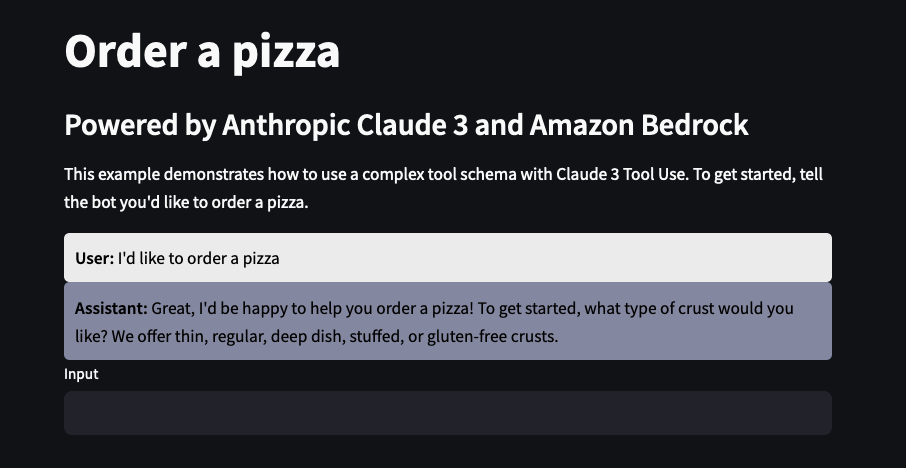
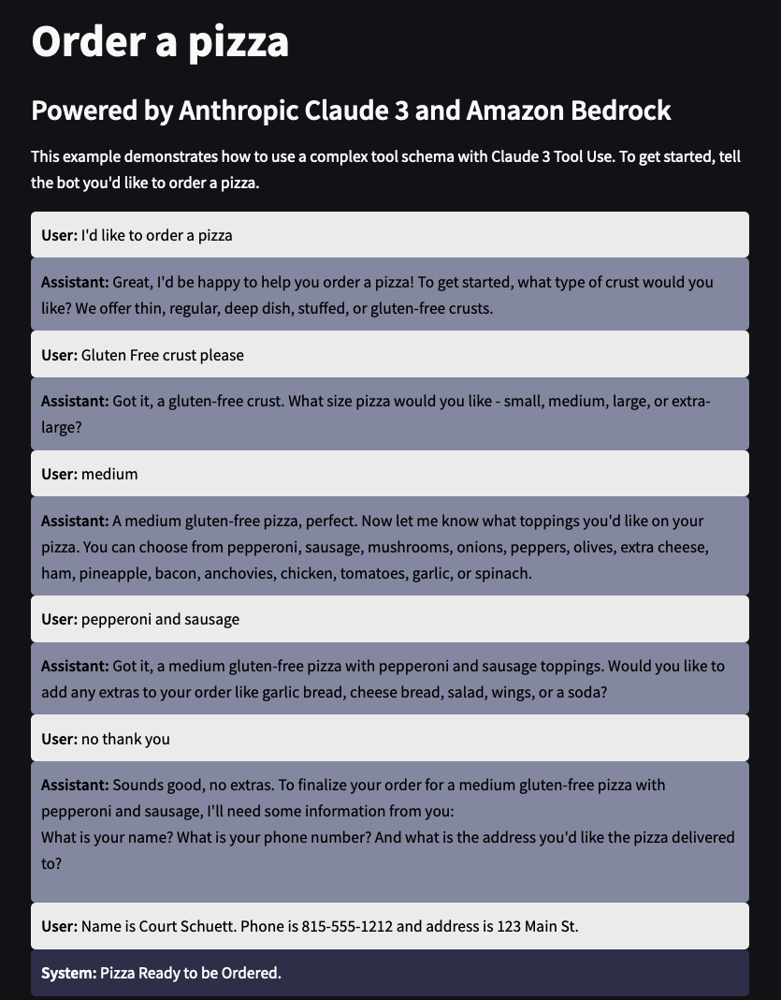

# Using complex JSON Schema with Claude 3 Tools

In these demos, we will show how to use complex JSON schema with Claude 3 using the [tools use feature](https://docs.anthropic.com/en/docs/tool-use#how-tool-use-works). This is meant as a simple and customizable demonstration you can use to familiarize yourself with how tools work. A basic understanding of tools use on Claude will be important for understanding this demo.


_Image from Streamlit example_

From here the bot will use the [tool use feature](https://docs.anthropic.com/en/docs/tool-use) of Claude to walk through the process of ordering a pizza. In this demo, we're not actually going to make a function call so the [output](https://docs.anthropic.com/en/docs/tool-use#json-output) will be the JSON that Claude thinks it needs to provide to call the function.

## JSON Schema

The tool use feature uses [JSON schema](https://json-schema.org/) to define the expected parameters of the tool. This means that Claude knows the schema that is is expected to provide the tool and will do it's best to provide that.

This can include simple [strings](https://json-schema.org/understanding-json-schema/reference/string):

```json
"delivery_instructions": {
    "type": "string",
    "description": "Any special delivery instructions for the order"
},
```

[Enumerated values](https://json-schema.org/understanding-json-schema/reference/enum):

```json
"size": {
    "type": "string",
    "description": "The size of the pizza",
    "enum": [
        "small",
        "medium",
        "large",
        "extra-large"
    ]
},
```

[Arrays](https://json-schema.org/understanding-json-schema/reference/array):

```json
"toppings": {
    "type": "array",
    "description": "A list of toppings for the pizza",
    "items": {
        "type": "string",
        "enum": [
            "pepperoni",
            "sausage",
            "mushrooms",
            "onions",
            "peppers",
            "olives",
            "extra cheese",
            "ham",
            "pineapple",
            "bacon",
            "anchovies",
            "chicken",
            "tomatoes",
            "garlic",
            "spinach"
        ]
    }
},
```

And nested [objects](https://json-schema.org/understanding-json-schema/reference/object):

```json
"customer_details": {
    "type": "object",
    "description": "Details about the customer placing the order",
    "properties": {
        "name": {
            "type": "string",
            "description": "The name of the customer"
        },
        "phone": {
            "type": "string",
            "description": "The phone number of the customer"
        },
        "address": {
            "type": "string",
            "description": "The delivery address for the order"
        }
    },
    "required": [
        "name",
        "phone",
        "address"
    ]
}
```

The complete schema can be found [here](tool_use/input_schema.py)

## Tool Use Best Practices

When combined with the above schema, Claude will know what fields are required and examples of what to look for in a response. Unlike other prompts for Claude which rely on [examples](https://docs.anthropic.com/en/docs/use-examples) to guide Claude, when using tools, the description is [one of the most important pieces](https://docs.anthropic.com/en/docs/tool-use#best-practices-for-tool-definitions) of information. These descriptions should be applied for each component of the JSON schema.

## Prompting

Finally, armed with these tools, we will pass a [system prompt](tool_use/system_prompt.py) and messages to Amazon Bedrock using the Converse API.

```python
system_prompt_with_date = (
    system_prompt
    + "\nThe current date and time is "
    + datetime.now().strftime("%Y-%m-%d %H:%M:%S")
)
converse_api_params = {
    "modelId": MODEL_ID,
    "messages": st.session_state.messages,
    "system": [{"text": system_prompt_with_date}],
    "inferenceConfig": {
        "temperature": TEMPERATURE,
        "maxTokens": MAX_TOKENS,
    },
    "toolConfig": tools,
}
response = bedrock_client.converse(**converse_api_params)
```

_Streamlit code example_

## Result

The result is a simple chat bot that can capture a wide variety of information from a user and produce reliable JSON for further processing.


_Image from Streamlit example_

```json
{
  "output": {
    "message": {
      "role": "assistant",
      "content": [
        {
          "text": "<thinking>\n- The user has provided all the required information to complete their pizza order:\n  - Crust: Gluten-free\n  - Size: Medium\n  - Toppings: Pepperoni, Sausage\n  - Extras: None\n  - Customer Name: Court Schuett\n  - Customer Phone: 815-555-1212\n  - Delivery Address: 123 Main St.\n- I now have everything needed from the data model, so I can invoke the tool to place the order.\n</thinking>"
        },
        {
          "toolUse": {
            "toolUseId": "tooluse_tLSqQR3LQriLD_4P6QgyhA",
            "name": "create_pizza_order",
            "input": {
              "crust": "gluten-free",
              "size": "medium",
              "toppings": ["pepperoni", "sausage"],
              "extras": [],
              "customer_details": {
                "name": "Court Schuett",
                "phone": "815-555-1212",
                "address": "123 Main St."
              }
            }
          }
        }
      ]
    }
  },
  "stopReason": "tool_use"
}
```
