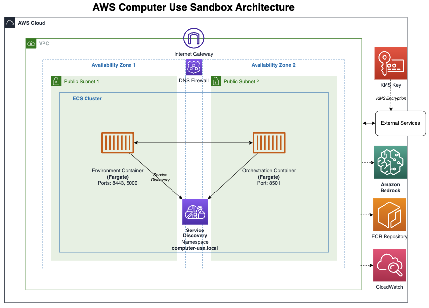

# AWS Computer Use Sandbox

> [!CAUTION]
> Computer use is a beta feature. Please be aware that computer use poses unique risks that are distinct from standard API features or chat interfaces. These risks are heightened when using computer use to interact with the internet. To minimize risks, consider taking precautions such as:
>
> 1. Use a dedicated virtual machine or container with minimal privileges to prevent direct system attacks or accidents.
> 2. Avoid giving the model access to sensitive data, such as account login information, to prevent information theft.
> 3. Limit internet access to an allowlist of domains to reduce exposure to malicious content.
> 4. Ask a human to confirm decisions that may result in meaningful real-world consequences as well as any tasks requiring affirmative consent, such as accepting cookies, executing financial transactions, or agreeing to terms of service.
>
> In some circumstances, Claude will follow commands found in content even if it conflicts with the user's instructions. For example, instructions on webpages or contained in images may override user instructions or cause Claude to make mistakes. We suggest taking precautions to isolate Claude from sensitive data and actions to avoid risks related to prompt injection.
>
> Finally, please inform end users of relevant risks and obtain their consent prior to enabling computer use in your own products.



This project contains the AWS CDK infrastructure code for deploying the Computer Use AWS application in the us-west-2 (Oregon) region. The infrastructure includes ECS Fargate services, ECR repositories, and all necessary networking components.

> [!IMPORTANT]
> The Beta API used in this reference implementation is subject to change. Please refer to the [API release notes](https://docs.anthropic.com/en/release-notes/api) for the most up-to-date information.

## Project Structure

```
ComputerUseAWS/
├── README.md
├── app.py
├── arch_diagrams
├── cdk.json
├── computer_use_aws_stack.py
├── requirements.txt
├── scripts/
│   └── get_urls.sh
├── computer_use_aws/
│   ├── environment_image/
│   │   ├── computer_use_demo/
│   │   ├── image/
│   │   ├── Dockerfile
│   │   └── requirements.txt
│   └── orchestration_image/
│       ├── computer_use_demo/
│       ├── Dockerfile
│       └── requirements.txt
└── tests/
    ├── integration/
    └── unit/
```

## Prerequisites

1. AWS CLI installed and configured with us-west-2 region
2. Python 3.7 or later
3. Node.js 14.x or later (required for CDK)
4. Docker installed and running
5. AWS CDK CLI installed (`npm install -g aws-cdk`)

## Quick Start
1. Clone the repository:
```bash
git clone https://github.com/aws-samples/anthropic-on-aws.git
cd computer-use
```

2. Make the gets_urls.sh script executable:
```bash
chmod +x scripts/get_urls.sh
```

3. Configure AWS CLI for us-west-2 (if not already configured):
```bash
aws configure set default.region us-west-2
```

4. Create virtual environment:
```bash
python -m venv .venv
source .venv/bin/activate  # On Windows use: .venv\Scripts\activate
```

5. Install the required dependencies:
```bash
pip install -r requirements.txt
```

6. Bootstrap CDK in us-west-2 (if you haven't already):
```bash
cdk bootstrap aws://ACCOUNT-NUMBER/us-west-2
```

7. Deploy the solution in **Fail-Secure Mode** (Default). This is the recommended setting for the sandbox environment.

> [!IMPORTANT]
> In **Fail-Secure Mode** if no IP address is provided, the security groups will default to a highly restrictive setting (255.255.255.255/32) that effectively blocks all access.

```bash
# Deploy with your current IP (Fail-Secure)
cdk deploy --context deployer_ip=$(curl -s https://api.ipify.org)

# Deploy with manual IP (Fail-Secure)
cdk deploy --context deployer_ip=203.0.113.1
# This will automatically be converted to 203.0.113.1/32

# Deploy with IP address range (Fail-Secure)
cdk deploy --context deployer_ip=203.0.113.0/24 
# Allows 203.0.113.0 through 203.0.113.255
```

> [!NOTE]
> This stack takes **~10-15 minutes** to deploy. After the deployment **it may take a few additional minutes** for the Environment/Virtual Machine to come online.

8. After the deploy has completed, you can get the URLs of the services:
```bash
./scripts/get_urls.sh
```

**Note**: If you are using aws profiles append --profile <profile name> to the command line if not provided "default" is assumed

```bash
./scripts/get_urls.sh --profile <your profile name>
```

## DNS Firewall Configuration

The stack includes a Route 53 Resolver DNS Firewall that controls domain access. By default, it operates on an allowlist basis - only explicitly allowed domains can be accessed while all others are blocked.

### Default Allowed Domains

The firewall allows access to:
- AWS services (*.amazonaws.com, *.aws.dev, etc.)
- Amazon domains (amazon.com, a2z.com)
- Anthropic domains (anthropic.com, claude.ai)
- GitHub domains (github.com, *.githubassets.com)
- Google domains (google.com, *.googleapis.com)
- Python package repositories (pypi.org, pythonhosted.org)
- Internal service discovery domains (*.computer-use.local)

### Updating Allowed Domains

To modify the allowed domains:

1. Edit the `cfn_firewall_domain_list` in `computer_use_aws_stack.py`
2. Add or remove domains using the following format:
```python
domains=[
    "example.com",      # Allow exact domain
    "*.example.com",    # Allow all subdomains
]
```
3. Redeploy the stack:
```bash
cdk deploy
```

### Managing DNS Firewall Rules

View current rules:
```bash
aws route53resolver get-firewall-rule-group --firewall-rule-group-id <ID>
```
Get the rule group ID from stack outputs:
```bash
aws cloudformation describe-stacks --stack-name ComputerUseAwsStack --query 'Stacks[0].Outputs[?OutputKey==`DnsFirewallRuleGroupId`].OutputValue' --output text
```

## Usage

Navigate to the links provided in the output of the `get_urls.sh` script to access the services, the Orchestration Service URL and Environment Service URL.

DCV is used to connect to the environment container for remote desktop access, for activities such as resetting the state of the environment, or elliciting the state of the environment prior to a new task.

The Streamlit interface is used to configure the API provider, model, and other parameters for the environment container. Then ultimately instruct the model via a chat interface to perform tasks.

## Steamlit GUI and DCV Access

After navigating to the Orchestration Service URL (Streamlit interface), you'll need to log in:

1. Default credentials for DCV and the Web UI:
   - **Username:** `computeruse`
   - **Password:** `admin`

2. After successful login, you'll see:
   - Configuration panel in the sidebar
   - Chat interface in the main area
   - HTTP Exchange Logs tab for debugging

Note: The session will timeout after 60 minutes of inactivity, requiring you to log in again.


## Infrastructure Components

- **VPC**: Configured with public and private subnets across 2 AZs in us-west-2
- **ECR Repository**: Single repository for both environment and orchestration images
- **ECS Cluster**: Fargate cluster for running containers
- **Task Definition**: Includes both containers with appropriate port mappings
- **Security Groups**: 
  - Environment container: Accepts traffic only from orchestration container
  - Orchestration container: Accepts public traffic on port 8501
- **IAM Roles**: Task execution role with minimal permissions
- **CloudWatch Logs**: Configured for container logging
- **KMS**: Encryption key for secure storage

## Container Ports

- **Environment Container**:
  - 8443: DCV
  - 5000: Flask Control API
- **Orchestration Container**:
  - 8501: Streamlit interface

## Monitoring

- Container insights enabled for the ECS cluster
- CloudWatch logs configured with KMS encryption
- VPC flow logs enabled for network monitoring
- All logs retained for one month

## Troubleshooting

1. If deployment fails:
```bash
# Check AWS credentials
aws sts get-caller-identity

# Check CloudFormation events
aws cloudformation describe-stack-events --stack-name ComputerUseAwsStack
```

2. If containers fail to start:
```bash
# Check ECS service events
aws ecs describe-services --cluster computer-use-aws-cluster --services computer-use-aws-service-computeruseawsstack

# Check container logs
aws logs get-log-events --log-group-name /ecs/computer-use-aws-computeruseawsstack
```

## Clean Up

To destroy the infrastructure:
```bash
cdk destroy
```
