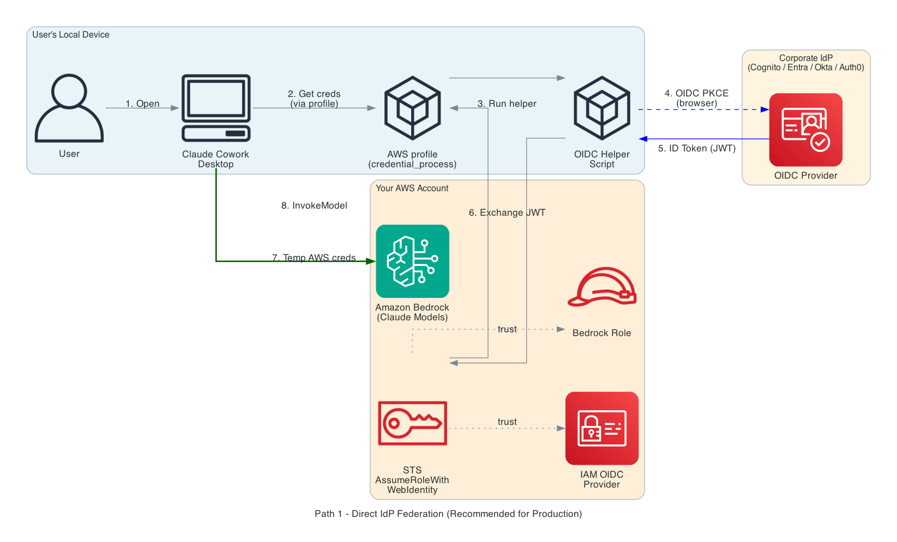
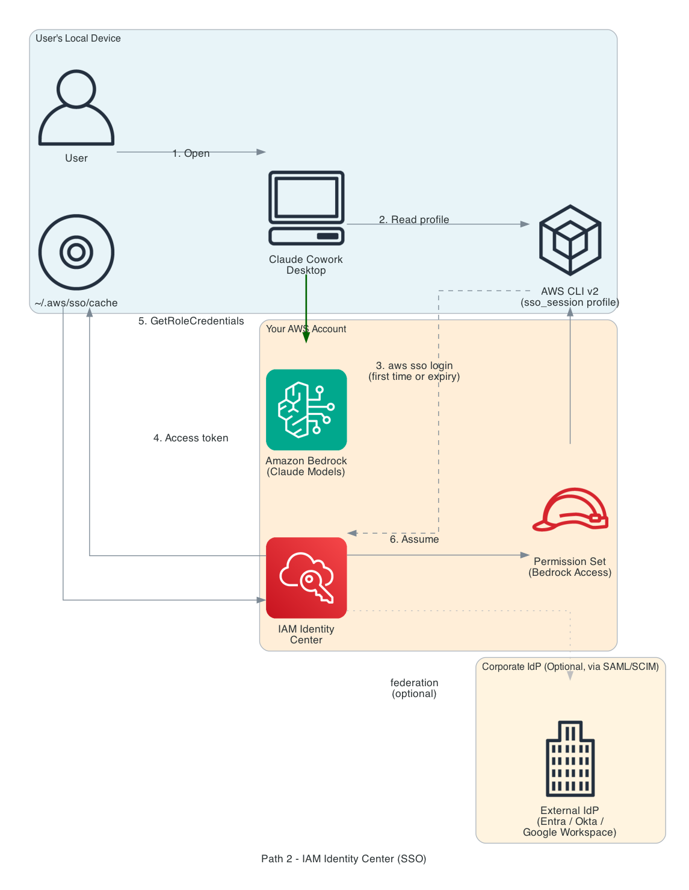
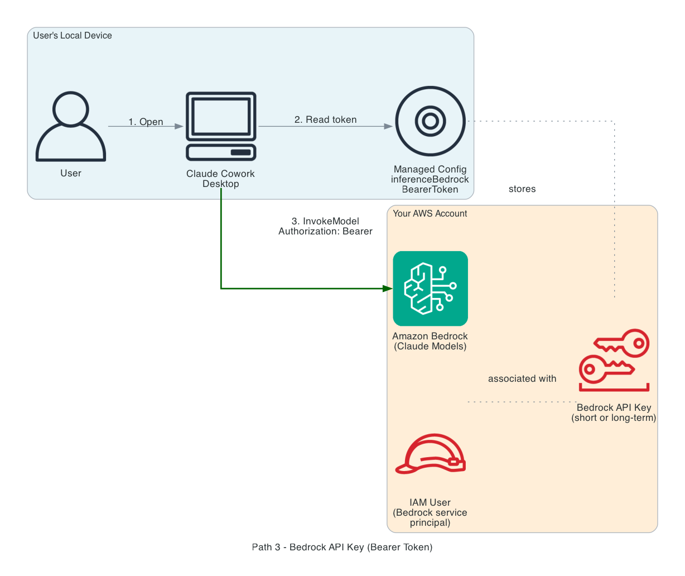

# Claude Cowork 3P on Amazon Bedrock — Identity Federation Setup Guide

Step-by-step instructions for authenticating Claude Cowork Desktop users against Amazon Bedrock. Covers three authentication methods — Direct IdP Federation, IAM Identity Center (SSO), and Bedrock API Keys — with live-tested deployment steps and architecture diagrams for each.

---

## Table of Contents

- [Overview](#overview)
- [Authentication methods comparison](#authentication-methods-comparison)
- [Prerequisites (all paths)](#prerequisites-all-paths)
- [Path 1 — Direct IdP Federation (Recommended)](#path-1--direct-idp-federation-recommended)
- [Path 2 — IAM Identity Center (SSO)](#path-2--iam-identity-center-sso)
- [Path 3 — Bedrock API Key (Bearer Token)](#path-3--bedrock-api-key-bearer-token)
- [IAM policy reference](#iam-policy-reference)
- [Security posture side by side](#security-posture-side-by-side)
- [Which path should you pick?](#which-path-should-you-pick)
- [Troubleshooting](#troubleshooting)
- [Adapting Path 1 to other OIDC providers](#adapting-path-1-to-other-oidc-providers)
- [References](#references)

---

## Overview

Claude Cowork 3P routes all model inference through Amazon Bedrock in your AWS account. Conversations and files never leave your AWS environment or the end-user device. This guide walks through the three ways Cowork Desktop can authenticate to Bedrock so you can pick the right approach for your organization.

The architecture patterns mirror those recommended for Claude Code in [Claude Code deployment patterns and best practices with Amazon Bedrock](https://aws.amazon.com/blogs/machine-learning/claude-code-deployment-patterns-and-best-practices-with-amazon-bedrock/).

## Authentication methods comparison

| Method | Seamlessness for user | Security | User attribution | Best for |
|---|---|---|---|---|
| Bedrock API Key | Fully silent (no login) | Low — shared long-lived secret | None (shared principal) | Proof of concept only |
| IAM Identity Center (SSO) | Browser login once per 8–12h | High | Basic (IAM principal) | Orgs already using IAM Identity Center |
| Direct IdP Federation | Browser once, then silent via refresh tokens | High | Complete (email, groups, custom claims) | Production deployments (recommended) |

All three methods are supported by Cowork Desktop out of the box. Cowork reads credentials in this order and uses the first one it finds: **bearer token → AWS profile → in-app credential helper**. You can have multiple configured; only the first match is used.

## Prerequisites (all paths)

### AWS account
- An AWS account with Amazon Bedrock access
- Claude models enabled in the Bedrock console → Model access page for the regions you plan to use
- IAM permissions to create roles, policies, and — depending on path — Cognito user pools, Identity Center permission sets, or IAM users

### End-user devices
- macOS 12+ or Windows 10/11
- Claude Desktop installed ([claude.com/download](https://claude.com/download)) and launched once
- Internet access to reach your IdP login page and Amazon Bedrock endpoints
- AWS CLI v2 (required for Identity Center and Direct IdP paths; not needed for API Key)

### Enabling 3P mode
All paths require Cowork Desktop to be configured for 3P (Bedrock) inference. The core setting is:

```json
{
  "deploymentMode": "3p",
  "enterpriseConfig": {
    "inferenceProvider": "bedrock",
    "inferenceBedrockRegion": "us-west-2",
    "inferenceModels": [
      "us.anthropic.claude-sonnet-4-6",
      "us.anthropic.claude-opus-4-7"
    ],
    "disableDeploymentModeChooser": true
  }
}
```

Each path below adds a small amount of additional configuration on top of this base.

---

## Path 1 — Direct IdP Federation (Recommended)

Direct IdP Federation connects your existing enterprise identity provider (Amazon Cognito, Microsoft Entra ID, Okta, Auth0, Google Workspace) directly to AWS IAM via OpenID Connect. Users sign in with their corporate credentials; AWS STS exchanges the IdP's ID token for temporary Bedrock credentials via `AssumeRoleWithWebIdentity`.

Cowork Desktop does not call the IdP directly. Instead, a standard AWS profile in `~/.aws/config` is configured with `credential_process` pointing at a small helper script. Cowork reads the profile; the AWS SDK runs the helper; the helper orchestrates the OIDC flow and emits temporary AWS credentials in the format the SDK expects. This keeps Cowork agnostic to the specific IdP — everything IdP-specific lives in the helper script.

### Architecture



**Zones at a glance:**
- 🔵 **Blue — User's local device**: Cowork Desktop, AWS profile, OIDC helper script
- 🟠 **Orange — Corporate IdP**: Cognito pool, Entra ID tenant, Okta org, etc.
- 🟤 **Tan — Your AWS account**: IAM OIDC provider, IAM role, AWS STS, Amazon Bedrock

### AWS infrastructure — two scenarios

The [CDK app](./cdk/) in this folder creates all required AWS resources.

#### Scenario A — Use Amazon Cognito (no existing IdP)

If your organization does not yet have an enterprise IdP, the CDK app can create a Cognito User Pool as the workforce directory.

```bash
cd cdk
npm install
npx cdk deploy --all \
  --context createCognito=true \
  --context cognitoDomainPrefix=my-company-cowork \
  --context bedrockRegions=us-west-2,us-east-1
```

This provisions:
- Cognito User Pool (email sign-in, strong password policy, optional MFA)
- Hosted-UI domain for the OIDC authorization flow
- App client configured for Authorization Code + PKCE
- IAM OIDC identity provider pointing at the Cognito issuer
- IAM role with least-privilege Bedrock access on Anthropic model ARNs

Provision a user:

```bash
aws cognito-idp admin-create-user \
  --user-pool-id <UserPoolId> \
  --username alice@example.com \
  --user-attributes Name=email,Value=alice@example.com \
    Name=email_verified,Value=true

aws cognito-idp admin-set-user-password \
  --user-pool-id <UserPoolId> \
  --username alice@example.com \
  --password '<StrongPassword>' --permanent
```

#### Scenario B — Federate with your existing IdP

For Entra ID, Okta, Auth0, and Google Workspace, you only need two values from your IdP: the **issuer URL** and the **OIDC app client ID**. Register `http://localhost:8765/callback` as an allowed redirect URI in your IdP's app registration.

##### Microsoft Entra ID

1. Register a new application in the Azure portal (Single tenant)
2. Set Redirect URI to `http://localhost:8765/callback` (Public client)
3. Note the Application (client) ID and Directory (tenant) ID

```bash
npx cdk deploy CoworkFederationStack \
  --context issuerUrl=https://login.microsoftonline.com/<TENANT_ID>/v2.0 \
  --context audience=<APPLICATION_CLIENT_ID> \
  --context bedrockRegions=us-west-2,us-east-1
```

##### Okta

1. Create a Native Application OIDC integration (required for PKCE)
2. Set Sign-in redirect URI to `http://localhost:8765/callback`

```bash
npx cdk deploy CoworkFederationStack \
  --context issuerUrl=https://<YOUR_ORG>.okta.com/oauth2/default \
  --context audience=<CLIENT_ID> \
  --context bedrockRegions=us-west-2,us-east-1
```

##### Auth0

```bash
npx cdk deploy CoworkFederationStack \
  --context issuerUrl=https://<TENANT>.auth0.com/ \
  --context audience=<CLIENT_ID> \
  --context bedrockRegions=us-west-2,us-east-1
```

##### Google Workspace

```bash
npx cdk deploy CoworkFederationStack \
  --context issuerUrl=https://accounts.google.com \
  --context audience=<CLIENT_ID> \
  --context bedrockRegions=us-west-2,us-east-1
```

### Device configuration

#### Install the OIDC helper

Install the helper on each device. **Zero pip dependencies** — uses Python 3.9+ stdlib only.

- [`helper/cowork-oidc-helper.py`](./helper/cowork-oidc-helper.py) — OIDC Auth Code + PKCE flow plus `AssumeRoleWithWebIdentity`
- [`helper/cowork-credential-helper.sh`](./helper/cowork-credential-helper.sh) — thin wrapper setting environment variables

Edit the wrapper with your CDK outputs:

```bash
#!/usr/bin/env bash
set -euo pipefail
export COWORK_OIDC_ISSUER_URL="<IssuerUrl-from-CDK>"
export COWORK_OIDC_CLIENT_ID="<Audience-from-CDK>"
export COWORK_ROLE_ARN="<RoleArn-from-CDK>"
export COWORK_AWS_REGION="us-west-2"
exec python3 "$(dirname "$0")/cowork-oidc-helper.py"
```

#### Wire into AWS profile

Add a named profile to `~/.aws/config` that uses the helper as `credential_process`. Cowork reads this profile via `inferenceBedrockProfile` — **not** via Cowork's own credential helper mechanism.

> **Important:** Cowork's `inferenceCredentialHelper` key expects a bearer token string, not AWS SDK credentials. The AWS profile / `credential_process` route is the correct integration point for OIDC federation.

```ini
[profile cowork-federation]
region = us-west-2
output = json
credential_process = /opt/cowork/cowork-credential-helper.sh
```

#### Cowork Desktop config (macOS)

```bash
# ~/Library/Application Support/Claude-3p/claude_desktop_config.json
```
```json
{
  "deploymentMode": "3p",
  "enterpriseConfig": {
    "inferenceProvider": "bedrock",
    "inferenceBedrockRegion": "us-west-2",
    "inferenceBedrockProfile": "cowork-federation",
    "inferenceModels": [
      "us.anthropic.claude-sonnet-4-6",
      "us.anthropic.claude-opus-4-7"
    ],
    "deploymentOrganizationUuid": "<YOUR-ORG-UUID>",
    "disableDeploymentModeChooser": true
  }
}
```

#### Cowork Desktop config (Windows)

```powershell
# Apply via Group Policy, Intune Settings Catalog, or PowerShell
$base = "HKLM:\SOFTWARE\Policies\Claude"
New-Item -Path $base -Force | Out-Null
Set-ItemProperty -Path $base -Name inferenceProvider        -Value "bedrock"
Set-ItemProperty -Path $base -Name inferenceBedrockRegion   -Value "us-west-2"
Set-ItemProperty -Path $base -Name inferenceBedrockProfile  -Value "cowork-federation"
Set-ItemProperty -Path $base -Name inferenceModels `
  -Value '["us.anthropic.claude-sonnet-4-6","us.anthropic.claude-opus-4-7"]'
Set-ItemProperty -Path $base -Name disableDeploymentModeChooser -Value "true"
```

### End-user experience

- **First launch:** user opens Cowork → browser opens to corporate IdP login → user signs in → tab closes → Cowork ready
- **Subsequent launches** (within refresh token lifetime, default 30 days): silent — no browser
- **After refresh token expires:** browser opens once for a fresh sign-in, identical to any other corporate SSO app

---

## Path 2 — IAM Identity Center (SSO)

IAM Identity Center acts as a workforce IdP in front of AWS. It can stand alone with local users, or federate to an external IdP (Entra, Okta, Google Workspace) via SAML 2.0 with SCIM for user provisioning. Users run `aws sso login` once per session (default 8–12h); the AWS SDK caches the access token and the user's permission set grants Bedrock access.

Choose this path when your organization already uses Identity Center for AWS access, or when you want a managed AWS-native SSO experience without deploying OIDC infrastructure yourself.

### Architecture



**Zones at a glance:**
- 🔵 **Blue — User's local device**: Cowork Desktop, AWS CLI v2, SSO token cache
- 🟠 **Orange — Corporate IdP (optional)**: external IdP federated via SAML/SCIM; not required if using Identity Center's built-in directory
- 🟤 **Tan — Your AWS account**: IAM Identity Center, permission set, Amazon Bedrock

### AWS setup

- Enable IAM Identity Center in your AWS account (one-time)
- (Optional) Federate Identity Center to your external IdP via SAML 2.0 + SCIM — see the [AWS IAM Identity Center User Guide](https://docs.aws.amazon.com/singlesignon/latest/userguide/)
- Create a permission set (e.g., `CoworkBedrockAccess`) with the least-privilege Bedrock policy shown at the end of this document
- Assign users/groups to the permission set on the target AWS account
- Note the Identity Center start URL (`https://d-xxxxxxxxxx.awsapps.com/start`) and the permission set name

### AWS CLI v2 installation

This path **requires AWS CLI v2** because `aws sso login` is not available in v1.

```bash
# macOS
curl "https://awscli.amazonaws.com/AWSCLIV2.pkg" -o AWSCLIV2.pkg
sudo installer -pkg AWSCLIV2.pkg -target /

# Windows
# Install via MSI: https://awscli.amazonaws.com/AWSCLIV2.msi
```

### Device `~/.aws/config`

```ini
[sso-session cowork-sso]
sso_start_url = https://d-xxxxxxxxxx.awsapps.com/start
sso_region = us-east-1
sso_registration_scopes = sso:account:access

[profile cowork-sso]
sso_session = cowork-sso
sso_account_id = <YOUR_ACCOUNT_ID>
sso_role_name = CoworkBedrockAccess
region = us-west-2
output = json
```

### First-time sign-in

```bash
aws sso login --profile cowork-sso
```

A browser opens to the Identity Center start URL. User signs in with their corporate credentials. An SSO access token caches under `~/.aws/sso/cache/` for the session duration configured on the permission set (default 8 hours, up to 12).

### Cowork Desktop config

```json
{
  "deploymentMode": "3p",
  "enterpriseConfig": {
    "inferenceProvider": "bedrock",
    "inferenceBedrockRegion": "us-west-2",
    "inferenceBedrockProfile": "cowork-sso",
    "inferenceModels": [
      "us.anthropic.claude-sonnet-4-6",
      "us.anthropic.claude-opus-4-7"
    ],
    "disableDeploymentModeChooser": true
  }
}
```

### End-user experience

- **First launch each session:** user runs `aws sso login` (or IT deploys a launcher that runs it automatically)
- **After sign-in:** Cowork works silently until the session expires (8–12h)
- **Token expiry:** Cowork returns `ExpiredTokenException` on next call; user re-runs `aws sso login`

For a zero-CLI experience, you can wrap `aws sso login` into a one-click app launcher. Anthropic customer teams have sample launcher scripts for macOS (AppleScript + .app bundle) and Windows (PowerShell + .cmd shim).

---

## Path 3 — Bedrock API Key (Bearer Token)

Bedrock API keys are long-lived or short-lived tokens generated against a dedicated IAM user. Cowork Desktop accepts a bearer token directly via the `inferenceBedrockBearerToken` configuration key. This is the simplest path to set up but the least secure: the token is a shared, long-lived secret with no per-user attribution.

> **Recommended only for short-lived proofs of concept (under one week). Not suitable for production deployments.**

### Architecture



**Zones at a glance:**
- 🔵 **Blue — User's local device**: Cowork Desktop, managed config containing the token
- 🟤 **Tan — Your AWS account**: IAM user, Bedrock API key bound to that user, Amazon Bedrock

No corporate IdP is involved. Every user on every device calls Bedrock with the same shared token.

### Create the API key

You can generate an API key from the Amazon Bedrock console (API keys page) or programmatically.

```bash
aws iam create-user --user-name cowork-bedrock-user

aws iam attach-user-policy \
  --user-name cowork-bedrock-user \
  --policy-arn arn:aws:iam::aws:policy/AmazonBedrockLimitedAccess

aws iam create-service-specific-credential \
  --user-name cowork-bedrock-user \
  --service-name bedrock.amazonaws.com
```

The response includes `ServiceCredentialSecret` — this is the bearer token. Store it in a secrets manager; treat it like any long-lived credential.

### Cowork Desktop config

```json
{
  "deploymentMode": "3p",
  "enterpriseConfig": {
    "inferenceProvider": "bedrock",
    "inferenceBedrockRegion": "us-west-2",
    "inferenceBedrockBearerToken": "<ServiceCredentialSecret>",
    "inferenceModels": [
      "us.anthropic.claude-sonnet-4-6",
      "us.anthropic.claude-opus-4-7"
    ],
    "disableDeploymentModeChooser": true
  }
}
```

### Quick test (verify the key works)

```bash
curl -X POST \
  "https://bedrock-runtime.us-west-2.amazonaws.com/model/us.anthropic.claude-sonnet-4-6/invoke" \
  -H "Authorization: Bearer <ServiceCredentialSecret>" \
  -H "Content-Type: application/json" \
  -d '{"anthropic_version":"bedrock-2023-05-31","max_tokens":30,
       "messages":[{"role":"user","content":"hello"}]}'
```

### End-user experience

- **First launch:** Cowork opens; no login screen, no browser, no setup
- **Every launch after:** identical — fully silent
- **Key rotation:** IT rotates the token, pushes the new config via MDM; users see no change

---

## IAM policy reference

The following least-privilege policy grants only the Bedrock actions Cowork needs, scoped to Anthropic model ARNs and the standard cross-region inference profile prefixes. Use it as the inline policy on the Identity Center permission set (Path 2), the IAM role created by the CDK app (Path 1), or the IAM user behind the API key (Path 3).

```json
{
  "Version": "2012-10-17",
  "Statement": [
    {
      "Sid": "InvokeClaudeModels",
      "Effect": "Allow",
      "Action": [
        "bedrock:InvokeModel",
        "bedrock:InvokeModelWithResponseStream",
        "bedrock:Converse",
        "bedrock:ConverseStream"
      ],
      "Resource": [
        "arn:aws:bedrock:*::foundation-model/anthropic.*",
        "arn:aws:bedrock:*:*:inference-profile/us.anthropic.*",
        "arn:aws:bedrock:*:*:inference-profile/eu.anthropic.*",
        "arn:aws:bedrock:*:*:inference-profile/global.anthropic.*",
        "arn:aws:bedrock:*:*:application-inference-profile/*"
      ]
    },
    {
      "Sid": "DiscoverModels",
      "Effect": "Allow",
      "Action": [
        "bedrock:ListFoundationModels",
        "bedrock:GetFoundationModel",
        "bedrock:ListInferenceProfiles",
        "bedrock:GetInferenceProfile"
      ],
      "Resource": "*"
    }
  ]
}
```

> **Note:** The `InvokeModel` statement intentionally has no `aws:RequestedRegion` condition. Cross-region inference profiles (`us.*`, `eu.*`, `global.*`) route requests to any region within the prefix group; a region condition would break these profiles.

## Security posture side by side

| Property | Path 1 — Direct IdP | Path 2 — Identity Center | Path 3 — API Key |
|---|---|---|---|
| Long-lived AWS credentials on device | None (STS temp) | None (STS temp) | Bearer token (long-lived or up to 12h) |
| Per-user attribution in CloudTrail | Complete (IdP claims) | Basic (IAM principal) | None |
| MFA support | Yes (enforced by IdP) | Yes (enforced by IdP / IdC) | No |
| User re-auth cadence | Every 30 days (refresh token) | Every 8–12 hours | Never (until rotated) |
| Conversation data egress to Anthropic | None | None | None |
| Setup effort | Medium (CDK + helper) | Low if IdC already enabled | Very low |

## Which path should you pick?

- **Production deployment with existing enterprise IdP** (Entra, Okta, Auth0, Google) → **Path 1**
- **Organization already uses IAM Identity Center** for AWS access → **Path 2**
- **Proof of concept for a small team**, under one week → **Path 3** (plan to migrate before expanding)
- **No enterprise IdP yet**, want a fully AWS-native stack → **Path 1 Scenario A (Cognito)**

## Troubleshooting

| Symptom | Likely cause | Fix |
|---|---|---|
| "Credential helper did not produce a token" | Cowork's `inferenceCredentialHelper` expects a bearer token; AWS SDK credential format does not match | Use `inferenceBedrockProfile` with `credential_process` in `~/.aws/config` — not `inferenceCredentialHelper` |
| "Could not connect to the endpoint URL" on `aws sso login` | AWS CLI v1 installed (no `sso login`) | Install AWS CLI v2 |
| "ForbiddenException: No access" after SSO login | User not assigned to permission set, or session predates assignment | Confirm assignment in Identity Center, logout and re-login |
| "AccessDenied" on Bedrock `InvokeModel` from a cross-region profile | IAM policy has `aws:RequestedRegion` condition | Remove the region condition from InvokeModel actions; cross-region profiles route anywhere |
| Cowork shows Anthropic login screen | `configLibrary` overriding `enterpriseConfig` | Clear `~/Library/Application Support/Claude-3p/configLibrary` and restart Cowork |
| "UnrecognizedClientException" on first call | Claude models not enabled for the region in Bedrock console | Bedrock console → Model access → Enable Anthropic models |
| Browser opens but Cowork still reports creds error | Token cache stale or OIDC redirect URI mismatch | Verify `http://localhost:8765/callback` is an allowed redirect URI in the IdP app registration |

## Adapting Path 1 to other OIDC providers

The helper script and Cowork configuration are IdP-agnostic. To switch providers, change only the issuer URL and client ID and register the redirect URI in the new IdP.

| Provider | Issuer URL format | Redirect URI to register |
|---|---|---|
| Amazon Cognito | `https://cognito-idp.<region>.amazonaws.com/<pool-id>` | Set automatically by CDK (Scenario A) |
| Microsoft Entra ID | `https://login.microsoftonline.com/<tenant-id>/v2.0` | `http://localhost:8765/callback` |
| Okta | `https://<org>.okta.com/oauth2/default` | `http://localhost:8765/callback` |
| Auth0 | `https://<tenant>.auth0.com/` | `http://localhost:8765/callback` |
| Google Workspace | `https://accounts.google.com` | `http://localhost:8765/callback` |

## References

- AWS Blog — [Claude Code deployment patterns and best practices with Amazon Bedrock](https://aws.amazon.com/blogs/machine-learning/claude-code-deployment-patterns-and-best-practices-with-amazon-bedrock/)
- AWS Blog — [Running Claude Cowork in Amazon Bedrock](https://aws.amazon.com/blogs/machine-learning/from-developer-desks-to-the-whole-organization-running-claude-cowork-in-amazon-bedrock/)
- Anthropic Docs — [Cowork 3P Overview](https://claude.com/docs/cowork/3p/overview)
- Anthropic Docs — [Cowork on Bedrock](https://claude.com/docs/cowork/3p/bedrock)
- Anthropic Docs — [Cowork 3P Configuration Reference](https://claude.com/docs/cowork/3p/configuration)
- AWS Docs — [IAM OIDC identity providers](https://docs.aws.amazon.com/IAM/latest/UserGuide/id_roles_providers_create_oidc.html)
- AWS Docs — [AssumeRoleWithWebIdentity](https://docs.aws.amazon.com/STS/latest/APIReference/API_AssumeRoleWithWebIdentity.html)
- AWS Docs — [IAM Identity Center User Guide](https://docs.aws.amazon.com/singlesignon/latest/userguide/)
- AWS Docs — [Amazon Bedrock API keys](https://docs.aws.amazon.com/bedrock/latest/userguide/api-keys.html)
- AWS Security Blog — [Securing Amazon Bedrock API keys](https://aws.amazon.com/blogs/security/securing-amazon-bedrock-api-keys-best-practices-for-implementation-and-management/)

---

## What's in this folder

```
identity-federation/
├── README.md                      ← this guide
├── cdk/                           ← AWS CDK app (TypeScript)
│   ├── bin/cowork-federation.ts
│   ├── lib/cowork-cognito-stack.ts
│   ├── lib/cowork-federation-stack.ts
│   ├── cdk.json, package.json, tsconfig.json
│   └── README.md
├── helper/                        ← OIDC credential helper (Python + bash)
│   ├── cowork-oidc-helper.py      ← main helper; no external deps
│   ├── cowork-credential-helper.sh ← wrapper with env-var config
│   └── test_e2e.py                ← non-interactive end-to-end test
└── diagrams/                      ← architecture diagrams
    ├── cowork-path1-direct-idp.png
    ├── cowork-path2-identity-center.png
    ├── cowork-path3-api-key.png
    └── generate_diagrams.py        ← regenerate diagrams with python-diagrams
```

## License

MIT-0. See the repository root for full license text.
