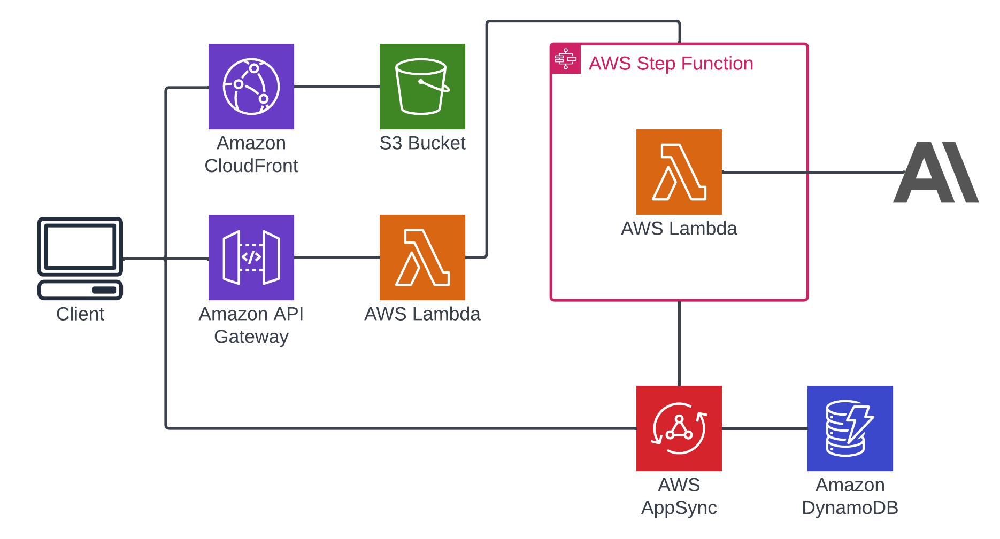
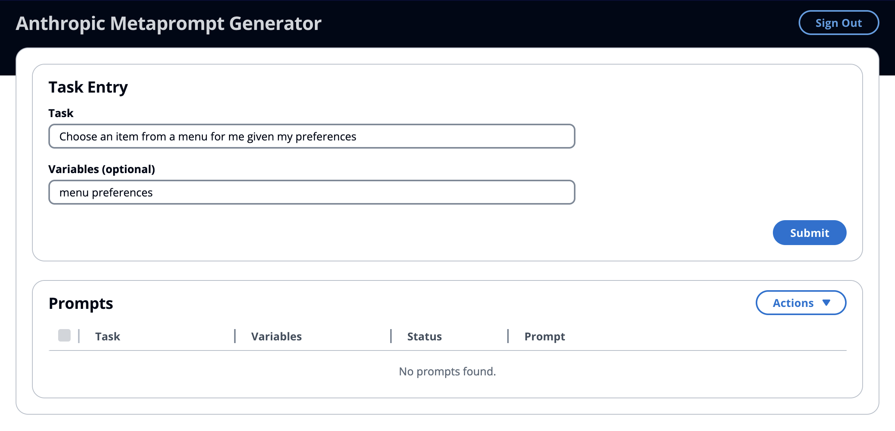
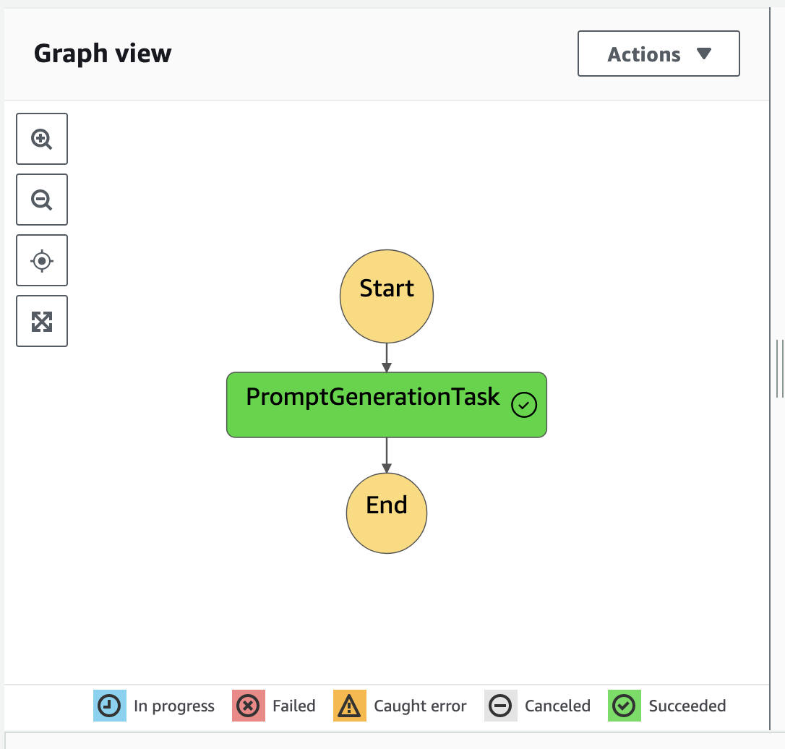
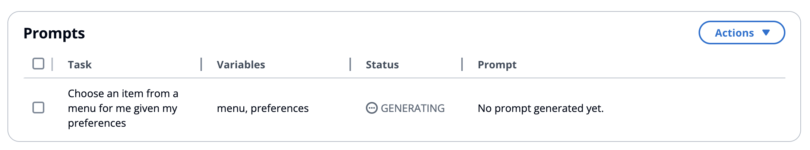
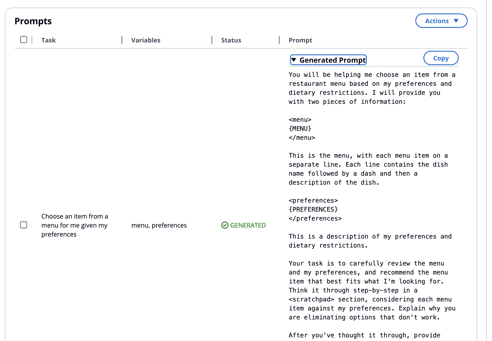

# Anthropic MetaPrompt Generator

In this example, we will cover two concepts for using LLMs in general and Anthropic in particular. The former is a method of asynchronously processing a complex prompt with AWS serverless components. The later is a method of using Claude 3 Opus to generate a well constructed prompt for a specific task. This can be a good jumping off point for prompt creation. You'll be able to enter a simple task and have a well constructed prompt generated for you.

## Asynchronously Processing

When working with Large Language Models and complex prompts, you will often exceed timeouts of various systems. In this case, if we simply had used an Amazon API Gateway with an AWS Lambda Function, the API Gateway timeout limit of 30 seconds could have been reached. In order to process the request with the LLM, we can use an AWS Step Function. By using a Step Function, we can immediately return a response to the API request and begin processing asynchronously.



This demo uses a simple React application hosted on an S3 Bucket with a Cloudfront Distribution in front of it. Within this application, we have created an API Gateway that is integrated with a Lambda function. This function will be used to start the state machine that will process the request. Within the state machine, the `promptGenerator` Lambda is invoked that will make a request to Anthropic with the included prompt and the task and variables from the client. When a response is returned from Anthropic, the Lambda function will update the AppSync database.

1. Client makes POST request to API Gateway with task and optional variables
2. The API Gateway invokes the `requestHandler` Lambda
3. The `requestHandler` Lambda starts the state machine
4. Within the state machine, the `promptGenerator` Lambda is invoked
   1. The `promptGenerator` Lambda makes a request to Anthropic
   2. Anthropic responds to the request
   3. The `promptGenerator` Lambda updates the AppSync database with the generated prompt
5. When the AppSync database is updated, the client is updated through a GraphQL subscription

### Task Entry

To start the process, enter a task in the Task Entry form and press Submit. This will send the request to the `requestHandler` Lambda function through the API Gateway.



### Request Handler Lambda

Because the `requestHandler` Lambda function is just acting as the front end for this application, it is relatively simple.

```typescript
const params = {
  stateMachineArn,
  input: JSON.stringify({ task, variables }),
};

const command = new StartExecutionCommand(params);
await sfnClient.send(command);

return createApiResponse({
  statusCode: 202,
  body: JSON.stringify({ message: 'Prompt generation started' }),
});
```

The core functionality is to start the state machine and return a response to the API Gateway and React application.

## State Machine

In this example, the State Machine is kept very simple.



It's only job is to invoke the `promptGenerator` Lambda function.

## Prompt Generator Lambda

### Pre-Processing

Before we make the request to Anthropic, we will perform pre-processing of the prompt. This will allow us to replace the `{{TASK}}` with the requested task and add the optional variables to the prompt.

```typescript
const { task, variables = [] } = event;

const updatedPrompt = promptTemplate.replace('{{TASK}}', task);
console.log(`Updated Prompt: ${updatedPrompt}`);

let variableString = '';
variableString = variables
  .map((variable: string) => `{${variable.toUpperCase()}}`)
  .join('\n');

let assistantPartial = '';
if (variableString) {
  assistantPartial += '<Inputs>';
  assistantPartial += variableString + '\n</Inputs>\n';
}
assistantPartial += '<Instructions Structure>';
console.log(`AssistantPartial: \n${assistantPartial}`);
```

If no variables are in the request, no `<Inputs></Inputs>` will be added.

We will also make a mutation to our AppSync database to let the user know that we're generating their prompt.

```typescript
const generatingResponse = await apolloClient.mutate({
  mutation: UPDATE_PROMPT_MUTATION,
  variables: {
    id: promptId,
    status: 'GENERATING',
  },
});
```



### Anthropic Request

Now that our prompt has been finalized, we will make the request using the Anthropic SDK using the `updatedPrompt` and `assistantPartial`.

```typescript
const response = await anthropic.messages.create({
  max_tokens: 4096,
  temperature: 0,
  messages: [
    { role: 'user', content: updatedPrompt },
    { role: 'assistant', content: assistantPartial },
  ],
  model: 'claude-3-opus-20240229',
});
```

### Post Processing

To make the result easier to read, we will extract the results between the tags from the response and remove any empty tags. Once completed, we will have a simple to read and use prompt.

```typescript
function extractBetweenTags(
  tag: string,
  text: string,
  strip: boolean = false,
): string[] {
  const regex = new RegExp(`<${tag}>(.+?)</${tag}>`, 'gs');
  const matches = text.match(regex);
  if (matches) {
    return strip
      ? matches.map((match) => match.replace(regex, '$1').trim())
      : matches.map((match) => match.replace(regex, '$1'));
  }
  return [];
}

function removeEmptyTags(text: string): string {
  return text.replace(/<(\w+)><\/\1>$/g, '');
}

function extractPrompt(metapromptResponse: string): string {
  const betweenTags = extractBetweenTags('Instructions', metapromptResponse)[0];
  return removeEmptyTags(removeEmptyTags(betweenTags).trim()).trim();
}
```

### Updating AppSync

Finally, with our generated prompt, we will use the Apollo client to `updatePrompt` into the GraphQL database.

```typescript
const generatedResponse = await apolloClient.mutate({
  mutation: UPDATE_PROMPT_MUTATION_WITH_PROMPT,
  variables: {
    id: promptId,
    status: 'GENERATED',
    prompt: generatedPrompt,
  },
});
```

## React Client

Finally, within the React client, we will subscribe to the AppSync database. Now, when the `promptGenerator` Lambda updates the AppSync database, the client will also update and the prompt can be shown in the table.

```typescript
useEffect(() => {
  const updateSub = client
    .graphql({ query: subscriptions.promptUpdated })
    .subscribe({
      next: ({ data }) => {
        console.log(data);
        const updatedPrompt = data.promptUpdated;
        if (updatedPrompt) {
          console.log('Prompt updated:', updatedPrompt);
          onPromptUpdated({
            ...updatedPrompt,
            status:
              PromptStatus[updatedPrompt.status as keyof typeof PromptStatus],
          });
        }
      },
      error: (error) => console.warn(error),
    });

  return () => {
    updateSub.unsubscribe();
  };
}, []);
```



## Prompt Generation

Now that we have the infrastructure to asynchronously generate a prompt and return the response to the client, let's see what that prompt looks like.

The included prompt can be viewed [here](/metaprompt-generator//src/resources/promptGenerator/prompt.ts). It is a long multi-shot prompt filled with half a dozen examples of good prompts for solving various tasks. These examples help Claude to write a good prompt for your task.

Let's see what it can do with an example:

- Task: `Choose an item from a menu for me given my preferences`
- Variables: `menu preferences`
- Generated Prompt:

```text
You will be helping me choose an item from a restaurant menu based on my preferences and dietary restrictions. I will provide you with two pieces of information:

<menu>
{MENU}
</menu>

This is the menu, with each menu item on a separate line. Each line contains the dish name followed by a dash and then a description of the dish.

<preferences>
{PREFERENCES}
</preferences>

This is a description of my preferences and dietary restrictions.

Your task is to carefully review the menu and my preferences, and recommend the menu item that best fits what I'm looking for. Think it through step-by-step in a <scratchpad> section, considering each menu item against my preferences. Explain why you are eliminating options that don't work.

After you've thought it through, provide your final recommendation in a <recommendation> section. Please also provide a <justification> explaining why you believe this is the best choice given my preferences. Provide the justification before the final recommendation.
```

You can see in this example, that the prompt we will use includes many of the recommended components outlined in [Anthropic Prompt Engineering Techniques](https://docs.anthropic.com/en/docs/prompt-engineering#prompt-engineering-techniques).

> - Give Claude a role: Prime Claude to inhabit a specific role (like that of an expert) in order to increase performance for your use case
> - Use XML tags: Incorporate XML tags to structure prompts and responses for greater clarity
> - Let Claude think: Encourage step-by-step thinking to improve the quality of Claude’s output

# Deploying

To deploy this demo, you must include an Anthropic API Key in a `.env` file. This API Key will be passed to the `promptGenerator` Lambda function and used when making requests to the Anthropic SDK.

```bash
ANTHROPIC_KEY='sk-ant-api03-XXXXXXX`
```

## Requirements

- yarn installed
- AWS account configured

Once configured and requirements installed, you can deploy the CDK stack:

```bash
yarn launch
```

The output will include

```bash
AnthropicMetaPromptGenerator.InfrastructuremetaPromptGeneratorAPIEndpointF4DD58F9 = https://xxxxxxxxx.execute-api.us-east-1.amazonaws.com/prod/
AnthropicMetaPromptGenerator.promptGeneratorSite = xxxxxxxx.cloudfront.net
AnthropicMetaPromptGenerator.siteBucket = anthropicmetapromptgenera-sitewebsitebucketbcxxxxxxxxx
```

This Cloudfront Distribution can be used to access the React app and try out the prompt generator.

## Cleanup

To delete this stack:

```
yarn cdk destroy
```
