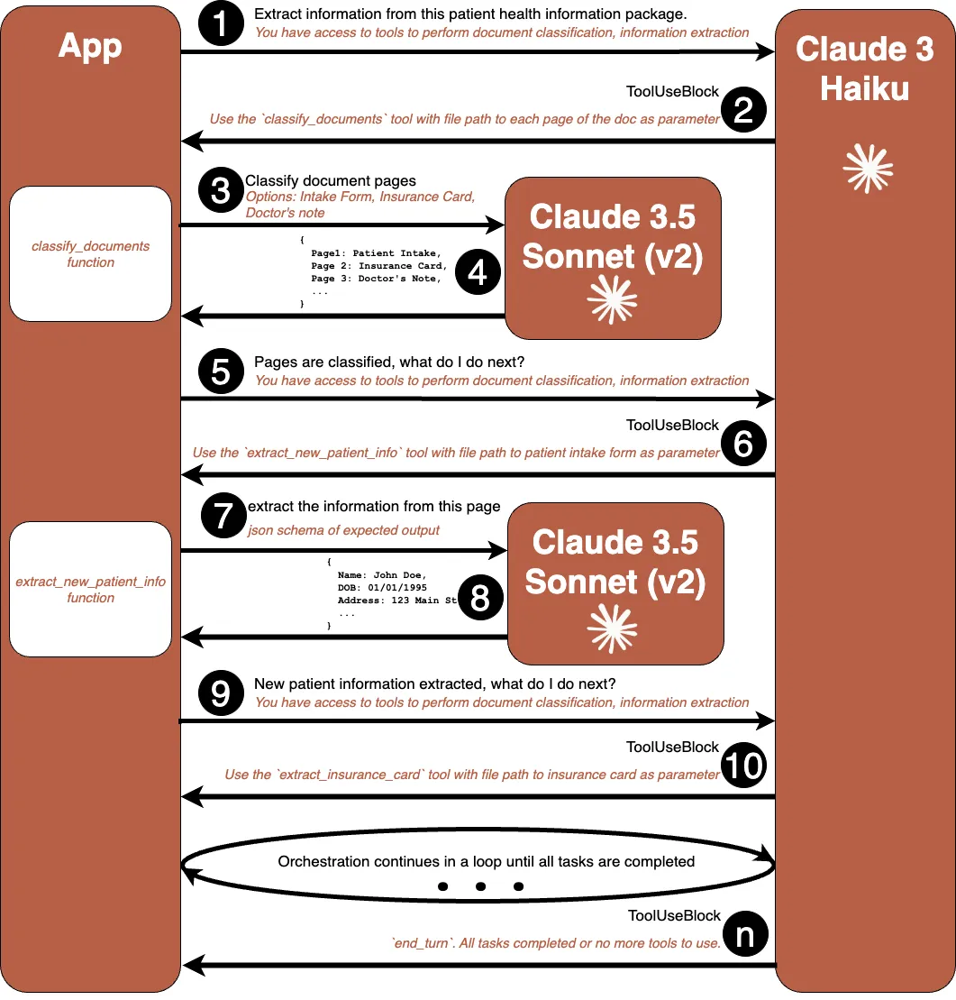

# Orchestrate an intelligent document processing workflow using tool-use on Amazon Bedrock 

## Solution Overview

This intelligent document processing solution leverages Amazon Bedrock to orchestrate a sophisticated workflow for handling multi-page healthcare documents with mixed content types. At the core of this solution is Amazon Bedrock's Converse API with its powerful tool-use capabilities, which enables foundation models to interact with external functions and APIs as part of their response generation.

The solution employs a strategic multi-model approach, optimizing for both performance and cost by selecting the most appropriate model for each task:

* **Claude 3 Haiku**: Serves as the workflow orchestrator due to its lower latency and cost-effectiveness. Its strong reasoning and tool-use abilities make it ideal for:
    - Coordinating the overall document processing pipeline
    - Making routing decisions for different document types
    - Invoking appropriate processing functions
    - Managing the workflow state

* **Claude 3.5 Sonnet (v2)**: For vision-intensive tasks where its superior visual reasoning capabilities excels at:
    - Interpreting complex document layouts and structure
    - Extracting text from tables and forms 
    - Processing medical charts and handwritten notes
    - Converting unstructured visual information into structured data

## Use Case and Dataset

For our example use case, we'll examine a patient intake process at a healthcare institution. The workflow processes a patient health information package containing three distinct document types that demonstrate the varying complexity in document processing:

1. **Structured Document**: A new patient intake form with standardized fields for personal information, medical history, and current symptoms. This form follows a consistent layout with clearly defined fields and checkboxes, making it an ideal example of a structured document.

2. **Semi-structured Document**: A health insurance card that contains essential coverage information. While insurance cards generally contain similar information (policy number, group ID, coverage dates), they come from different providers with varying layouts and formats, showing the semi-structured nature of these documents.

3. **Unstructured Document**: A handwritten doctor's note from an initial consultation, containing free-form observations, preliminary diagnoses, and treatment recommendations. This represents the most challenging category of unstructured documents, where information isn't confined to any predetermined format or structure.

The example document can be downloaded [here](docs/new-patient-registration.pdf).

## Solution Setup
1.	Setup an Amazon SageMaker Domain using the instruction in the [quick setup guide](https://docs.aws.amazon.com/sagemaker/latest/dg/onboard-quick-start.html)
2.	Launch the Studio. Then create and launch a JupyterLab space using the instruction in the [documentation](https://docs.aws.amazon.com/sagemaker/latest/dg/studio-updated-jl-user-guide-create-space.html)
3.	Follow instructions in the documentation to [create a guardrail](https://docs.aws.amazon.com/bedrock/latest/userguide/guardrails-create.html). Focus on adding “Sensitive Information Filters” that would mask personally identifiable information (PII) or personal health information (PIH).
4.	Clone the code from the aws-samples GitHub repository
`git clone <repo-url>`
5.	Change directory to the root of the cloned repository by running
`cd medical-idp`
6.	Install dependencies by running
`pip install -r requirements.txt`
7.	Update setup.sh with the guardrail ID you created in step 3. Then set the ENV variable by running
`source setup.sh`
8.	Finally, start the Streamlit application by running
`streamlit run app.py`

Now you are ready to explore the intelligent document processing workflow using Amazon Bedrock.

> ⚠️ **WARNING**: This codebase demonstrates intelligent document processing capabilities using Claude models and references medical documents as an example. Any medical or healthcare-related analysis, diagnosis, or decision-making without proper review and validation by qualified medical professionals is done at your own risk. Neither AWS nor the authors assume any liability for such use.
